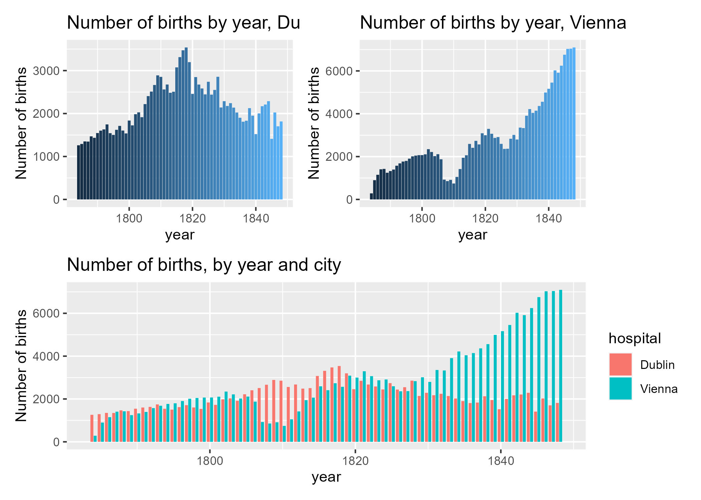
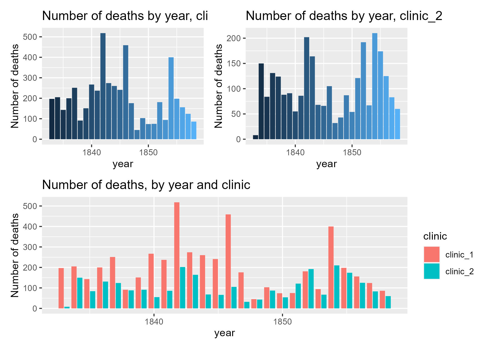

## The project

In the mid 1800s, Dr. Ignaz Semmelweis was an obstetrician at Vienna General Hospital. At the time, maternal death due to puerperal fever was common, but he was particularly concerned that the death rate in his clinic (Clinic 1) was much higher than the death rate in another clinic at Vienna General Hospital (Clinic 2). So what was the difference between these two clinics? Doctors and midwives worked in Clinic 1, while only midwives worked in Clinic 2. This led Dr. Semmelweis to hypothesize that doctors carried deadly "cadaverous particles" from their autopsies to their patients in Clinic 2.

In 1847, Dr. Semmelweis instated a policy where doctors had to use a chlorine solution to wash their hands between performing autopsies and seeing patients. The maternal mortality rate drastically decreased as seen in the plot below. Sadly, germ theory (the idea that there are particles that cause disease) was not widely accepted at the time, so his hypothesis was rejected by most doctors.

In this project, I extract : 

1.  the death rates for each year in the both datasets

2.  In each clinic, the average death rate for the years before handwashing was introduced in 1847

3.  The average death rates in the Vienna General Hospital both before and after pathological autopsies were introduced in 1823

 

  

 

   

Skills developed: Manipulation, Visualization, Probability & statistics

Link: [Semmelweiss_project](https://github.com/petoulemonde/petoulemonde.github.io/tree/main/docs/Semmelweiss_project)

----

## Main results 

Before handwashing implantation, the average death rate of clinic_1 is 0.0799393, and the average death rate of clinic_2 is 0.0478738. Both clinics were in Vienna. In Vienna General Hospital, the average death rate was 0.0116602 before handwashing implantation and 0.0587796 after implantation. 

----

## Future work

- Find more data on clinics to explain why clinic_1 had a lower average death rate
 