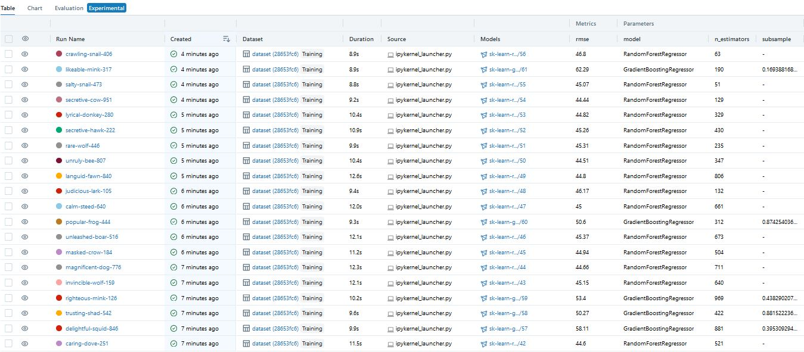

## The project

This dataset is extracted from the following Kaggle competition : [https://www.kaggle.com/competitions/optiver-trading-at-the-close/overview](https://www.kaggle.com/competitions/optiver-trading-at-the-close/overview) . 

Kaggle competition brief : 
This dataset contains historic data for the daily ten minute closing auction on the NASDAQ stock exchange. Your challenge is to predict the future price movements of stocks relative to the price future price movement of a synthetic index composed of NASDAQ-listed stocks.

This is a forecasting competition using the time series API. The private leaderboard will be determined using real market data gathered after the submission period closes.

The objective of this project is to create a proof of concept of the use of mlflow without autlog with optuna, and best model extraction from mlflow.

 

 

 

    

Skills developed: Model optimization 

Link : [US_stocks_prediction_project](https://github.com/petoulemonde/petoulemonde.github.io/tree/main/docs/US_stocks_prediction_project)

----
## Data description

The dataset used in this project is available here : https://www.kaggle.com/competitions/optiver-trading-at-the-close/data?select=train.csv .

----
## Project Board

2023-11-26 : 
- Notebook finished
- Add images in readme
- Add package images

2023-11-23 : Creation of readme
  
2023-11-22 : Project creation
- Creation of notebook

----
## Future work

1. RandomForstRegressor & GradientBoostingRegressor don't look like good models to predict. Test with NN, auto-ML solution and xgboost, lightGBM and catboost.