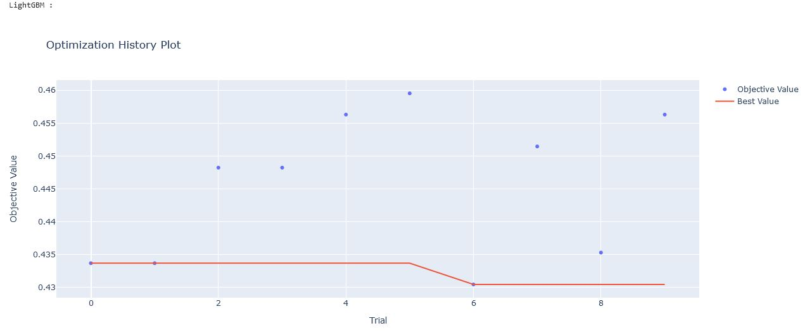

## The project

This project come from the following Kaggle competition : [https://www.kaggle.com/competitions/playground-series-s3e22/overview](https://www.kaggle.com/competitions/playground-series-s3e22/overview). The dataset for this competition (both train and test) was generated from a deep learning model trained on a portion of the Horse Survival Dataset. Feature distributions are close to, but not exactly the same, as the original. Feel free to use the original dataset as part of this competition, both to explore differences as well as to see whether incorporating the original in training improves model performance. The link to the Kaggle competiton is . The objective of this project is to train the model to prediction outcome. The metric is micro-averaged F1-score.

 

 

 

 [![](https://img.shields.io/badge/pandas-white?logo=data:image/png;base64,iVBORw0KGgoAAAANSUhEUgAAAMIAAAEDCAMAAABQ/CumAAAAeFBMVEX///8TB1QAAEb/ygDnBIgPAFLNzNYTAFnQ0NgMAFcAAETb2eP39/oUBlfV1N7/xwDmAID/9tfLydcjG17/4Yz//vbCwM3ykcL61OfoBIwyKmgAADYAAE0AAErx8PTIxdT/+un/34T85/Lyir/lAHv50eX+9fkpH2Ma8J+4AAACEklEQVR4nO3dzVIaQRSAUYNCEIGoiYmJivnP+79hFrmLVHELZ6pnmG483xqaPruh5lb32ZkkSZIkSZIkvb52z7dZU2+rT4uH2X6rx6m31afF7M1+87dTb6tPCDWEUEMINYRQQ5MS1tu0nqtMSrhKn26e1v1WmZawyn58g4DQL4QIoSyECKEshAihLIQIoSyECKEshAihLIQIoSyECKEshAihLIQIoSyECOFA6cvM5a4nYb29yjoO4WmVvM58WPQkbF8e+RqPcDlPVp4t+xLS/W0QEBCqI8yTLpsizN8n/WmJ0CEEBAQEBAQEBIT2CF+/fci6a4hw8y7rvC3CeRYCAgICAgICAgICAgICwlCEtJYIdzdp/3+kdkKHToFQ+RjJMCEcCKF7CAdC6B7CgRC6Nylh9zGtJUJ6uNCsnsOFhhkvPAHC9x+fsloi/Pp5nXTREuH++iLpMwICAgICAgICAgICAgKC/87R7/u0lggdQkBAQEBAQEB4dYQON67UTqh9KuwkDlRBQED4R8gOF5o3Rdh8yepLGO0ez6MNPO+WQ9w3NilhvBAihLIQIoSyECKEshAihLIQIoSyECKEshAihLIQIoSyECKEshAihLIQIoSyEKJt+lL0SNeADUR4TG9cGWXHew10AkPP4aRBO9ohEuOFUEMINYRQQwg1dAKEDvd41t5t2u7lL0qSJEmSJEnSyfUXeomSFq0EzbkAAAAASUVORK5CYII=)](#)       [![](https://img.shields.io/badge/Xgboost-white?logo=data:image/png;base64,iVBORw0KGgoAAAANSUhEUgAAAAoAAAAKCAMAAAC67D+PAAAAIGNIUk0AAHomAACAhAAA+gAAAIDoAAB1MAAA6mAAADqYAAAXcJy6UTwAAACuUExURQAAAC6o4Cum3yak3zqt4uvx+Wu/6Eex4zWr4Rqf3BCb2zCn3y2m3y2m3iWj3iyl3i+n3y6n3jKo3y+o4C+o4C2n3y2n3yel30ey5Fu75zOq4Sel3yel3yyn3yqm3yak3imm3ymm3yqm3yyn3yqm3yml3yak3yil3yWk3iel3iel3yel3yml3yil3yqm3zGo4C6n3yql3iKi3Sik3Sym3yym3yum3iym3i+n3wAAAEVLK78AAAA5dFJOUwAAAAAAAAAAAAAAAAAAAAAAAAASGSIgIQIBDF6KeYSdaF9jZntmbn6GhYGEgIJhCAcNDAgKCQsKCankUGkAAAABYktHRACIBR1IAAAACXBIWXMAAA7YAAAO2AEHSJGmAAAAB3RJTUUH5wsdFRIsQvdCYgAAAAFvck5UAc+id5oAAABPSURBVAjXY2DAChgZmZiYWVjZ2DkYhEVExcQlOLkkpRikZWTl5BUUlZRVGFTV1DU0tbR1dPUY9A0MjYxNTM3MLRi4eXj5+AUEeAWFsBsLADroBl2z3xGNAAALQGVYSWZJSSoACAAAAAgAAAEEAAEAAADoAwAAAQEEAAEAAAD0AQAAAgEDAAMAAABuAAAAGgEFAAEAAAB0AAAAGwEFAAEAAAB8AAAAKAEDAAEAAAADAAAAMQECAAwAAACEAAAAMgECABQAAACQAAAApAAAAAgACAAIACYAAAABAAAAJgAAAAEAAABHSU1QIDIuMTAuOAAyMDE5OjA0OjIzIDE0OjEwOjI0AAgAAAEEAAEAAAAAAQAAAQEEAAEAAACAAAAAAgEDAAMAAAAKAQAAAwEDAAEAAAAGAAAABgEDAAEAAAAGAAAAFQEDAAEAAAADAAAAAQIEAAEAAAAQAQAAAgIEAAEAAAAvCgAAAAAAAAgACAAIAP/Y/+AAEEpGSUYAAQEAAAEAAQAA/9sAQwAIBgYHBgUIBwcHCQkICgwUDQwLCwwZEhMPFB0aHx4dGhwcICQuJyAiLCMcHCg3KSwwMTQ0NB8nOT04MjwuMzQy/9sAQwEJCQkMCwwYDQ0YMiEcITIyMjIyMjIyMjIyMjIyMjIyMjIyMjIyMjIyMjIyMjIyMjIyMjIyMjIyMjIyMjIyMjIy/8AAEQgAgAEAAwEiAAIRAQMRAf/EAB8AAAEFAQEBAQEBAAAAAAAAAAABAgMEBQYHCAkKC//EALUQAAIBAwMCBAMFBQQEAAABfQECAwAEEQUSITFBBhNRYQcicRQygZGhCCNCscEVUtHwJDNicoIJChYXGBkaJSYnKCkqNDU2Nzg5OkNERUZHSElKU1RVVldYWVpjZGVmZ2hpanN0dXZ3eHl6g4SFhoeIiYqSk5SVlpeYmZqio6Slpqeoqaqys7S1tre4ubrCw8TFxsfIycrS09TV1tfY2drh4uPk5ebn6Onq8fLz9PX29/j5+v/EAB8BAAMBAQEBAQEBAQEAAAAAAAABAgMEBQYHCAkKC//EALURAAIBAgQEAwQHBQQEAAECdwABAgMRBAUhMQYSQVEHYXETIjKBCBRCkaGxwQkjM1LwFWJy0QoWJDThJfEXGBkaJicoKSo1Njc4OTpDREVGR0hJSlNUVVZXWFlaY2RlZmdoaWpzdHV2d3h5eoKDhIWGh4iJipKTlJWWl5iZmqKjpKWmp6ipqrKztLW2t7i5usLDxMXGx8jJytLT1NXW19jZ2uLj5OXm5+jp6vLz9PX29/j5+v/aAAwDAQACEQMRAD8A+f6KKKACiiigAooooAKKKKACiiigAooooAKKKKACiiigAooooAKKKKACiiigAooooAKKKKACiiigAooooAKKKKACiiigAooooAKKKKACiiigAooooAKKKKACiiigAooooAKKKKACiiigAooooAKKKKACiiigAooooAKKKKACiiigAooooAKKKKACiiigAooooAKKKKACiiigAooooAKKKKACiiigAooooAKKKKACiiigAooooAKKKKACiiigAooooAKKKKACiiigAooooAKKKKACiiigAoor15PDWmeKPCGjra20ViZbeBvtK28SvmMiKd3PBcfLM4XcCxC9+K1p0nUuo9FcxrVo0rOWzdjyGivaG0bRrK0svD39lQvdXVurvdCzTfFbBsSzl2RyHkIZEGcKzdVATNXULrwd4Wgs9OvbKCSRY9wSKwhuJlHUNM7leWySBk8dlUrnX6q1dykkl+fYxWMUrKEW29beXfXv0PIaK9W0i10DxLrFzrNhpsMdpYokbpJbpH5s0gYLmIFo9ipEx42tvYE7u2usfh+81HUtKg0e1leyXyryX+yoo4kc/KY1kA3BwdwBAU/IxU8A04YRzWklq7LfUmpjlBtOD0V3tp+P5HiVFdg3gm91bxPq8OnQw2Gm21/NbiW5kby4trNhB953IAUHAYjcu7Gc1n6p4L13SmhMlmbiG4uTa28tqfNEsmflAA+YFuqhgCecDg453TmlzW0OpVYOXLdX7dTn6K7ZvhdrqWfmG5037ZnH2H7T+8zu2/fx5XT5vv8AT34rL0XwVrOtTzKIksooJWgnnvSY1jkAJKFQC5YYAIVTt3LnAOabpVE0uV6iVak02pKy312OdortF+GWt/2lHGxil00TxxT6janekSsMlyjbXwAGHIGSMA5IzpePPC9hBpFvqGh6TFaR27SG98ueRtqExLGT5jnPzMw+X8e1V9Xqcrk1sR9apc0YKSvLY85ooorE6AooooAKKKKACiiigAooooAKKKKACiiigAooooAKKKKACiiigCexs7jUb+2sbVBJc3MqwxIWC7nYgAZOAOSOTxXuWl6V/Y2hWWlCYXDWscjNMpcrIfMXeU3cBFaWMADbndu2gs2PJ/B/iO28MatNe3OnNeiS3aBVSZYmjLFcsGKPj5QynAGQxGcZB0YPH80fjGfWZLRzYzQG1axjuMEQjBVQ7K2DvVXJCjLbuAGIrrwtaFF873/TqcONoVMRF01orfe+i9DubXS2Txz4w1Gad3kE1usAVyUW3uFaaNDkZBVEiUAcDBAyMGrcehLNfeJNT1fS5WnOpLBayX2nIYZrVVZYTCzLzhU+YjII8s5zk15/qXxCMviOLV9L0mG1xY/Y5orlxOZxuLBmZVQ5HyAY5xGoyRkVsN8VNNRWe28N3KzgZjM2pK6Bu25RCpYZ6gEZ9R1rWlWopJSfwt9L3uYVqGIbk4r4klva1jtdJ0pYBJbvZW1sbnUrhnXTrU7hBCRbjKKMswMMz7VzkyHAy2KuaBqOp39zptxq2mX1pcfbTELDUizMU+TDgMq8EswHHVDye3m2m/EjSNP0aw0//hG7thaQLFlNUCqzcl2AMLEbnLNjJxuwOMVneIfiFLqlpJZ6XYnTreZNsrPcedMw53KHCqAhBGRtzwRuwSKuOKpxglfZPS3V+ZnPBVZ1ZNrdrW+yVuh6Bq2l+IrLw9Fo+g2STanbeTpji0iyIhtYSTKcAJl1JMjAYMhbhsEb1/b6fdvqU4dNsF99psoQFw5BdNwUjoglByMbWZDkcZ8s0X4lQ2Ok29nqWjy3k1ughSe3vFt90agBQymNgSAMZGMgDIzknn18aa6urC/+2uQGb/RSzeRtbbuTZn7p2JnvlVOcgGksVSSW7207WG8FWk2tFbmd+rb29LHqls2sy69qBubC9t9Djtlisjc24iEk7GIu6nGZFPlyFWycKw+7uwdZWOpRW9pZ6dfWjzC5tYGeGUpcM3mym4gnK7DvBeVfmyCOAQFJ831f4mrcae0Oj6XcafdNwLmW9ExjXvsAjTa3o2TjnAzgi3D8V7Nogbvw2wnI2stjfC3gCjhVSMxOVAXAxuPTjA4DWJgnbm7vVd+m4ng6rjdwV9FZO1rddu/kdYLO9tLrSTZ61ey6atvd/abS+dWaRl8tQS6KplwbhCokHybGweQK4v4lXviLT7k6RN50OiXMcMsB+zLGLj92jsPNCgyBXbkFiAQvGQMUV+I903iddQntXOlpG8CabFMF2xtg/fKn5yyozPtydoHC4UUfGPjBPFC2MEGntZ21p5jKstx5zsz7Q3zBVG3CLgY9eTkAYVa0JU3GDa1v8jpo0KsasZ1En7tr+d7nLUUUVxnoBRRRQAUUUUAFFFFABRRRQAUUUUAFFFFABRRRQAUUUUAFFFFABRRRQAUUUUAFFFFABRRRQAUUUUAFFFFABRRRQAUUUUAFFFFABRRRQAUUUUAFFFFABRRRQAUUUUAFFFFABRRRQAUUUUAFFFFABRRRQAUUUUAFFFFABRRRQAUUUUAFFFFABRRRQAUUUUAFFFFABRRRQAUUUUAFFFFABRRRQAUUUUAFFFFABRRRQAUUUUAFFFFABRRRQAUUUUAFFFFABRRRQAUUUUAFFFFABRRRQB//2QBGf/JeAAAAJXRFWHRkYXRlOmNyZWF0ZQAyMDIzLTExLTI5VDIxOjE4OjM4KzAwOjAw3eclLQAAACV0RVh0ZGF0ZTptb2RpZnkAMjAyMy0xMS0yOVQyMToxODozOCswMDowMKy6nZEAAAAodEVYdGRhdGU6dGltZXN0YW1wADIwMjMtMTEtMjlUMjE6MTg6NDQrMDA6MDA2yt8jAAAAGnRFWHRleGlmOkJpdHNQZXJTYW1wbGUAOCwgOCwgOBLtPicAAAAhdEVYdGV4aWY6RGF0ZVRpbWUAMjAxOTowNDoyMyAxNDoxMDoyNFDWNLAAAAAUdEVYdGV4aWY6SW1hZ2VMZW5ndGgANTAwepCB2QAAABR0RVh0ZXhpZjpJbWFnZVdpZHRoADEwMDAXFjEKAAAAGXRFWHRleGlmOlNvZnR3YXJlAEdJTVAgMi4xMC44SYxETQAAAABJRU5ErkJggg==)](#)

Skills developed: Supervised learning (LightGBM? CatBoost, Xgboost), Model optimization (optuna), Model tracking (MLFlow)

Link : [horse_health_prediction_project](https://github.com/petoulemonde/petoulemonde.github.io/tree/main/docs/horse_health_prediction_project)

----
#### Project Board

2023-11-25 : 

- Add image of projects and packages
- End of project

2023-11-23 : Creation of readme
  
2023-11-22 : Project creation
- Creation of notebook

----
#### Main results 

The best model is the LightGBM model, with following parameters : n_estimators = 1046.
The best score obtained is 0.43042071197411.

----
#### Future work

1. Develop a better preprocessing method to optimise F1-score

2. Implement a neural network model

3. Found and implement an auto-ML system  