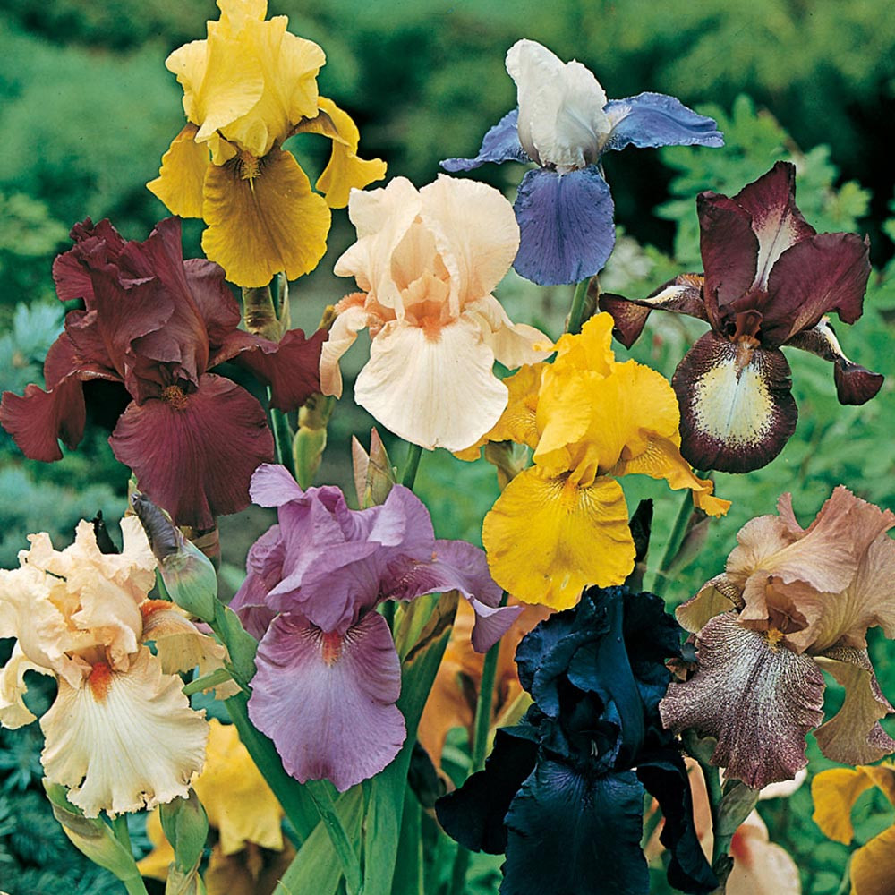

---
title: "notebook-Iris dataset exploration"
author: "Pierre-Etienne TOULEMONDE"
date: "11-12-2022"
output:
  html_document:
    toc: TRUE
    number_sections: TRUE
---

# Iris dataset presentation



The Iris dataset, also known as Fisher's Iris or Anderson's Iris, is a multivariate dataset introduced in 1936 by Ronald Fisher in his paper The use of multiple measurements in taxonomic problems as an example of the application of linear discriminant analysis<sup>1</sup> . Data were collected by Edgar Anderson to quantify variations in the morphology of iris flowers of three species<sup>1</sup>. Two of the three species were collected in the Gaspé Peninsula. "All are from the same field, picked on the same day and measured on the same day by the same person with the same measuring tools<sup>1</sup>".

The data set includes 50 samples of each of the three iris species (Iris setosa, Iris virginica and Iris versicolor).  Four characteristics were measured from each sample: length and width of sepals and petals, in centimetres. Based on the combination of these four variables, Fisher developed a linear discriminant analysis model to distinguish between the species.

<sup>1</sup><a href="https://fr.wikipedia.org/wiki/Iris_de_Fisher#cite_ref-fisher36_1-0">Iris de Fisher - Wikipédia</a>

In this project, I found : 

1. found the best algorithm to predict species

[](#)[![](https://img.shields.io/badge/Skim-white?logo=data:image/png;base64,iVBORw0KGgoAAAANSUhEUgAAABoAAAAeCAYAAAAy2w7YAAAAIGNIUk0AAHomAACAhAAA+gAAAIDoAAB1MAAA6mAAADqYAAAXcJy6UTwAAAAGYktHRAD/AP8A/6C9p5MAAAAJcEhZcwAALiMAAC4jAXilP3YAAAAHdElNRQfnCwUQOwpH2uXvAAAFynpUWHRSYXcgcHJvZmlsZSB0eXBlIHhtcAAAWMOdWUmW6zYM3OMUOQJJcJCO41jSLu9lmeOnCpSsiZLs337dtkUQQ2EgwJb//vlX/sKP+uhE36XTV+nyUFweciox++D4Pb/zWJRrOoSQfY55yiEnfdXnH+ophOBkZYOHf3NL6uKQXHBR81SwMThNYdSIXxeCju4VHF9QIYB51lcKMUrMB/l1kTp0JeLl9AWZU7GfMBYQhdFElDCp156vMIk6DXgQ8HeoTPCupQdbqF26MFAAl1ddjhrFmJMUzYoHvZnWA4URGs4EwCVANpCghgBix2j7Kp2sRgG6DqwaZplO4wo3PgO/PGBl3kPTvIE43ctbxcWqu2qsLopgRY3lJH0mXAEFYjHHMLVZGL5OEUeA0wAf8KD/XjNE3Rvo6QKEHJHgIiyfyVa9wIAenao2dPweEnmSnGnMOaocxIT8XgUJCYk+NiYGPeMHmlSJ/ntTZQZuiMMvbscuvzUwD8LHXwMM/8FXuQboXqh8L7VoigUhAJopgbKoRX0AfYpIkVxxYTZ9GZIl9qwPe61km9m5INzp3DUYZ2c/C5HZeiZs/i3Plj3VePklz6p+bWHyHdDnarTUpCX/BeBlSPTwQZccUrZLgL8EfLfqpONxPbg9BdhV0/S91pVntld6ycKgbmOqoPgTxpouHwaaUErjXuh2j7Q23aMBredPW23FUFgK5tn6wNQ9GN9gk4HRo/yNAX3T6A44w2tXVve/GS0zgzkJrS7Ox1ICC7CNMB2nHCKsOwjd7ZHjpkegbStzMSkqgWfuKyMb5zZTfw9nk/g5spnpfS0mCMW44JGQOEiTwYowi9le2GGXfBs7qW/hCJ+xMXizQj6SPorouE+uZRxJ70XIKuPiVH9Fj/iNpVjV/JvYRBYdNB3oYz5+bh6Qm86HLR8bqgsD145A/kz+kWHs5cIcRBGi5xMMqCEdWJcr8GfT/sSUo2j5VfaVU6QmH080HsjAp0eKxisDrvWX3wy4Firfqn52QGQ3nOx7ylF+N6Jtg/yZ/DPDxf1La4n2F+UV0nNCLUIvyRWWixLudZfPYMIW1N8pfy9M7qTtNKVeOh8F03mHtMH9ST8TIdcyGlp9TNpAP++Ua/h+006eZT1oSWtc6cXOgsIOLFqqPju6rak8ADnLexa3qdk2dbDRYm0caJyO+WOysUffa8dCg1IuMFgHC+I32szmrQNI6LKxcW6cKYoV4EX3B3RAUVXRgGKCHvAd3zDqDHhHP8+JDkw4T3s8K6ze6IqT9njmTbukam3Ns/xnvSV2tUzR3tL/4q8LsNtbmPnr+M7OxJq9tIw3dnNhp7CsE064jZ+DoHXgerEFy17o0lqqEFrvOlPvSVaKOzFyJcdahmxnrmfSRIsmdkNoBZcpaul6jVEX6VwNLk5JQ3/U6o7hI9hNDZEgZIC2hxcGiCq7L2BkIZoSThGP2Hsh9Hr89ZpsucNnV6eUNrMzWvKFV75LEWihaFsCwjzityAdQI1XshRxTCF86pBCxdIGZZXwamJCYT3wIirPKfIo/zm+pGGKZ0u19ImFh2S2ODqK3NHJkyzbvkmYh0ZrJW4l5I7ptlJsEl6uMv5Q3Dg+41RdrmEqcss9Ae90xFoFc+D6GF5gcWNsdQw3CzqrdfQkvNZrZAHErpBrKUx0P7SDWcGczTDoTiY09Wke2QdDpvnU4Jzm87vN6BOS9Bx7SLVqhAwqULko5yG1StzXkLS7t8FuQL0ZkmbzQIX1jMBMNK0/GfKVPheN1ucq55XmSTbV6Cb4rDhMIA47fDcNlJgylbzOrd8ti4tOe93j7N4CESj1tETV25Q3a5AbxAtti73s+B/uQT6FdIQJe+anGxO5Vz365GI/s3R7Zstac15DPC13W5dDc73iONLJmfAu89jobBsxTuIcUFFGFlXXo2WNq+ttx7t2uH973X6+bd/+q2BTakIEOdeqUN6+yfbfGIb+/1lGpWk/z7w8AAAAAW9yTlQBz6J3mgAACFdJREFUSMd9lnmMXVUdxz/nnLu8fZu3zNpZOrRT2sJQKNakhRhrEYgiMeJCDALRAGqjEhMM/us/JojiH5JoUEyMy19GgxhZhFBKtaFlAg62pdPOdDqd7c2bt9333t2Of7zXgoL8/ro5N/f7vfe7nHvgQ+aO+x+CeI6t+27GLAyR2XbNtsTY9icTY9t/mZ7ctUuk84zfeACAT9334IdBoT5o8d6HH6EeKtrtDjXHIZfNZduud08Yhj+KZ3K32rH4tNduH7SiMZVKJucaoXAitk20r8gdn7+bmWNHPpzo6997lDCew/UCFhcvMDY2btVqtduq1c2fKDvyYDJfLKXyRaLJFGY01hf6/qFmvXYglUxWBwaH5i5dWvIt26Zvyzjx/p1sLLx9BVtcvvjEl+7lb795iokbb+Lc8VcYmd63p+k0v4Uy7kxk+xKRZBoNKKVQSqHRhH6AU9ukWSm3tO/9OR6LPb5w8tg/+qam9e7bP8vsi8+y9sZrXaKJA7dQXlokEk+wMn+Oq3bsGKlUKl/1Q31/JJUeTOdLKMsCrQmCACEEhmGglCIIAkKtCX2fenkNp7qxGvr+U1rIJ9v16nyir0C7UacwvAVlZvO4rRambScM0/xCq93+qRlL3FUcGU2m+grYERs0aK0RoiuAZZlIKXBrVVrLF3BWlojmSyRy+XgYBPs7LeegMk3PtKyzvut2hFSo9Jathtdp3eR12o+Zkdi3U6X+oYnJbWwdG2ViZIjltXVMpWh3XLTWXRmkxGs08E69Qbh6Ed2okhrZwt4brsWKJWj7uhj6/m2dVnOvVGolEk9cUNixH0hl/DBdHLi2f3RcJdNpxoeHSCcTpBJxOq5HMZthsJgnm0qSTSXpz/exsbbGl6e3s+fq7Zy5cJFrrr+WPdfv5sTsHBgmdjwphVJbfbfz6U6zUTK01h9PFUq5ZF+BTDpFIhbDCwJsy6LWaDJUKmIoiW2ZBH5A23U5u7CItiOkRye468D1FHbvZte+aWbmLuG0XZSUCMsiXShhWXa6vDh/0EAQCCkBKG9WqTUdtNa8/c4chhKMpGziiRTn1ms0nBau5+EHAVJKfv/vBYxSgdFtV9FouRybOYXreRhKonu+IgUIAgN6C3T1DwIfPwhodVw+OiD5/v4EsnANr664rFcbnF+vML++ieP6RJNpfn3sDLUX3+Qrt36EuYsrSCHQuosDAnq+GgBSSpRUPaKQwA8QgONDyvKJ503mzzZYXVrhMzfsZLCYwdeaowsVfvyXoyQiNpVqnY1qA9CEoUZK2X31XlINNL1FjUAQhgGe56G1ZqGmWa77THVWGSwW+cWfnuPomXkm8hmG+wuIWBrPC5gY72O1XMHzPIQAKRVCCMSVHUFgaDS+7+P3vsL3fYIgAKARmJxvKnZUL7Gz/yp2DJVYKFc4sbjK7IZDWxsEfsjkUJ6Ts6d7Je4+L6VE90oOmise6TAk1BqtNVIKIsk0ZiLNb880SUWavOnO8MldW7GjETAt/vqvec4sl0ln4kRNyUq5ihCiR0BPwrDrv+55dHmuFFJIZDSBaZscWwEvmubuQ1dzbr2BHTUxELT0PEEQsqWQZW2jQsNxUFISBCGiF4gwDAlDjeZ/iKB7U0hJICSeF2JbBm8trHH8zBIvvXmOQirGaCnLdZNDTA32MTVS5NmjJ3pedENwGUf3FOK9REIIlOomTyuDIATP8zENRTYZZbPZ5lK5ysW1TWbeWUQHAamozUgxw9LqRk+RLlkQhF0i3q2NcZnd9/0rRFlL4WuPui+xJEwOFdg5NkDTDSlXG5QrNdYqNQbyWWpOm47nY5oGvh+gNUgpCMOuBUJIBGAIQArZ25m1jhIg5k8L1w2xd+zBw2JyuMjcUpmIodg92o89OUw8YjE2kOO5oyd7EnUrI4QgDDVCXN7xu98kEQJlKJRhoIQIh2OmrqsImXiE65LdFFmmwfpmnY16g1OLK7x+ep4gDPE8n/mLy3ieRxAEaN0tq9ZgGGZPoW6fJFoLr9NBCgFSqbNtLcN8if6BEnOXVumLmYz2Zxjrz5GK2RhSkIjalHIJ0CHr1TqxaIR4NNIFFQIpxZWoEwZotFR2ruS7TnPSdztFZZoIZVDQLgVCZjcdJsdHCIVB1FLs3z3B3qlRJof6SNomsahNJhljetsYGsHiyvq7RfU8GuU1GpX18yB+LsgUyBQHxjy384AyrXuj8XixKMGwY9SsCIfv+xy5bIqXT55huVIDDbap2NqfI2pIZk6fxzQVY4NF2q7H86+9Qa28TqNSrvpu5w9SqSfqZ2ffEjc/9Agzzz/Ddfd8U5z81RP7CMPvItXtkUyfZScSpBIJpqfG2btzK8VMglBrnLZH3DZRQuAF3V/B4mqFF149zusnZvxOs/l3BI8l86UXGuU1P1UoIUYOfIxmuYZl29QrZaamdsQvzM/f2Wq3D1vxxN54Lo8yLYQQRG2TTCJGLGJhKAM/CGi0XNbLG5RXlmnXq7OGUk9I0/qd23Kq0WSKIPCJxdPvHre++I3v8NLLr5BOp5g/fw4rluj33c79UhkPRJKp4UgqgzLMXrJCEAIdBrj1Gq3a5kro+08rw/hZrbx2Pts/iOs4JPJFVk4c+e8D5Fv/fI3G6hJ2YZiNUzNEcsVGfW72FStbeNFzHNtrO5NCSNuwLNDgOg2c8mqr06j/ETh8y+FHn547fmRz+uBt1DfWqZyaoXlp4f0HyPfO8PYdtIw4hm3T3NwgmsqYrc3KIeBhMxo9AEK6LecY6MetWPwZz3Fa0VSGwPcwIklWT7z0PswPJLo8hen9uE4NaRh06nWsWKzgdzpf02hbGdaTXru5ZMVThL5HPJNl+fUj/xfrP2na98EiSovEAAAAJXRFWHRkYXRlOmNyZWF0ZQAyMDIzLTExLTA1VDE2OjU5OjA0KzAwOjAwud8wigAAACV0RVh0ZGF0ZTptb2RpZnkAMjAyMy0xMS0wNVQxNjo1OTowNCswMDowMMiCiDYAAAAodEVYdGRhdGU6dGltZXN0YW1wADIwMjMtMTEtMDVUMTY6NTk6MTArMDA6MDCnco1kAAAAE3RFWHRkYzpGb3JtYXQAaW1hZ2UvcG5n6IZgQwAAAAx0RVh0R0lNUDpBUEkAMi4wJUoNPgAAABR0RVh0R0lNUDpQbGF0Zm9ybQBNYWMgT1MAh5OgAAAAH3RFWHRHSU1QOlRpbWVTdGFtcAAxNTQ3MjU0MTU1MjQ2NjEwJ+BmfQAAABN0RVh0R0lNUDpWZXJzaW9uADIuMTAuNhDgOQ4AAAATdEVYdHhtcDpDb2xvclNwYWNlAHNSR0LuXmVHAAAAGXRFWHR4bXA6Q3JlYXRvclRvb2wAR0lNUCAyLjEw6nU78AAAACB0RVh0eG1wOkV4aWZWZXJzaW9uAEV4aWYgVmVyc2lvbiAyLjFa9hHDAAAAKHRFWHR4bXA6Rmxhc2hQaXhWZXJzaW9uAEZsYXNoUGl4IFZlcnNpb24gMS4wOrGrrwAAABh0RVh0eG1wOk9yaWVudGF0aW9uAFRvcC1sZWZ0uG7l4QAAABd0RVh0eG1wOlBpeGVsWERpbWVuc2lvbgA1NjQKA8ajAAAAF3RFWHR4bXA6UGl4ZWxZRGltZW5zaW9uADgwNieAciwAAAAXdEVYdHhtcDpSZXNvbHV0aW9uVW5pdABJbmNo2TGTXQAAABJ0RVh0eG1wOlhSZXNvbHV0aW9uADcyD6oy0gAAABJ0RVh0eG1wOllSZXNvbHV0aW9uADcykqXTpAAAAEV0RVh0eG1wTU06RG9jdW1lbnRJRABnaW1wOmRvY2lkOmdpbXA6OWI0NDk4MTEtMTM2Mi00Yzk0LWJkMmMtYjUxNzdkYjQwYjU4XV/gXAAAAD10RVh0eG1wTU06SW5zdGFuY2VJRAB4bXAuaWlkOmViMTQzOGEzLWI0M2MtNDdmOC1hYTkxLTdlY2ZlOWExZGM1M4WHUdYAAABFdEVYdHhtcE1NOk9yaWdpbmFsRG9jdW1lbnRJRAB4bXAuZGlkOjJjZTI3OTcwLWNkYzktNDAyOS05OTFjLWU0YzkzZDQ2YTU1Odz2INgAAAAASUVORK5CYII=)](#)[](#)[![](https://img.shields.io/badge/Corrplot-white?logo=data:image/jpeg;base64,/9j/4AAQSkZJRgABAQEAYABgAAD//gA7Q1JFQVRPUjogZ2QtanBlZyB2MS4wICh1c2luZyBJSkcgSlBFRyB2NjIpLCBxdWFsaXR5ID0gOTAK/9sAQwADAgIDAgIDAwMDBAMDBAUIBQUEBAUKBwcGCAwKDAwLCgsLDQ4SEA0OEQ4LCxAWEBETFBUVFQwPFxgWFBgSFBUU/9sAQwEDBAQFBAUJBQUJFA0LDRQUFBQUFBQUFBQUFBQUFBQUFBQUFBQUFBQUFBQUFBQUFBQUFBQUFBQUFBQUFBQUFBQU/8AAEQgAHgAeAwEiAAIRAQMRAf/EABsAAQABBQEAAAAAAAAAAAAAAAgGAQIEBQcJ/8QALhAAAQQBAgQFAwQDAAAAAAAAAQIDBAURBiEABxIxCBQVIkETMmEWIyRxUVKB/8QAFwEAAwEAAAAAAAAAAAAAAAAAAQYHAv/EACYRAAEDAgUEAwEAAAAAAAAAAAECAxEABAUTITFBUWGB8FJxweH/2gAMAwEAAhEDEQA/ANPY2z/K6VbLcuPqacX6kpx5d/ZrfDxs20hICWx/qPjCh1KUerAPoPyK1fB1TQzFRZnmlLtJvQQ9KcBSHk59zyEkfcNuwzt84pq7kVV6pq5cUzLpxT/WCj1V1KSFSkPq36T2UnYfA2/IGV7qHUXhJ1lNkSZrDtQtm0nk2morCUoqesUJR7EoA6sJH95WSrOAWlSm8Tay25kE8+/ylZKXbB3Mc6e+ffvoauctfGGofVbZth1p24SlMextcdCbBlIJw1sd/jsO2x4Zda5GuW/OMuurDZUz7CtKTuCchWMnYb4/r54BHNbwvX1ZCsrSDZ2KoM+LNlhx/V8wD+TYMOIwgM9inBIPc4KsqSOJpyZ1xAp7edXztQFUkzrhQQu9spHtRKYRnKmhnf5O++fk8ILaw0swek8VaL2wbv7VLzE6E8hXftG1Y/OJ3y1PaWv6ifYdaRJZCE6ontt49WaGSEtdxnH+B23A4inhd5rxq/VNlBtrKFawjMvHVifbzp+wmshCehxnBTsCD3P3HpJxw9l1qLuE6zMBZCnen+OvukL6gckdz0jI/wCfngc625PT6Spvp1dOszJPqKkhep5LSf3bNlZ+1nIzjJ/PfPfgOIUwCknXjxW8NurfE28haDuRv8h+RRG1drG85f6pvlLv1ulZuFNsr1VYLSoKsWwn2hsDOASBsFAFSilSUpLs8LvM2n1JT2jvq6JDxt7QgpsJkjb6rJVhTrQOMqGOxwQcZJxbzN8MFfqLTtv9W1vlPPJlJIVfuYw7NZeUOosk4ynOMdwM5O4P9PB1fyq5kSaaokvzY0py6mEz9Uzeoq880gklLQ92wycErJJJBABo6su6ZKUTAqHpUtp3UidK/9k=)](#)[![](https://img.shields.io/badge/FactoMineR-white?logo=data:image/jpeg;base64,/9j/4AAQSkZJRgABAQAAAQABAAD/2wBDAAMCAgICAgMCAgIDAwMDBAYEBAQEBAgGBgUGCQgKCgkICQkKDA8MCgsOCwkJDRENDg8QEBEQCgwSExIQEw8QEBD/2wBDAQMDAwQDBAgEBAgQCwkLEBAQEBAQEBAQEBAQEBAQEBAQEBAQEBAQEBAQEBAQEBAQEBAQEBAQEBAQEBAQEBAQEBD/wAARCAAeAB4DAREAAhEBAxEB/8QAGgAAAgIDAAAAAAAAAAAAAAAABAcFBgIDCP/EACsQAAAFAwMEAQMFAAAAAAAAAAECAwQFAAYRBxIhCDFBYRMUFVEWIjJCkf/EABoBAAIDAQEAAAAAAAAAAAAAAAcIAwQGBQn/xAAuEQABAwMDAwIFBAMAAAAAAAABAgMEBREhAAZBBxIxCBMUIjJRYRUjQoFxkcH/2gAMAwEAAhEDEQA/AEHatpwD6CgoGBtYr6XkCnERMcxU26YGwY5zdgEA5AB71f3FuGmbRpYmSgCpX0p+50Yd8772v0x2uifNbC31D5EZznzq9MunbTNOdLbl2LqTUiogLpIpw2ARIBwPIe6XGr9TNwT2zKj2bavawznSG7o66bu3Ek1SMQyyFdoAsbfYZ1HDoTbq7Z7LaeKndN2Kx0ftK4fGmoqX+Qbx5xXfoXVSZSn24tcbC21gG/IB5sNbTZPqGqu1pbUPdTQeZWASb5APNhpdakwdlvYiKdxUEZufeokugfcUyaheDBgecZzgfNMM65T50VqVDyhXgjOnhlu0TcVJi1SkgKbcvn/n9abnTg8hYKx/1VNTCLY08b5ClcHAuNnHFKv1SmS6xWjFaQVJawAOL687OvtcqG7N1riNoKm2MJAyBcX0frBe9tRrBO6LcnGSkoJfovkTVATFRNyOKz+3aVLfc+ElNkN/VkcjQ/2fRZsh4wJrSg39WR/IeNGWnrBZraIZx0UxdyLk6RVFys0t4mVEP3CPuoKlt2ct5TrqglIOO42xqCq7RqTslx6SsISCQO42xxpJa9TJWVzluMke+ZpSZQKVs6S2bBKHIgHujx0nmqRBXTnVhSW8gpN/Om+9OW4XY1Kdo0p0OIZymxuB3HOmP0+DBuIZOz7lZtVEy5PDkckAxlU+5xLn3WI6s0KXSJaatGKux3yRwRgX0LfUds+ftqsIr0AqSxIF7ji2M6uGoem8JcoNbUh7eaNFFDg4UcgiAFAgcCXjzQ5olbfhd02Q4VAYtfQM2/uGXTiqfIdUoD5QCefvo21rLgXdvqMfshoNZioZr9Q3AElFQJ/fcHge9V59Ufale77nuBQ7rHIF+Laq1Sry2ZodDvvBYCu1WQCeLfjXPGq6bGUligjLqycC3MZJk6XOKhjKhwoXcPfA0y/TaivU+lipS0Btb3AFsDwbafLoDtCRTKCa5UWUoVJ8JtawT4NvzrRAakxz20I9krCqlcsh3N3Ca20xDgOQHIc4z3DzW/koh1WEYc5vvSdHCbIpG69u/o9Vi97Zx5yP8HjUst1ly9kiVrc1uhMuRDhdM4JYD8YxQJrvR6Ml+8F7sQc2IvpLt8+nKJCmd1Nk+20rISQTb+9Yveo+Z1JYG2sDR8GuG10zTUwqoXzhQOS13tr9L6XRVpnVD95SfHA/1zrd9NPT3RKSW6vWVfEWOE+Bf8/fVT1K1LjV4uJYsbfBs3bCcCEA4f6P5H3RbqEppbaG0oskeBpnK/uFh1ppiMz2JRgAeLa//9k=)](#)[](#)[](#)[](#)[](#)[![](https://img.shields.io/badge/FactoMineR-white?logo=data:image/jpeg;base64,/9j/4AAQSkZJRgABAQEAYABgAAD/4REKRXhpZgAATU0AKgAAAAgABAE7AAIAAAAVAAAISodpAAQAAAABAAAIYJydAAEAAAAqAAAQ2OocAAcAAAgMAAAAPgAAAAAc6gAAAAgAAAAAAAAAAAAAAAAAAAAAAAAAAAAAAAAAAAAAAAAAAAAAAAAAAAAAAAAAAAAAAAAAAAAAAAAAAAAAAAAAAAAAAAAAAAAAAAAAAAAAAAAAAAAAAAAAAAAAAAAAAAAAAAAAAAAAAAAAAAAAAAAAAAAAAAAAAAAAAAAAAAAAAAAAAAAAAAAAAAAAAAAAAAAAAAAAAAAAAAAAAAAAAAAAAAAAAAAAAAAAAAAAAAAAAAAAAAAAAAAAAAAAAAAAAAAAAAAAAAAAAAAAAAAAAAAAAAAAAAAAAAAAAAAAAAAAAAAAAAAAAAAAAAAAAAAAAAAAAAAAAAAAAAAAAAAAAAAAAAAAAAAAAAAAAAAAAAAAAAAAAAAAAAAAAAAAAAAAAAAAAAAAAAAAAAAAAAAAAAAAAAAAAAAAAAAAAAAAAAAAAAAAAAAAAAAAAAAAAAAAAAAAAAAAAAAAAAAAAAAAAAAAAAAAAAAAAAAAAAAAAAAAAAAAAAAAAAAAAAAAAAAAAAAAAAAAAAAAAAAAAAAAAAAAAAAAAAAAAAAAAAAAAAAAAAAAAAAAAAAAAAAAAAAAAAAAAAAAAAAAAAAAAAAAAAAAAAAAAAAAAAAAAAAAAAAAAAAAAAAAAAAAAAAAAAAAAAAAAAAAAAAAAAAAAAAAAAAAAAAAAAAAAAAAAAAAAAAAAAAAAAAAAAAAAAAAAAAAAAAAAAAAAAAAAAAAAAAAAAAAAAAAAAAAAAAAAAAAAAAAAAAAAAAAAAAAAAAAAAAAAAAAAAAAAAAAAAAAAAAAAAAAAAAAAAAAAAAAAAAAAAAAAAAAAAAAAAAAAAAAAAAAAAAAAAAAAAAAAAAAAAAAAAAAAAAAAAAAAAAAAAAAAAAAAAAAAAAAAAAAAAAAAAAAAAAAAAAAAAAAAAAAAAAAAAAAAAAAAAAAAAAAAAAAAAAAAAAAAAAAAAAAAAAAAAAAAAAAAAAAAAAAAAAAAAAAAAAAAAAAAAAAAAAAAAAAAAAAAAAAAAAAAAAAAAAAAAAAAAAAAAAAAAAAAAAAAAAAAAAAAAAAAAAAAAAAAAAAAAAAAAAAAAAAAAAAAAAAAAAAAAAAAAAAAAAAAAAAAAAAAAAAAAAAAAAAAAAAAAAAAAAAAAAAAAAAAAAAAAAAAAAAAAAAAAAAAAAAAAAAAAAAAAAAAAAAAAAAAAAAAAAAAAAAAAAAAAAAAAAAAAAAAAAAAAAAAAAAAAAAAAAAAAAAAAAAAAAAAAAAAAAAAAAAAAAAAAAAAAAAAAAAAAAAAAAAAAAAAAAAAAAAAAAAAAAAAAAAAAAAAAAAAAAAAAAAAAAAAAAAAAAAAAAAAAAAAAAAAAAAAAAAAAAAAAAAAAAAAAAAAAAAAAAAAAAAAAAAAAAAAAAAAAAAAAAAAAAAAAAAAAAAAAAAAAAAAAAAAAAAAAAAAAAAAAAAAAAAAAAAAAAAAAAAAAAAAAAAAAAAAAAAAAAAAAAAAAAAAAAAAAAAAAAAAAAAAAAAAAAAAAAAAAAAAAAAAAAAAAAAAAAAAAAAAAAAAAAAAAAAAAAAAAAAAAAAAAAAAAAAAAAAAAAAAAAAAAAAAAAAAAAAAAAAAAAAAAAAAAAAAAAAAAAAAAAAAAAAAAAAAAAAAAAAAAAAAAAAAAAAAAAAAAAAAAAAAAAAAAAAAAAAAAAAAAAAAAAAAAAAAAAAAAAAAAAAAAAAAAAAAAAAAAAAAAAAAAAAAAAAAAAAAAAAAAAAAAAAAAAAAAAAAAAAAAAAAAAAAAAAAAAAAAAAAAAAAAAAAAAAAAAAAAAAAAAAAAAAAAAAAAAAAAAAAAAAAAAAAAAAAAAAAAAAAAAAAAAAAAAAAAAAAAAAAAAAAAAAAAAAAAAAAAAAAAAAAAAAAAAAAAAAAAAAAAAAAAAAAAAAAAAAAAAAAAAAAAAAAAAAAAAAAAAAAAAAAAAAAAAAAAAAAAAAAAAAAAAAAAAAAAAAAAAAAAAAAAAAAAAAAAAAAAAAAAAAAAAAAAAAAAAAAAAAAAAAAAAAAAAAAAAAAAAAAAAAAAAAAAAAAAAAAAAAAAAAAAAAAAAAAAAAAAAAAAAAAAAAAAAAAAAAAAAAAAAAAAAAAAAAAAAAAAAAAAAAAAAAAAAAAAAAAAAAAAAAAAAAAAAAAAAAAAAAAAAAAAAAAAAAAAAAAAAAAAAAAAAAAAAAAAAAAAAAAAAAAAAAAAAAAAAAAAAAAAAAAAAAAAAAAAAAAAAAAAAAAAAAAAAAAAAAAAAAAAAAAAAAAAAAAAAAAAAAAAAAAAAAAAAAAAAAAAAAAAAAAAAAAAAAAAAAAAAAAAAAAAAAAAAAAAAAAAAAAAAAAAAAAAAAAAAAAAAAAAAAAAAAAAAAAAAAAAAAAAAAAAAAAAAAAAAAAAAAAAAAAAAAAAAAAAAAAAAAAAAAAAAAAAAAAAAAAAAAAAAAAAAAAAAAAAAAAAAAAAAAAAAAAAAAAAAAAAAAAAAAAAAAAAAAAAAAAAAAAAAAAAAAAAAAAAAAAAAAAAAAAAAAAAAAAAAAAAAAAAAAAAAAAAAAAAAAAAAAAAAAAAAAAAAAAAAAAAAAAAAAAAAAAAAAAAAAAAAAAAAAAAAAAAAAAAAAAAAAAAAAAAAAAAAAAAAAAAAAAAAAAAAAAAAAAAAAAAAAAAAAAAAAAAAAAAAAAAAAAAAAAAAAAAAAAAAAAAAAAAAAAAAAAAAAAAAAAAAAAAAAAAAAAAAAAAAAAAAAAAAAAAAAAFBpZXJyZS1FdGllbm5lX2xvY2FsAAAABZADAAIAAAAUAAAQrpAEAAIAAAAUAAAQwpKRAAIAAAADNDkAAJKSAAIAAAADNDkAAOocAAcAAAgMAAAIogAAAAAc6gAAAAgAAAAAAAAAAAAAAAAAAAAAAAAAAAAAAAAAAAAAAAAAAAAAAAAAAAAAAAAAAAAAAAAAAAAAAAAAAAAAAAAAAAAAAAAAAAAAAAAAAAAAAAAAAAAAAAAAAAAAAAAAAAAAAAAAAAAAAAAAAAAAAAAAAAAAAAAAAAAAAAAAAAAAAAAAAAAAAAAAAAAAAAAAAAAAAAAAAAAAAAAAAAAAAAAAAAAAAAAAAAAAAAAAAAAAAAAAAAAAAAAAAAAAAAAAAAAAAAAAAAAAAAAAAAAAAAAAAAAAAAAAAAAAAAAAAAAAAAAAAAAAAAAAAAAAAAAAAAAAAAAAAAAAAAAAAAAAAAAAAAAAAAAAAAAAAAAAAAAAAAAAAAAAAAAAAAAAAAAAAAAAAAAAAAAAAAAAAAAAAAAAAAAAAAAAAAAAAAAAAAAAAAAAAAAAAAAAAAAAAAAAAAAAAAAAAAAAAAAAAAAAAAAAAAAAAAAAAAAAAAAAAAAAAAAAAAAAAAAAAAAAAAAAAAAAAAAAAAAAAAAAAAAAAAAAAAAAAAAAAAAAAAAAAAAAAAAAAAAAAAAAAAAAAAAAAAAAAAAAAAAAAAAAAAAAAAAAAAAAAAAAAAAAAAAAAAAAAAAAAAAAAAAAAAAAAAAAAAAAAAAAAAAAAAAAAAAAAAAAAAAAAAAAAAAAAAAAAAAAAAAAAAAAAAAAAAAAAAAAAAAAAAAAAAAAAAAAAAAAAAAAAAAAAAAAAAAAAAAAAAAAAAAAAAAAAAAAAAAAAAAAAAAAAAAAAAAAAAAAAAAAAAAAAAAAAAAAAAAAAAAAAAAAAAAAAAAAAAAAAAAAAAAAAAAAAAAAAAAAAAAAAAAAAAAAAAAAAAAAAAAAAAAAAAAAAAAAAAAAAAAAAAAAAAAAAAAAAAAAAAAAAAAAAAAAAAAAAAAAAAAAAAAAAAAAAAAAAAAAAAAAAAAAAAAAAAAAAAAAAAAAAAAAAAAAAAAAAAAAAAAAAAAAAAAAAAAAAAAAAAAAAAAAAAAAAAAAAAAAAAAAAAAAAAAAAAAAAAAAAAAAAAAAAAAAAAAAAAAAAAAAAAAAAAAAAAAAAAAAAAAAAAAAAAAAAAAAAAAAAAAAAAAAAAAAAAAAAAAAAAAAAAAAAAAAAAAAAAAAAAAAAAAAAAAAAAAAAAAAAAAAAAAAAAAAAAAAAAAAAAAAAAAAAAAAAAAAAAAAAAAAAAAAAAAAAAAAAAAAAAAAAAAAAAAAAAAAAAAAAAAAAAAAAAAAAAAAAAAAAAAAAAAAAAAAAAAAAAAAAAAAAAAAAAAAAAAAAAAAAAAAAAAAAAAAAAAAAAAAAAAAAAAAAAAAAAAAAAAAAAAAAAAAAAAAAAAAAAAAAAAAAAAAAAAAAAAAAAAAAAAAAAAAAAAAAAAAAAAAAAAAAAAAAAAAAAAAAAAAAAAAAAAAAAAAAAAAAAAAAAAAAAAAAAAAAAAAAAAAAAAAAAAAAAAAAAAAAAAAAAAAAAAAAAAAAAAAAAAAAAAAAAAAAAAAAAAAAAAAAAAAAAAAAAAAAAAAAAAAAAAAAAAAAAAAAAAAAAAAAAAAAAAAAAAAAAAAAAAAAAAAAAAAAAAAAAAAAAAAAAAAAAAAAAAAAAAAAAAAAAAAAAAAAAAAAAAAAAAAAAAAAAAAAAAAAAAAAAAAAAAAAAAAAAAAAAAAAAAAAAAAAAAAAAAAAAAAAAAAAAAAAAAAAAAAAAAAAAAAAAAAAAAAAAAAAAAAAAAAAAAAAAAAAAAAAAAAAAAAAAAAAAAAAAAAAAAAAAAAAAAAAAAAAAAAAAAAAAAAAAAAAAAAAAAAAAAAAAAAAAAAAAAAAAAAAAAAAAAAAAAAAAAAAAAAAAAAAAAAAAAAAAAAAAAAAAAAAAAAAAAAAAAAAAAAAAAAAAAAAAAAAAAAAAAAAAAAAAAAAAAAAAAAAAAAAAAAAAAAAAAAAAAAAAAAAAAAAAAAAAAAAAAAAAAAAAAAAAAAAAAAAAAAAAAAAAAAAAAAAAAAAAAAAAAAAAAAAAAAAAAAAAAAAAAAAAAAAAAAAAAAAAAAAAAAAAAAAAAAAAAAAAAAAAAAAAAAAAAAAAAAAAAAAAAAAAAAAAAAAAAAAAAAAAAAAAAAAAAAAAAAAAAAAAAAAAAAAAAAAAAAAAAAAAAAAAAAAAAAAAAAAAAAAAAAAAAAAAAAAAAAAAAAAAAAAAAAAAAAAAAAAAAAAAAAAAAAAAAAAAAAAAAAAAAAAAAAAAAAAAAAAAAAAAAAAAAAAAAAAAAAAAAAAAAAAAAAAAAAAAAAAAAAAAAAAAAAAAAAAAAAAAAAAAAAAAAAAAAAAAAAAAAAAAAAAAAAAAAAAAAAAAAAAAAAAAAAAAAAAAAAAAAAAAAAAAAAAAAAAAAAAAAAAAAAAAAAAAAAAAAAAAAAAAAAAAAAAAAAAAAAAAAAAAAAAAAAAAAAAAAAAAAAAAAAAAAAAAAAAAAAAAAAAAAAAAAAAAAAAAAAAAAAAAAAAAAAAAAAAAAAAAAAAAAAAAAAAAAAAAAAAAAAAAAAAAAAAAAAAAAAAAAAAAAAAAAAAAAAAAAAAAAAAAAAAAAAAAAAAAAAAAAAAAAAAAAAAAAAAAAAAAAAAAAAAAAAAAAAAAAAAAAAAAAAAAAAAAAAAAAAAAAAAAAAAAAAAAAAAAAAAAAAAAAAAAAAAAAAAAAAAAAAAAAAAAAAAAAAAAAAAAAAAAAAAAAAAAAAAAAAAAAAAAAAAAAAAAAAADIwMjM6MTE6MDUgMjI6Mzg6MzQAMjAyMzoxMTowNSAyMjozODozNAAAAFAAaQBlAHIAcgBlAC0ARQB0AGkAZQBuAG4AZQBfAGwAbwBjAGEAbAAAAP/hCydodHRwOi8vbnMuYWRvYmUuY29tL3hhcC8xLjAvADw/eHBhY2tldCBiZWdpbj0n77u/JyBpZD0nVzVNME1wQ2VoaUh6cmVTek5UY3prYzlkJz8+DQo8eDp4bXBtZXRhIHhtbG5zOng9ImFkb2JlOm5zOm1ldGEvIj48cmRmOlJERiB4bWxuczpyZGY9Imh0dHA6Ly93d3cudzMub3JnLzE5OTkvMDIvMjItcmRmLXN5bnRheC1ucyMiPjxyZGY6RGVzY3JpcHRpb24gcmRmOmFib3V0PSJ1dWlkOmZhZjViZGQ1LWJhM2QtMTFkYS1hZDMxLWQzM2Q3NTE4MmYxYiIgeG1sbnM6ZGM9Imh0dHA6Ly9wdXJsLm9yZy9kYy9lbGVtZW50cy8xLjEvIi8+PHJkZjpEZXNjcmlwdGlvbiByZGY6YWJvdXQ9InV1aWQ6ZmFmNWJkZDUtYmEzZC0xMWRhLWFkMzEtZDMzZDc1MTgyZjFiIiB4bWxuczp4bXA9Imh0dHA6Ly9ucy5hZG9iZS5jb20veGFwLzEuMC8iPjx4bXA6Q3JlYXRlRGF0ZT4yMDIzLTExLTA1VDIyOjM4OjM0LjQ4NzwveG1wOkNyZWF0ZURhdGU+PC9yZGY6RGVzY3JpcHRpb24+PHJkZjpEZXNjcmlwdGlvbiByZGY6YWJvdXQ9InV1aWQ6ZmFmNWJkZDUtYmEzZC0xMWRhLWFkMzEtZDMzZDc1MTgyZjFiIiB4bWxuczpkYz0iaHR0cDovL3B1cmwub3JnL2RjL2VsZW1lbnRzLzEuMS8iPjxkYzpjcmVhdG9yPjxyZGY6U2VxIHhtbG5zOnJkZj0iaHR0cDovL3d3dy53My5vcmcvMTk5OS8wMi8yMi1yZGYtc3ludGF4LW5zIyI+PHJkZjpsaT5QaWVycmUtRXRpZW5uZV9sb2NhbDwvcmRmOmxpPjwvcmRmOlNlcT4NCgkJCTwvZGM6Y3JlYXRvcj48L3JkZjpEZXNjcmlwdGlvbj48L3JkZjpSREY+PC94OnhtcG1ldGE+DQogICAgICAgICAgICAgICAgICAgICAgICAgICAgICAgICAgICAgICAgICAgICAgICAgICAgICAgICAgICAgICAgICAgICAgICAgICAgICAgICAgICAgICAgICAgICAgICAgICAgCiAgICAgICAgICAgICAgICAgICAgICAgICAgICAgICAgICAgICAgICAgICAgICAgICAgICAgICAgICAgICAgICAgICAgICAgICAgICAgICAgICAgICAgICAgICAgICAgICAgICAKICAgICAgICAgICAgICAgICAgICAgICAgICAgICAgICAgICAgICAgICAgICAgICAgICAgICAgICAgICAgICAgICAgICAgICAgICAgICAgICAgICAgICAgICAgICAgICAgICAgIAogICAgICAgICAgICAgICAgICAgICAgICAgICAgICAgICAgICAgICAgICAgICAgICAgICAgICAgICAgICAgICAgICAgICAgICAgICAgICAgICAgICAgICAgICAgICAgICAgICAgCiAgICAgICAgICAgICAgICAgICAgICAgICAgICAgICAgICAgICAgICAgICAgICAgICAgICAgICAgICAgICAgICAgICAgICAgICAgICAgICAgICAgICAgICAgICAgICAgICAgICAKICAgICAgICAgICAgICAgICAgICAgICAgICAgICAgICAgICAgICAgICAgICAgICAgICAgICAgICAgICAgICAgICAgICAgICAgICAgICAgICAgICAgICAgICAgICAgICAgICAgIAogICAgICAgICAgICAgICAgICAgICAgICAgICAgICAgICAgICAgICAgICAgICAgICAgICAgICAgICAgICAgICAgICAgICAgICAgICAgICAgICAgICAgICAgICAgICAgICAgICAgCiAgICAgICAgICAgICAgICAgICAgICAgICAgICAgICAgICAgICAgICAgICAgICAgICAgICAgICAgICAgICAgICAgICAgICAgICAgICAgICAgICAgICAgICAgICAgICAgICAgICAKICAgICAgICAgICAgICAgICAgICAgICAgICAgICAgICAgICAgICAgICAgICAgICAgICAgICAgICAgICAgICAgICAgICAgICAgICAgICAgICAgICAgICAgICAgICAgICAgICAgIAogICAgICAgICAgICAgICAgICAgICAgICAgICAgICAgICAgICAgICAgICAgICAgICAgICAgICAgICAgICAgICAgICAgICAgICAgICAgICAgICAgICAgICAgICAgICAgICAgICAgCiAgICAgICAgICAgICAgICAgICAgICAgICAgICAgICAgICAgICAgICAgICAgICAgICAgICAgICAgICAgICAgICAgICAgICAgICAgICAgICAgICAgICAgICAgICAgICAgICAgICAKICAgICAgICAgICAgICAgICAgICAgICAgICAgICAgICAgICAgICAgICAgICAgICAgICAgICAgICAgICAgICAgICAgICAgICAgICAgICAgICAgICAgICAgICAgICAgICAgICAgIAogICAgICAgICAgICAgICAgICAgICAgICAgICAgICAgICAgICAgICAgICAgICAgICAgICAgICAgICAgICAgICAgICAgICAgICAgICAgICAgICAgICAgICAgICAgICAgICAgICAgCiAgICAgICAgICAgICAgICAgICAgICAgICAgICAgICAgICAgICAgICAgICAgICAgICAgICAgICAgICAgICAgICAgICAgICAgICAgICAgICAgICAgICAgICAgICAgICAgICAgICAKICAgICAgICAgICAgICAgICAgICAgICAgICAgICAgICAgICAgICAgICAgICAgICAgICAgICAgICAgICAgICAgICAgICAgICAgICAgICAgICAgICAgICAgICAgICAgICAgICAgIAogICAgICAgICAgICAgICAgICAgICAgICAgICAgICAgICAgICAgICAgICAgICAgICAgICAgICAgICAgICAgICAgICAgICAgICAgICAgICAgICAgICAgICAgICAgICAgICAgICAgCiAgICAgICAgICAgICAgICAgICAgICAgICAgICAgICAgICAgICAgICAgICAgICAgICAgICAgICAgICAgICAgICAgICAgICAgICAgICAgICAgICAgICAgICAgICAgICAgICAgICAKICAgICAgICAgICAgICAgICAgICAgICAgICAgICAgICAgICAgICAgICAgICAgICAgICAgICAgICAgICAgICAgICAgICAgICAgICAgICAgICAgICAgICAgICAgICAgICAgICAgIAogICAgICAgICAgICAgICAgICAgICAgICAgICAgICAgICAgICAgICAgICAgICAgICAgICAgICAgICAgICAgICAgICAgICAgICAgICAgICAgICAgICAgICAgICAgICAgICAgICAgCiAgICAgICAgICAgICAgICAgICAgICAgICAgICAgICAgICAgICAgICAgICAgICAgICAgICAgICAgICAgICAgICAgICAgICAgICAgICAgICAgICAgICAgICAgICAgICAgICAgICAKICAgICAgICAgICAgICAgICAgICAgICAgICAgIDw/eHBhY2tldCBlbmQ9J3cnPz7/2wBDAAcFBQYFBAcGBQYIBwcIChELCgkJChUPEAwRGBUaGRgVGBcbHichGx0lHRcYIi4iJSgpKywrGiAvMy8qMicqKyr/2wBDAQcICAoJChQLCxQqHBgcKioqKioqKioqKioqKioqKioqKioqKioqKioqKioqKioqKioqKioqKioqKioqKioqKir/wAARCAAeAB4DASIAAhEBAxEB/8QAGQAAAgMBAAAAAAAAAAAAAAAABAUCAwcG/8QAMBAAAQMCBAMGBQUAAAAAAAAAAQIDBAURAAYSIQcTMRQWIkFRkVNhk7LSIzIzVIH/xAAYAQACAwAAAAAAAAAAAAAAAAABAgAEBf/EABwRAQACAgMBAAAAAAAAAAAAAAEAEQIhEiJRgf/aAAwDAQACEQMRAD8ATVKdW6vmmchmXNkSHJLtkIeVewUegvYAAYBDtYMF2YJEzs7Kw245z1WSo+XXFi1R0ZqlKmyH47IkvanI/wC8eJVrYZRMvMSOGdTr3apAdjT22EMgjlqSdO6h6+Lr8sathXyUuytQBLGYVTUxAqeJC2ualsvKBKLXv1w/4c1+qxa/IDVQkaVxVFSVuFYJCk2Njffc++KsoUGn5pziiA3UZ4ZEFa1PXCXAtKQNIO/h39tvngTIQtmF4ekVf3owuSIkOHLSxjkPkjjJH7Ry9Ha5H8lrXsu3Xzvg116OOEma22nGheu+BCVDdOpNrD0sD7YAzDw9qcbMc9sSIi0l9S0qK1AkKOoXGnrvhb3EqnxYf1FfhiUKN+RrrU06O9Ca40Q1MuR0N93xcoUkJva/2gf5jNMh75ieI/rL+9GIdxKn8WH9RX4Y7Dhzw9nrq8qRJlxm222NH6epZJUoHzA28JwtGGLuHaz/2Q==)](#)[![](https://img.shields.io/badge/GtSummary-white?logo=data:image/jpeg;base64,/9j/4AAQSkZJRgABAQEAYABgAAD/4REKRXhpZgAATU0AKgAAAAgABAE7AAIAAAAVAAAISodpAAQAAAABAAAIYJydAAEAAAAqAAAQ2OocAAcAAAgMAAAAPgAAAAAc6gAAAAgAAAAAAAAAAAAAAAAAAAAAAAAAAAAAAAAAAAAAAAAAAAAAAAAAAAAAAAAAAAAAAAAAAAAAAAAAAAAAAAAAAAAAAAAAAAAAAAAAAAAAAAAAAAAAAAAAAAAAAAAAAAAAAAAAAAAAAAAAAAAAAAAAAAAAAAAAAAAAAAAAAAAAAAAAAAAAAAAAAAAAAAAAAAAAAAAAAAAAAAAAAAAAAAAAAAAAAAAAAAAAAAAAAAAAAAAAAAAAAAAAAAAAAAAAAAAAAAAAAAAAAAAAAAAAAAAAAAAAAAAAAAAAAAAAAAAAAAAAAAAAAAAAAAAAAAAAAAAAAAAAAAAAAAAAAAAAAAAAAAAAAAAAAAAAAAAAAAAAAAAAAAAAAAAAAAAAAAAAAAAAAAAAAAAAAAAAAAAAAAAAAAAAAAAAAAAAAAAAAAAAAAAAAAAAAAAAAAAAAAAAAAAAAAAAAAAAAAAAAAAAAAAAAAAAAAAAAAAAAAAAAAAAAAAAAAAAAAAAAAAAAAAAAAAAAAAAAAAAAAAAAAAAAAAAAAAAAAAAAAAAAAAAAAAAAAAAAAAAAAAAAAAAAAAAAAAAAAAAAAAAAAAAAAAAAAAAAAAAAAAAAAAAAAAAAAAAAAAAAAAAAAAAAAAAAAAAAAAAAAAAAAAAAAAAAAAAAAAAAAAAAAAAAAAAAAAAAAAAAAAAAAAAAAAAAAAAAAAAAAAAAAAAAAAAAAAAAAAAAAAAAAAAAAAAAAAAAAAAAAAAAAAAAAAAAAAAAAAAAAAAAAAAAAAAAAAAAAAAAAAAAAAAAAAAAAAAAAAAAAAAAAAAAAAAAAAAAAAAAAAAAAAAAAAAAAAAAAAAAAAAAAAAAAAAAAAAAAAAAAAAAAAAAAAAAAAAAAAAAAAAAAAAAAAAAAAAAAAAAAAAAAAAAAAAAAAAAAAAAAAAAAAAAAAAAAAAAAAAAAAAAAAAAAAAAAAAAAAAAAAAAAAAAAAAAAAAAAAAAAAAAAAAAAAAAAAAAAAAAAAAAAAAAAAAAAAAAAAAAAAAAAAAAAAAAAAAAAAAAAAAAAAAAAAAAAAAAAAAAAAAAAAAAAAAAAAAAAAAAAAAAAAAAAAAAAAAAAAAAAAAAAAAAAAAAAAAAAAAAAAAAAAAAAAAAAAAAAAAAAAAAAAAAAAAAAAAAAAAAAAAAAAAAAAAAAAAAAAAAAAAAAAAAAAAAAAAAAAAAAAAAAAAAAAAAAAAAAAAAAAAAAAAAAAAAAAAAAAAAAAAAAAAAAAAAAAAAAAAAAAAAAAAAAAAAAAAAAAAAAAAAAAAAAAAAAAAAAAAAAAAAAAAAAAAAAAAAAAAAAAAAAAAAAAAAAAAAAAAAAAAAAAAAAAAAAAAAAAAAAAAAAAAAAAAAAAAAAAAAAAAAAAAAAAAAAAAAAAAAAAAAAAAAAAAAAAAAAAAAAAAAAAAAAAAAAAAAAAAAAAAAAAAAAAAAAAAAAAAAAAAAAAAAAAAAAAAAAAAAAAAAAAAAAAAAAAAAAAAAAAAAAAAAAAAAAAAAAAAAAAAAAAAAAAAAAAAAAAAAAAAAAAAAAAAAAAAAAAAAAAAAAAAAAAAAAAAAAAAAAAAAAAAAAAAAAAAAAAAAAAAAAAAAAAAAAAAAAAAAAAAAAAAAAAAAAAAAAAAAAAAAAAAAAAAAAAAAAAAAAAAAAAAAAAAAAAAAAAAAAAAAAAAAAAAAAAAAAAAAAAAAAAAAAAAAAAAAAAAAAAAAAAAAAAAAAAAAAAAAAAAAAAAAAAAAAAAAAAAAAAAAAAAAAAAAAAAAAAAAAAAAAAAAAAAAAAAAAAAAAAAAAAAAAAAAAAAAAAAAAAAAAAAAAAAAAAAAAAAAAAAAAAAAAAAAAAAAAAAAAAAAAAAAAAAAAAAAAAAAAAAAAAAAAAAAAAAAAAAAAAAAAAAAAAAAAAAAAAAAAAAAAAAAAAAAAAAAAAAAAAAAAAAAAAAAAAAAAAAAAAAAAAAAAAAAAAAAAAAAAAAAAAAAAAAAAAAAAAAAAAAAAAAAAAAAAAAAAAAAAAAAAAAAAAAAAAAAAAAAAAAAAAAAAAAAAAAAAAAAAAAAAAAAAAAAAAAAAAAAAAAAAAAAAAAAAAAAAAAAAAAAAAAAAAAAAAAAAAAAAAAAAAAAAAAAAAAAAAAAAAAAAAAAAAAAAAAAAAAAAAAAAAAAAAAAAAAAAAAAAAAAAAAAAAAAAAAAAAAAAAAAAAAAAAAAAAAAAAAAAAAAAAAAAAAAAAAAAAAAAAAAAAAAAAAAAAAAAAAAAAAAAAAAAAAAAAAAAAAAAAAAAAAAAAAAAAAAAAAAAAAAAAAAAAAAAAAAAAAAAAAAAAAAAAAAAAAAAAAAAAAAAAAAAAAAAAAAAAAAAAAAAAAAAAAAAAAAAAAAAAAAAAAAAAAAAAAAAAAAAAAAAAAAAAAAAAAAAAAAAAAAAAAAAAAAAAAAAAAAAAAAAAAAAAAAAAAAAAAAAAAAAAAAAAAAAAAAAAAAAAAAAAAAAAAAAAAAAAAAAAAAAAAAAAAAAAAAAAAAAAAAAAAAAAAAAAAAAAAAAAAAAAAAAAAAAAAAAAAAAAAAAAAAAAAAAAAAAAAAAAAAAAAAAAAAAAAAAAAAAAAAAAAAAAAAAAAAAAAAAAAAAAAAAAAAAAAAAAAAAAAAAAAAAAAAAAAAAAAAAAAAAAAAAAAAAAAAAAAAAAAAAAAAAAAAAAAAAAAAAAAAAAAAAAAAAAAAAAAAAAAAAAAAAAAAAAAAAAAAFBpZXJyZS1FdGllbm5lX2xvY2FsAAAABZADAAIAAAAUAAAQrpAEAAIAAAAUAAAQwpKRAAIAAAADNjkAAJKSAAIAAAADNjkAAOocAAcAAAgMAAAIogAAAAAc6gAAAAgAAAAAAAAAAAAAAAAAAAAAAAAAAAAAAAAAAAAAAAAAAAAAAAAAAAAAAAAAAAAAAAAAAAAAAAAAAAAAAAAAAAAAAAAAAAAAAAAAAAAAAAAAAAAAAAAAAAAAAAAAAAAAAAAAAAAAAAAAAAAAAAAAAAAAAAAAAAAAAAAAAAAAAAAAAAAAAAAAAAAAAAAAAAAAAAAAAAAAAAAAAAAAAAAAAAAAAAAAAAAAAAAAAAAAAAAAAAAAAAAAAAAAAAAAAAAAAAAAAAAAAAAAAAAAAAAAAAAAAAAAAAAAAAAAAAAAAAAAAAAAAAAAAAAAAAAAAAAAAAAAAAAAAAAAAAAAAAAAAAAAAAAAAAAAAAAAAAAAAAAAAAAAAAAAAAAAAAAAAAAAAAAAAAAAAAAAAAAAAAAAAAAAAAAAAAAAAAAAAAAAAAAAAAAAAAAAAAAAAAAAAAAAAAAAAAAAAAAAAAAAAAAAAAAAAAAAAAAAAAAAAAAAAAAAAAAAAAAAAAAAAAAAAAAAAAAAAAAAAAAAAAAAAAAAAAAAAAAAAAAAAAAAAAAAAAAAAAAAAAAAAAAAAAAAAAAAAAAAAAAAAAAAAAAAAAAAAAAAAAAAAAAAAAAAAAAAAAAAAAAAAAAAAAAAAAAAAAAAAAAAAAAAAAAAAAAAAAAAAAAAAAAAAAAAAAAAAAAAAAAAAAAAAAAAAAAAAAAAAAAAAAAAAAAAAAAAAAAAAAAAAAAAAAAAAAAAAAAAAAAAAAAAAAAAAAAAAAAAAAAAAAAAAAAAAAAAAAAAAAAAAAAAAAAAAAAAAAAAAAAAAAAAAAAAAAAAAAAAAAAAAAAAAAAAAAAAAAAAAAAAAAAAAAAAAAAAAAAAAAAAAAAAAAAAAAAAAAAAAAAAAAAAAAAAAAAAAAAAAAAAAAAAAAAAAAAAAAAAAAAAAAAAAAAAAAAAAAAAAAAAAAAAAAAAAAAAAAAAAAAAAAAAAAAAAAAAAAAAAAAAAAAAAAAAAAAAAAAAAAAAAAAAAAAAAAAAAAAAAAAAAAAAAAAAAAAAAAAAAAAAAAAAAAAAAAAAAAAAAAAAAAAAAAAAAAAAAAAAAAAAAAAAAAAAAAAAAAAAAAAAAAAAAAAAAAAAAAAAAAAAAAAAAAAAAAAAAAAAAAAAAAAAAAAAAAAAAAAAAAAAAAAAAAAAAAAAAAAAAAAAAAAAAAAAAAAAAAAAAAAAAAAAAAAAAAAAAAAAAAAAAAAAAAAAAAAAAAAAAAAAAAAAAAAAAAAAAAAAAAAAAAAAAAAAAAAAAAAAAAAAAAAAAAAAAAAAAAAAAAAAAAAAAAAAAAAAAAAAAAAAAAAAAAAAAAAAAAAAAAAAAAAAAAAAAAAAAAAAAAAAAAAAAAAAAAAAAAAAAAAAAAAAAAAAAAAAAAAAAAAAAAAAAAAAAAAAAAAAAAAAAAAAAAAAAAAAAAAAAAAAAAAAAAAAAAAAAAAAAAAAAAAAAAAAAAAAAAAAAAAAAAAAAAAAAAAAAAAAAAAAAAAAAAAAAAAAAAAAAAAAAAAAAAAAAAAAAAAAAAAAAAAAAAAAAAAAAAAAAAAAAAAAAAAAAAAAAAAAAAAAAAAAAAAAAAAAAAAAAAAAAAAAAAAAAAAAAAAAAAAAAAAAAAAAAAAAAAAAAAAAAAAAAAAAAAAAAAAAAAAAAAAAAAAAAAAAAAAAAAAAAAAAAAAAAAAAAAAAAAAAAAAAAAAAAAAAAAAAAAAAAAAAAAAAAAAAAAAAAAAAAAAAAAAAAAAAAAAAAAAAAAAAAAAAAAAAAAAAAAAAAAAAAAAAAAAAAAAAAAAAAAAAAAAAAAAAAAAAAAAAAAAAAAAAAAAAAAAAAAAAAAAAAAAAAAAAAAAAAAAAAAAAAAAAAAAAAAAAAAAAAAAAAAAAAAAAAAAAAAAAAAAAAAAAAAAAAAAAAAAAAAAAAAAAAAAAAAAAAAAAAAAAAAAAAAAAAAAAAAAAAAAAAAAAAAAAAAAAAAAAAAAAAAAAAAAAAAAAAAAAAAAAAAAAAAAAAAAAAAAAAAAAAAAAAAAAAAAAAAAAAAAAAAAAAAAAAAAAAAAAAAAAAAAAAAAAAAAAAAAAAAAAAAAAAAAAAAAAAAAAAAAAAAAAAAAAAAAAAAAAAAAAAAAAAAAAAAAAAAAAAAAAAAAAAAAAAAAAAAAAAAAAAAAAAAAAAAAAAAAAAAAAAAAAAAAAAAAAAAAAAAAAAAAAAAAAAAAAAAAAAAAAAAAAAAAAAAAAAAAAAAAAAAAAAAAAAAAAAAAAAAAAAAAAAAAAAAAAAAAAAAAAAAAAAAAAAAAAAAAAAAAAAAAAAAAAAAAAAAAAAAAAAAAAAAAAAAAAAAAAAAAAAAAAAAAAAAAAAAAAAAAAAAAAAAAAAAAAAAAAAAAAAAAAAAAAAAAAAAAAAAAAAAAAAAAAAAAAAAAAAAAAAAAAAAAAAAAAAAAAAAAAAAAAAAAAAAAAAAAAAAAAAAAAAAAAAAAAAAAAAAAAAAAAAAAAAAAAAAAAAAAAAAAAAAAAAAAAAAAAAAAAAAAAAAAAAAAAAAAAAAAAAAAAAAAAAAAAAAAAAAAAAAAAAAAAAAAAAAAAAAAAAAAAAAAAAAAAAAAAAAAAAAAAAAAAAAAAAAAAAAAAAAAAAAAAAAAAAAAAAAAAAAAAAAAAAAAAAAAAAAAAAAAAAAAAAAAAAAAAAAAAAAAAAAAAAAAAAAAAAAAAAAAAAAAAAAAAAAAAAAAAAAAAAAAAAAAAADIwMjM6MTE6MDUgMjI6NDA6MTgAMjAyMzoxMTowNSAyMjo0MDoxOAAAAFAAaQBlAHIAcgBlAC0ARQB0AGkAZQBuAG4AZQBfAGwAbwBjAGEAbAAAAP/hCydodHRwOi8vbnMuYWRvYmUuY29tL3hhcC8xLjAvADw/eHBhY2tldCBiZWdpbj0n77u/JyBpZD0nVzVNME1wQ2VoaUh6cmVTek5UY3prYzlkJz8+DQo8eDp4bXBtZXRhIHhtbG5zOng9ImFkb2JlOm5zOm1ldGEvIj48cmRmOlJERiB4bWxuczpyZGY9Imh0dHA6Ly93d3cudzMub3JnLzE5OTkvMDIvMjItcmRmLXN5bnRheC1ucyMiPjxyZGY6RGVzY3JpcHRpb24gcmRmOmFib3V0PSJ1dWlkOmZhZjViZGQ1LWJhM2QtMTFkYS1hZDMxLWQzM2Q3NTE4MmYxYiIgeG1sbnM6ZGM9Imh0dHA6Ly9wdXJsLm9yZy9kYy9lbGVtZW50cy8xLjEvIi8+PHJkZjpEZXNjcmlwdGlvbiByZGY6YWJvdXQ9InV1aWQ6ZmFmNWJkZDUtYmEzZC0xMWRhLWFkMzEtZDMzZDc1MTgyZjFiIiB4bWxuczp4bXA9Imh0dHA6Ly9ucy5hZG9iZS5jb20veGFwLzEuMC8iPjx4bXA6Q3JlYXRlRGF0ZT4yMDIzLTExLTA1VDIyOjQwOjE4LjY4NjwveG1wOkNyZWF0ZURhdGU+PC9yZGY6RGVzY3JpcHRpb24+PHJkZjpEZXNjcmlwdGlvbiByZGY6YWJvdXQ9InV1aWQ6ZmFmNWJkZDUtYmEzZC0xMWRhLWFkMzEtZDMzZDc1MTgyZjFiIiB4bWxuczpkYz0iaHR0cDovL3B1cmwub3JnL2RjL2VsZW1lbnRzLzEuMS8iPjxkYzpjcmVhdG9yPjxyZGY6U2VxIHhtbG5zOnJkZj0iaHR0cDovL3d3dy53My5vcmcvMTk5OS8wMi8yMi1yZGYtc3ludGF4LW5zIyI+PHJkZjpsaT5QaWVycmUtRXRpZW5uZV9sb2NhbDwvcmRmOmxpPjwvcmRmOlNlcT4NCgkJCTwvZGM6Y3JlYXRvcj48L3JkZjpEZXNjcmlwdGlvbj48L3JkZjpSREY+PC94OnhtcG1ldGE+DQogICAgICAgICAgICAgICAgICAgICAgICAgICAgICAgICAgICAgICAgICAgICAgICAgICAgICAgICAgICAgICAgICAgICAgICAgICAgICAgICAgICAgICAgICAgICAgICAgICAgCiAgICAgICAgICAgICAgICAgICAgICAgICAgICAgICAgICAgICAgICAgICAgICAgICAgICAgICAgICAgICAgICAgICAgICAgICAgICAgICAgICAgICAgICAgICAgICAgICAgICAKICAgICAgICAgICAgICAgICAgICAgICAgICAgICAgICAgICAgICAgICAgICAgICAgICAgICAgICAgICAgICAgICAgICAgICAgICAgICAgICAgICAgICAgICAgICAgICAgICAgIAogICAgICAgICAgICAgICAgICAgICAgICAgICAgICAgICAgICAgICAgICAgICAgICAgICAgICAgICAgICAgICAgICAgICAgICAgICAgICAgICAgICAgICAgICAgICAgICAgICAgCiAgICAgICAgICAgICAgICAgICAgICAgICAgICAgICAgICAgICAgICAgICAgICAgICAgICAgICAgICAgICAgICAgICAgICAgICAgICAgICAgICAgICAgICAgICAgICAgICAgICAKICAgICAgICAgICAgICAgICAgICAgICAgICAgICAgICAgICAgICAgICAgICAgICAgICAgICAgICAgICAgICAgICAgICAgICAgICAgICAgICAgICAgICAgICAgICAgICAgICAgIAogICAgICAgICAgICAgICAgICAgICAgICAgICAgICAgICAgICAgICAgICAgICAgICAgICAgICAgICAgICAgICAgICAgICAgICAgICAgICAgICAgICAgICAgICAgICAgICAgICAgCiAgICAgICAgICAgICAgICAgICAgICAgICAgICAgICAgICAgICAgICAgICAgICAgICAgICAgICAgICAgICAgICAgICAgICAgICAgICAgICAgICAgICAgICAgICAgICAgICAgICAKICAgICAgICAgICAgICAgICAgICAgICAgICAgICAgICAgICAgICAgICAgICAgICAgICAgICAgICAgICAgICAgICAgICAgICAgICAgICAgICAgICAgICAgICAgICAgICAgICAgIAogICAgICAgICAgICAgICAgICAgICAgICAgICAgICAgICAgICAgICAgICAgICAgICAgICAgICAgICAgICAgICAgICAgICAgICAgICAgICAgICAgICAgICAgICAgICAgICAgICAgCiAgICAgICAgICAgICAgICAgICAgICAgICAgICAgICAgICAgICAgICAgICAgICAgICAgICAgICAgICAgICAgICAgICAgICAgICAgICAgICAgICAgICAgICAgICAgICAgICAgICAKICAgICAgICAgICAgICAgICAgICAgICAgICAgICAgICAgICAgICAgICAgICAgICAgICAgICAgICAgICAgICAgICAgICAgICAgICAgICAgICAgICAgICAgICAgICAgICAgICAgIAogICAgICAgICAgICAgICAgICAgICAgICAgICAgICAgICAgICAgICAgICAgICAgICAgICAgICAgICAgICAgICAgICAgICAgICAgICAgICAgICAgICAgICAgICAgICAgICAgICAgCiAgICAgICAgICAgICAgICAgICAgICAgICAgICAgICAgICAgICAgICAgICAgICAgICAgICAgICAgICAgICAgICAgICAgICAgICAgICAgICAgICAgICAgICAgICAgICAgICAgICAKICAgICAgICAgICAgICAgICAgICAgICAgICAgICAgICAgICAgICAgICAgICAgICAgICAgICAgICAgICAgICAgICAgICAgICAgICAgICAgICAgICAgICAgICAgICAgICAgICAgIAogICAgICAgICAgICAgICAgICAgICAgICAgICAgICAgICAgICAgICAgICAgICAgICAgICAgICAgICAgICAgICAgICAgICAgICAgICAgICAgICAgICAgICAgICAgICAgICAgICAgCiAgICAgICAgICAgICAgICAgICAgICAgICAgICAgICAgICAgICAgICAgICAgICAgICAgICAgICAgICAgICAgICAgICAgICAgICAgICAgICAgICAgICAgICAgICAgICAgICAgICAKICAgICAgICAgICAgICAgICAgICAgICAgICAgICAgICAgICAgICAgICAgICAgICAgICAgICAgICAgICAgICAgICAgICAgICAgICAgICAgICAgICAgICAgICAgICAgICAgICAgIAogICAgICAgICAgICAgICAgICAgICAgICAgICAgICAgICAgICAgICAgICAgICAgICAgICAgICAgICAgICAgICAgICAgICAgICAgICAgICAgICAgICAgICAgICAgICAgICAgICAgCiAgICAgICAgICAgICAgICAgICAgICAgICAgICAgICAgICAgICAgICAgICAgICAgICAgICAgICAgICAgICAgICAgICAgICAgICAgICAgICAgICAgICAgICAgICAgICAgICAgICAKICAgICAgICAgICAgICAgICAgICAgICAgICAgIDw/eHBhY2tldCBlbmQ9J3cnPz7/2wBDAAcFBQYFBAcGBQYIBwcIChELCgkJChUPEAwRGBUaGRgVGBcbHichGx0lHRcYIi4iJSgpKywrGiAvMy8qMicqKyr/2wBDAQcICAoJChQLCxQqHBgcKioqKioqKioqKioqKioqKioqKioqKioqKioqKioqKioqKioqKioqKioqKioqKioqKir/wAARCAAeABsDASIAAhEBAxEB/8QAGAAAAwEBAAAAAAAAAAAAAAAABAUGAwf/xAAqEAABAwIGAQQBBQAAAAAAAAABAgMEBREABhITITFBIlFhYhQWIzJxcv/EABYBAQEBAAAAAAAAAAAAAAAAAAADAv/EABoRAAIDAQEAAAAAAAAAAAAAAAACAREiAzH/2gAMAwEAAhEDEQA/AO9VPMcaBK/BjNO1CpFOpMKKAVgHpSyfS2n7KI+L9YUzItSdSmXX66qlqJuzGpzgSlk+6lKSS8fggI+vnBVHWEZhzFpBKzPQSE2Fx+MyOb4nswVGp1LMEmBTz+O4xFJbcRGS4t5zSVabE/xHjoE8XuQMZa6z6BvCzW9BQRXNuTFR3U4aDpSPd5rlTf8AoakfKesVLL7UlhD0dxDrTiQpDjatSVA9EEdjEpT2H49Tpz7jWy69fWANIUkpJJt4PuLm3H94PyKAMlU8JAACV2AH3VifJ2ddRUwBFWI6WK7UG6nPmUZmbMQ8xOaIS06NhDe2pznQdSSbKteybE9YKcyY+22N/NdcLZWFuKS+AkEDjjTwk+R0eL4sHWm32ltPIS42tJSpCxcKB7BB7GJ/9LyYB28uVd2mRF8KjKaD6Gh7shR/bPx6kfXFgJkRmcvy4j83MFWlr3StmCVFx2Z6VcJbTb03UCTa3AuQL3pMpwpNOytBizmtmQhBK29QVoJUTYkcE8+MbUmgwaPuLjNqckvW35T6i488fss8n4HQ8AYZYA//2Q==)](#)

Skills developed: Visualization, Supervised machine learning, Unsupervised machine learning 

## Load libraries

```{r setup, include=FALSE}
knitr::opts_chunk$set(echo = TRUE)

packages <- c("tidyverse",
              "skimr",
              "patchwork",
              "corrplot",
              "FactoMineR",
              "factoextra",
              "tidymodels",
              "randomForest", 
              "ranger",
              "plotly",
              "gtsummary")
installed_packages <- packages %in% rownames(installed.packages())
if( any( installed_packages == FALSE)) {
  install.packages(packages[!installed_packages])
}
invisible( lapply(packages, library, character.only=TRUE) )
```

## Load datasets

```{r , include=FALSE}
data(iris)
```


## Univariate Description

### Graphic description
```{r graphic-description}
iris %>%
  select_if(is.numeric) %>%
  gather() %>%
  ggplot(aes(x=key, y=value, fill=key)) + 
    geom_boxplot() +
  labs(title = "Boxplot of each numeric variables",
       x = "variables")
```

### Numeric description
```{r numeric_description}
skim(iris)
iris %>%
  group_by(Species) %>%
  skim()
```

### Table one
```{r table-one}
iris %>%
  tbl_summary(by = Species,
              type = all_continuous() ~ "continuous2",
              statistic = all_continuous() ~ c("{median} ({p25}-{p75})", "{mean} ({sd})")) %>%
  add_overall(last = TRUE) %>%
  add_stat_label()
```

## Multivariate description
### Correlation matrice
*Important* : Only numeric variables can be used in PCA.
```{r corrplot}
corrplot(round(cor(select_if(iris, is.numeric)),2), 
         type="upper", 
         order="hclust", 
         tl.col="black", 
         tl.srt=45)
```

### Principal component analysis
```{r PCA}
res.pca <- PCA(select_if(iris, is.numeric), graph = FALSE)
plot(res.pca, choix = "var")

jpeg("images/pca_plot.jpg")
plot(res.pca, choix = "var")
dev.off()

barplot(res.pca$eig[, 2], names.arg=1:nrow(res.pca$eig), 
       main = "Variances",
       xlab = "Principal Components",
       ylab = "Percentage of variances",
       col ="steelblue")
# Add connected line segments to the plot
lines(x = 1:nrow(res.pca$eig), res.pca$eig[, 2], 
      type="b", pch=19, col = "red")

``` 
<!-- To go durther : http://www.sthda.com/english/wiki/wiki.php?id_contents=7851 -->

<u>Interpretation</u> : 
*Sepal.Length*, *Pental.Width* and *Petal.Lenght* are highly correlated variables: knowing one of the three variables gives a fairly good idea of the values of the others.

## Machine learning classification
### Hierarchical Clustering
```{r hclust, warning = FALSE}
res.h <- hclust(dist(iris), method = "complete")
plot(res.h, hang = -1, cex = 0.6)

jpeg("images/results_hclust.jpg")
plot(res.h, hang = -1, cex = 0.6)
dev.off()

# table(iris$Species, 
#       cutree(res.h, k=3))

res.iris <- tibble(species = iris$Species, 
                   hclust = cutree(res.h, k=3) ) %>%
  mutate(hclust = case_when(hclust == 1 ~ "setosa",
                             hclust == 2 ~ "virginica",
                             hclust == 3 ~ "versicolor") )

```
<!--  To go further : http://www.sthda.com/english/articles/28-hierarchical-clustering- -->
<!--  http://www.sthda.com/english/wiki/beautiful-dendrogram-visualizations-in-r-5-must-known-methods-unsupervised-machine-learning -->

<u>Interpretation</u> : 
With hclust method, Setosa and virginica are recognised almost all the time. The species versicolor is confused half the time with the species virginica.

### K-Nearest neighboors
```{r knn}
iris_split <- initial_split(iris, prop = 0.7)
iris_train <- iris_split %>% training()
iris_test <- iris_split %>% testing()

nearest_neighbor_kknn_spec <-
  nearest_neighbor() %>%
  set_engine('kknn') %>%
  set_mode('classification')

knn_mod <- nearest_neighbor_kknn_spec %>%
  fit(Species ~ ., iris_train) 
knn_last_fit <- last_fit(nearest_neighbor_kknn_spec, recipe(Species ~ ., data = iris), iris_split)

knn.a <- accuracy(cbind(iris, predict(knn_mod, iris)), Species, .pred_class)$.estimate

res.iris$knn <- predict(knn_mod, iris)$.pred_class

knn.plot <- ggplot(res.iris, aes(x=knn, fill=species)) + 
  geom_bar() + 
  labs(title = "Knn model",
       x="Species from KNN model")
ggplotly(knn.plot)
```

### Kmeans
```{r kmeans}
fviz_nbclust(select_if(iris, is.numeric), kmeans, method = "wss")

res.km <- kmeans(select_if(iris, is.numeric), centers = 3, nstart = 25)$cluster
res.km <- as.factor( ifelse(res.km == 1, "virginica", ifelse(res.km == 2, "versicolor", "setosa") ) )

# table(iris$Species, res.km)
km.a <- accuracy(cbind(iris, res.km), Species, res.km)$.estimate

res.iris$km <- res.km

km.plot <- ggplot(res.iris, aes(x=km, fill=species)) + 
  geom_bar() + 
  labs(title = "Kmeans model",
       x="Species from kmeans model")
ggplotly(km.plot)

```
<!-- Note : https://www.datanovia.com/en/fr/blog/visualisation-du-clustering-k-means-dans-r-guide-etape-par-etape/ -->

### Xgboost
```{r xgboost}
xgboost_parnsnip <-
  boost_tree() %>%
  set_engine('xgboost') %>%
  set_mode('classification')

res.xgboost <- xgboost_parnsnip %>%
  fit(Species ~ ., data = iris) %>%
  predict(iris) %>% 
  pull(.pred_class)

xgboost.a <- accuracy(cbind(iris, res.xgboost), Species, res.xgboost)$.estimate
res.iris$xgboost <- res.xgboost

xgboost.plot <- ggplot(res.iris, aes(x=xgboost, fill=species)) + 
  geom_bar() + 
  labs(title = "Xgboost model",
       x="Species from Xgboost model")
ggplotly(xgboost.plot)

```

### Ranger
```{r ranger}
ranger_parnsnip <-
  rand_forest() %>%
  set_engine('ranger') %>%
  set_mode('classification')

res.ranger <- ranger_parnsnip %>%
  fit(Species ~ ., data = iris) %>%
  predict(iris) %>% 
  pull(.pred_class)

ranger.a <- accuracy(cbind(iris, res.ranger), Species, res.ranger)$.estimate
res.iris$ranger <- res.ranger

ranger.plot <- ggplot(res.iris, aes(x=ranger, fill=species)) + 
  geom_bar() + 
  labs(title = "Ranger model",
       x="Species from Ranger model")
ggplotly(ranger.plot)
```

### Comparaison models
The objective right now is to compare the 4 models. 2 methods : graphically, and with accuracy of each model.
```{r comparison_model}
(knn.plot + km.plot)/ (xgboost.plot + ranger.plot)
```

The accuracy table :
```{r comparison_table}
data.frame(model = c("knn", "kmeans", "xgboost", "ranger"),
           accuracy = c(knn.a, km.a, xgboost.a, ranger.a))
```

Analyse results with PCA :
```{r PCA_results, warning = FALSE}
res.pca.res <- PCA(res.iris %>%
  mutate(species = case_when(species == "setosa" ~ 1,
                             species == "virginica" ~ 2,
                             species == "versicola" ~ 3),
         hclust = case_when(hclust == "setosa" ~ 1,
                             hclust == "virginica" ~ 2,
                             hclust == "versicola" ~ 3),
         knn = case_when(knn == "setosa" ~ 1,
                             knn == "virginica" ~ 2,
                             knn == "versicola" ~ 3),
         km = case_when(km == "setosa" ~ 1,
                             km == "virginica" ~ 2,
                             km == "versicola" ~ 3),
         xgboost = case_when(xgboost == "setosa" ~ 1,
                             xgboost == "virginica" ~ 2,
                             xgboost == "versicola" ~ 3),
         ranger = case_when(ranger == "setosa" ~ 1,
                             ranger == "virginica" ~ 2,
                             ranger == "versicola" ~ 3)), graph = FALSE)

plot(res.pca.res, choix = "var")
```

## With dimension reduction
```{r iris_pca, warning = FALSE}
iris_pca <- PCA(iris %>% select(-Species), 
                ncp = 3, 
                graph = FALSE)$ind$coord %>%
  as_tibble() %>%
  mutate(Species =  case_when(iris$Species == "setosa" ~ 1,
                              iris$Species == "virginica" ~ 2,
                              iris$Species == "versicolor" ~ 3),
         Species = as_factor(Species))

```

### Hierarchical Clustering
```{r hclust_pca, warning = FALSE}
res.h <- hclust(dist(iris_pca), method = "complete")
plot(res.h, hang = -1, cex = 0.6)

# table(iris$Species,
#       cutree(res.h, k=3))

res.iris <- tibble(species = iris$Species, 
                   hclust = cutree(res.h, k=3) ) %>%
  mutate(hclust = case_when(hclust == 1 ~ "setosa",
                             hclust == 2 ~ "virginica",
                             hclust == 3 ~ "versicolor") )

```

### K-Nearest neighboors
```{r knn_pca}
iris_pca_split <- initial_split(iris_pca, prop = 0.7)
iris_pca_train <- iris_pca_split %>% training()
iris_pca_test <- iris_pca_split %>% testing()

nearest_neighbor_kknn_spec <-
  nearest_neighbor() %>%
  set_engine('kknn') %>%
  set_mode('classification')

knn_mod <- nearest_neighbor_kknn_spec %>%
  fit(Species ~ ., iris_pca_train) 
knn_last_fit <- last_fit(nearest_neighbor_kknn_spec, recipe(Species ~ ., data = iris_pca), iris_pca_split)

knn.a.pca <- accuracy(cbind(iris_pca, predict(knn_mod, iris_pca)), Species, .pred_class)$.estimate

res.iris$knn <- predict(knn_mod, iris_pca)$.pred_class

knn.plot.pca <- ggplot(res.iris, aes(x=knn, fill=species)) + 
  geom_bar() + 
  labs(title = "Knn model",
       x="Species from KNN model")
ggplotly(knn.plot.pca)
```

### Kmeans
```{r kmeans_pca}
fviz_nbclust(select_if(iris_pca, is.numeric), kmeans, method = "wss")

res.km <- kmeans(select_if(iris_pca, is.numeric), centers = 3, nstart = 25)$cluster
res.km <- as.factor( ifelse(res.km == 1, "virginica", ifelse(res.km == 2, "versicolor", "setosa") ) )

# table(iris$Species, res.km)
km.a.pca <- accuracy(cbind(iris, res.km), Species, res.km)$.estimate

res.iris$km <- res.km

km.plot.pca <- ggplot(res.iris, aes(x=km, fill=species)) + 
  geom_bar() + 
  labs(title = "Kmeans model",
       x="Species from kmeans model")
ggplotly(km.plot.pca)

```

### Xgboost
```{r xgboost_pca}
xgboost_parnsnip <-
  boost_tree() %>%
  set_engine('xgboost') %>%
  set_mode('classification')

res.xgboost <- xgboost_parnsnip %>%
  fit(Species ~ ., data = iris_pca) %>%
  predict(iris_pca) %>% 
  pull(.pred_class)

xgboost.a.pca <- accuracy(cbind(iris_pca, res.xgboost), Species, res.xgboost)$.estimate
res.iris$xgboost <- res.xgboost

xgboost.plot.pca <- ggplot(res.iris, aes(x=xgboost, fill=species)) + 
  geom_bar() + 
  labs(title = "Xgboost model",
       x="Species from Xgboost model")
ggplotly(xgboost.plot.pca)

```

### Ranger
```{r ranger_pca}
ranger_parnsnip <-
  rand_forest() %>%
  set_engine('ranger') %>%
  set_mode('classification')

res.ranger <- ranger_parnsnip %>%
  fit(Species ~ ., data = iris_pca) %>%
  predict(iris_pca) %>% 
  pull(.pred_class)

ranger.a.pca <- accuracy(cbind(iris_pca, res.ranger), Species, res.ranger)$.estimate
res.iris$ranger <- res.ranger

ranger.plot.pca <- ggplot(res.iris, aes(x=ranger, fill=species)) + 
  geom_bar() + 
  labs(title = "Ranger model",
       x="Species from Ranger model")
ggplotly(ranger.plot.pca)
```

### Comparaison models
The objective right now is to compare the 4 models. 2 methods : graphically, and with accuracy of each model.
```{r comparison_model_pca}
(knn.plot.pca + km.plot.pca)/ (xgboost.plot.pca + ranger.plot.pca)
```

The accuracy table :
```{r comparison_table_pca}
data.frame(model = c("knn", "kmeans", "xgboost", "ranger"),
           accuracy = c(knn.a, km.a, xgboost.a, ranger.a),
           accuracy_PCA = c(knn.a.pca, km.a.pca, xgboost.a.pca, ranger.a.pca))
```

## With scaling
```{r iris_scaled, warning = FALSE}
iris_scaled <- scale(iris %>% select(-Species), center = FALSE, scale = TRUE) %>%
  as_tibble() %>%
  mutate(Species = iris$Species, 
         Species =  case_when(iris$Species == "setosa" ~ 1,
                              iris$Species == "virginica" ~ 2,
                              iris$Species == "versicolor" ~ 3),
         Species = as_factor(Species))

```

### Hierarchical Clustering
```{r hclust_scaled, warning = FALSE}
res.h <- hclust(dist(iris_scaled), method = "complete")
plot(res.h, hang = -1, cex = 0.6)

# table(iris$Species,
#       cutree(res.h, k=3))

res.iris <- tibble(species = iris$Species, 
                   hclust = cutree(res.h, k=3) ) %>%
  mutate(hclust = case_when(hclust == 1 ~ "setosa",
                             hclust == 2 ~ "virginica",
                             hclust == 3 ~ "versicolor") )

```

### K-Nearest neighboors
```{r knn_scaled}
iris_scaled_split <- initial_split(iris_scaled, prop = 0.7)
iris_scaled_train <- iris_scaled_split %>% training()
iris_scaled_test <- iris_scaled_split %>% testing()

nearest_neighbor_kknn_spec <-
  nearest_neighbor() %>%
  set_engine('kknn') %>%
  set_mode('classification')

knn_mod <- nearest_neighbor_kknn_spec %>%
  fit(Species ~ ., iris_scaled_train) 
knn_last_fit <- last_fit(nearest_neighbor_kknn_spec, recipe(Species ~ ., data = iris_scaled), iris_scaled_split)

knn.a.scaled <- accuracy(cbind(iris_scaled, predict(knn_mod, iris_scaled)), Species, .pred_class)$.estimate

res.iris$knn <- predict(knn_mod, iris_scaled)$.pred_class

knn.plot.scaled <- ggplot(res.iris, aes(x=knn, fill=species)) + 
  geom_bar() + 
  labs(title = "Knn model",
       x="Species from KNN model")
ggplotly(knn.plot.scaled)
```

### Kmeans
```{r kmeans_scaled}
fviz_nbclust(select_if(iris_scaled, is.numeric), kmeans, method = "wss")

res.km <- kmeans(select_if(iris_scaled, is.numeric), centers = 3, nstart = 25)$cluster
res.km <- as.factor( ifelse(res.km == 1, "virginica", ifelse(res.km == 2, "versicolor", "setosa") ) )

# table(iris$Species, res.km)
km.a.scaled <- accuracy(cbind(iris, res.km), Species, res.km)$.estimate

res.iris$km <- res.km

km.plot.scaled <- ggplot(res.iris, aes(x=km, fill=species)) + 
  geom_bar() + 
  labs(title = "Kmeans model",
       x="Species from kmeans model")
ggplotly(km.plot.scaled)

```

### Xgboost
```{r xgboost_scaled}
xgboost_parnsnip <-
  boost_tree() %>%
  set_engine('xgboost') %>%
  set_mode('classification')

res.xgboost <- xgboost_parnsnip %>%
  fit(Species ~ ., data = iris_scaled) %>%
  predict(iris_scaled) %>% 
  pull(.pred_class)

xgboost.a.scaled <- accuracy(cbind(iris_scaled, res.xgboost), Species, res.xgboost)$.estimate
res.iris$xgboost <- res.xgboost

xgboost.plot.scaled <- ggplot(res.iris, aes(x=xgboost, fill=species)) + 
  geom_bar() + 
  labs(title = "Xgboost model",
       x="Species from Xgboost model")
ggplotly(xgboost.plot.scaled)

```

### Ranger
```{r ranger_scaled}
ranger_parnsnip <-
  rand_forest() %>%
  set_engine('ranger') %>%
  set_mode('classification')

res.ranger <- ranger_parnsnip %>%
  fit(Species ~ ., data = iris_scaled) %>%
  predict(iris_scaled) %>% 
  pull(.pred_class)

ranger.a.scaled <- accuracy(cbind(iris_scaled, res.ranger), Species, res.ranger)$.estimate
res.iris$ranger <- res.ranger

ranger.plot.scaled <- ggplot(res.iris, aes(x=ranger, fill=species)) + 
  geom_bar() + 
  labs(title = "Ranger model",
       x="Species from Ranger model")
ggplotly(ranger.plot.scaled)
```

### Comparaison models
The objective right now is to compare the 4 models. 2 methods : graphically, and with accuracy of each model.

Four graphs on the top : models without PCA, four models int he bottom : with PCA.
```{r comparison_model_with_scaled}
(knn.plot.scaled + km.plot.scaled)/ (xgboost.plot.scaled + ranger.plot.scaled)
```

The accuracy table :
```{r comparison_table_scaled}
data.frame(model = c("knn", "kmeans", "xgboost", "ranger"),
           accuracy = c(knn.a, km.a, xgboost.a, ranger.a),
           accuracy_PCA = c(knn.a.pca, km.a.pca, xgboost.a.pca, ranger.a.pca),
           accuracy_scaled = c(knn.a.scaled, km.a.scaled, xgboost.a.scaled, ranger.a.scaled))
```

## With scaling and centering
```{r iris_centered, warning = FALSE}
iris_centered <- scale(iris %>% select(-Species), center = TRUE, scale = TRUE) %>%
  as_tibble() %>%
  mutate(Species = iris$Species, 
         Species =  case_when(iris$Species == "setosa" ~ 1,
                              iris$Species == "virginica" ~ 2,
                              iris$Species == "versicolor" ~ 3),
         Species = as_factor(Species))

```

### Hierarchical Clustering
```{r hclust_centered, warning = FALSE}
res.h <- hclust(dist(iris_centered), method = "complete")
plot(res.h, hang = -1, cex = 0.6)

# table(iris$Species,
#       cutree(res.h, k=3))

res.iris <- tibble(species = iris$Species, 
                   hclust = cutree(res.h, k=3) ) %>%
  mutate(hclust = case_when(hclust == 1 ~ "setosa",
                             hclust == 2 ~ "virginica",
                             hclust == 3 ~ "versicolor") )

```

### K-Nearest neighboors
```{r knn_centered}
iris_centered_split <- initial_split(iris_centered, prop = 0.7)
iris_centered_train <- iris_centered_split %>% training()
iris_centered_test <- iris_centered_split %>% testing()

nearest_neighbor_kknn_spec <-
  nearest_neighbor() %>%
  set_engine('kknn') %>%
  set_mode('classification')

knn_mod <- nearest_neighbor_kknn_spec %>%
  fit(Species ~ ., iris_centered_train) 
knn_last_fit <- last_fit(nearest_neighbor_kknn_spec, recipe(Species ~ ., data = iris_centered), iris_scaled_split)

knn.a.centered <- accuracy(cbind(iris_centered, predict(knn_mod, iris_centered)), Species, .pred_class)$.estimate

res.iris$knn <- predict(knn_mod, iris_centered)$.pred_class

knn.plot.centered <- ggplot(res.iris, aes(x=knn, fill=species)) + 
  geom_bar() + 
  labs(title = "Knn model",
       x="Species from KNN model")
ggplotly(knn.plot.centered)
```

### Kmeans
```{r kmeans_centered}
fviz_nbclust(select_if(iris_centered, is.numeric), kmeans, method = "wss")

res.km <- kmeans(select_if(iris_centered, is.numeric), centers = 3, nstart = 25)$cluster
res.km <- as.factor( ifelse(res.km == 1, "virginica", ifelse(res.km == 2, "versicolor", "setosa") ) )

# table(iris$Species, res.km)
km.a.centered <- accuracy(cbind(iris, res.km), Species, res.km)$.estimate

res.iris$km <- res.km

km.plot.centered <- ggplot(res.iris, aes(x=km, fill=species)) + 
  geom_bar() + 
  labs(title = "Kmeans model",
       x="Species from kmeans model")
ggplotly(km.plot.centered)

```

### Xgboost
```{r xgboost_centered}
xgboost_parnsnip <-
  boost_tree() %>%
  set_engine('xgboost') %>%
  set_mode('classification')

res.xgboost <- xgboost_parnsnip %>%
  fit(Species ~ ., data = iris_centered) %>%
  predict(iris_centered) %>% 
  pull(.pred_class)

xgboost.a.centered <- accuracy(cbind(iris_centered, res.xgboost), Species, res.xgboost)$.estimate
res.iris$xgboost <- res.xgboost

xgboost.plot.centered <- ggplot(res.iris, aes(x=xgboost, fill=species)) + 
  geom_bar() + 
  labs(title = "Xgboost model",
       x="Species from Xgboost model")
ggplotly(xgboost.plot.centered)

```

### Ranger
```{r ranger_centered}
ranger_parnsnip <-
  rand_forest() %>%
  set_engine('ranger') %>%
  set_mode('classification')

res.ranger <- ranger_parnsnip %>%
  fit(Species ~ ., data = iris_centered) %>%
  predict(iris_centered) %>% 
  pull(.pred_class)

ranger.a.centered <- accuracy(cbind(iris_centered, res.ranger), Species, res.ranger)$.estimate
res.iris$ranger <- res.ranger

ranger.plot.centered <- ggplot(res.iris, aes(x=ranger, fill=species)) + 
  geom_bar() + 
  labs(title = "Ranger model",
       x="Species from Ranger model")
ggplotly(ranger.plot.centered)
```

### Comparaison models
The objective right now is to compare the 4 models. 2 methods : graphically, and with accuracy of each model.

Four graphs on the top : models without PCA, four models int he bottom : with PCA.
```{r comparison_model_with_centered}
(knn.plot.centered + km.plot.centered)/ (xgboost.plot.centered + ranger.plot.centered)
```

The accuracy table :
```{r comparison_table_centered}
data.frame(model = c("knn", "kmeans", "xgboost", "ranger"),
           accuracy = c(knn.a, km.a, xgboost.a, ranger.a),
           accuracy_PCA = c(knn.a.pca, km.a.pca, xgboost.a.pca, ranger.a.pca),
           accuracy_scaled = c(knn.a.scaled, km.a.scaled, xgboost.a.scaled, ranger.a.scaled), 
           accuracy_centered = c(knn.a.centered, km.a.centered, xgboost.a.centered, ranger.a.centered))
```

## Conclusion
For the iris dataset, the best model for predicting the species is the Xgboost model (regardless of the transformations tested). The Kmeans model is a very poor model for predicting species. The *PCA* and *centered* transformations only had an impact on the kmeans model, by reducing its accuracy.

## Session

```{r session_info}
print( paste0( "System version : ", sessionInfo()$running, ", ", sessionInfo()$platform) )
print( paste0( R.version$version.string, " - ", R.version$nickname ) )

for (package in c( sessionInfo()$basePkgs, objects(sessionInfo()$otherPkgs) ) ) {
  print( paste0( package, " : ", package, "_", packageVersion(package) ) ) }
```