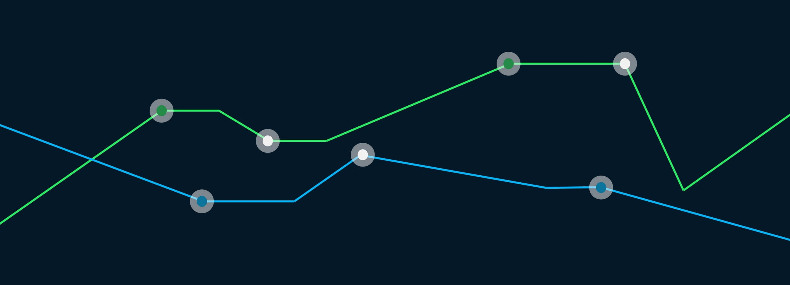

```{r setup, include=FALSE}
knitr::opts_chunk$set(echo = TRUE)
```

# Programming Languages study

It’s important to stay informed about trends in programming languages and technologies. Knowing what languages are growing or shrinking can help you decide where to invest. An excellent source to gain a better understanding of popular technologies is [Stack Overflow](https://stackoverflow.com/). Stack overflow is an online question-and-answer site for coding topics. By looking at the number of questions about each technology, you can get an idea of how many people are using it.

In this project, I extract : 

1. The fraction of the total number of questions asked in 2019 had the tag R

2. The five most asked tags over the last 5 years (2015-2020)

[](#) [](#) [![](https://img.shields.io/badge/Skimr-white?logo=data:image/png;base64,iVBORw0KGgoAAAANSUhEUgAAAAkAAAAKCAMAAABR24SMAAAAIGNIUk0AAHomAACAhAAA+gAAAIDoAAB1MAAA6mAAADqYAAAXcJy6UTwAAAELUExURQ0iKRs1Phw3QAwhKAwiKhMmLxoyOwkeJg4gJxcwORs3QRgzPBMoLwYYHhoxOiZBSyZGUSQ9Rx41PhkxOQQXHhk0PTVSXStKVBcyPCA9SB47Rh88Rxw6RB06RBk3QR06RRo3QhgzPCc9RiFASxYwOgARFxMmLh84QT1YX09laj1TWBYtNQERGAEVHQ4nMRMvOQ0nMQAEDylLV1NueEpncTxaZVlUVmFsbS5QXVtlYY6JgGBvdWN2fWF4fiRIVExdW5+Rf2Fxd0dncz1cZyVHUyVJVSpXZ1h1fVd2gFFveTNSXSNFUS1GUDZRXV5+iFh5hF96gShKVUFRWHaPkoGWmICRkkdiaU5nbf///0wIfYsAAAAydFJOUwAAAAAAAAAAFHnTexUKUcD7+8JSC6319rHx9e7x7vHx9aDw8qcGRbX4+blJBw5tyXEQaAy9hAAAAAFiS0dEWO21xI4AAAAJcEhZcwAALiMAAC4jAXilP3YAAAAHdElNRQfnCQkPLDit4jhsAAAFynpUWHRSYXcgcHJvZmlsZSB0eXBlIHhtcAAAWMOdWUmW6zYM3OMUOQJJcJCO41jSLu9lmeOnCpSsiZLs337dtkUQQ2EgwJb//vlX/sKP+uhE36XTV+nyUFweciox++D4Pb/zWJRrOoSQfY55yiEnfdXnH+ophOBkZYOHf3NL6uKQXHBR81SwMThNYdSIXxeCju4VHF9QIYB51lcKMUrMB/l1kTp0JeLl9AWZU7GfMBYQhdFElDCp156vMIk6DXgQ8HeoTPCupQdbqF26MFAAl1ddjhrFmJMUzYoHvZnWA4URGs4EwCVANpCghgBix2j7Kp2sRgG6DqwaZplO4wo3PgO/PGBl3kPTvIE43ctbxcWqu2qsLopgRY3lJH0mXAEFYjHHMLVZGL5OEUeA0wAf8KD/XjNE3Rvo6QKEHJHgIiyfyVa9wIAenao2dPweEnmSnGnMOaocxIT8XgUJCYk+NiYGPeMHmlSJ/ntTZQZuiMMvbscuvzUwD8LHXwMM/8FXuQboXqh8L7VoigUhAJopgbKoRX0AfYpIkVxxYTZ9GZIl9qwPe61km9m5INzp3DUYZ2c/C5HZeiZs/i3Plj3VePklz6p+bWHyHdDnarTUpCX/BeBlSPTwQZccUrZLgL8EfLfqpONxPbg9BdhV0/S91pVntld6ycKgbmOqoPgTxpouHwaaUErjXuh2j7Q23aMBredPW23FUFgK5tn6wNQ9GN9gk4HRo/yNAX3T6A44w2tXVve/GS0zgzkJrS7Ox1ICC7CNMB2nHCKsOwjd7ZHjpkegbStzMSkqgWfuKyMb5zZTfw9nk/g5spnpfS0mCMW44JGQOEiTwYowi9le2GGXfBs7qW/hCJ+xMXizQj6SPorouE+uZRxJ70XIKuPiVH9Fj/iNpVjV/JvYRBYdNB3oYz5+bh6Qm86HLR8bqgsD145A/kz+kWHs5cIcRBGi5xMMqCEdWJcr8GfT/sSUo2j5VfaVU6QmH080HsjAp0eKxisDrvWX3wy4Firfqn52QGQ3nOx7ylF+N6Jtg/yZ/DPDxf1La4n2F+UV0nNCLUIvyRWWixLudZfPYMIW1N8pfy9M7qTtNKVeOh8F03mHtMH9ST8TIdcyGlp9TNpAP++Ua/h+006eZT1oSWtc6cXOgsIOLFqqPju6rak8ADnLexa3qdk2dbDRYm0caJyO+WOysUffa8dCg1IuMFgHC+I32szmrQNI6LKxcW6cKYoV4EX3B3RAUVXRgGKCHvAd3zDqDHhHP8+JDkw4T3s8K6ze6IqT9njmTbukam3Ns/xnvSV2tUzR3tL/4q8LsNtbmPnr+M7OxJq9tIw3dnNhp7CsE064jZ+DoHXgerEFy17o0lqqEFrvOlPvSVaKOzFyJcdahmxnrmfSRIsmdkNoBZcpaul6jVEX6VwNLk5JQ3/U6o7hI9hNDZEgZIC2hxcGiCq7L2BkIZoSThGP2Hsh9Hr89ZpsucNnV6eUNrMzWvKFV75LEWihaFsCwjzityAdQI1XshRxTCF86pBCxdIGZZXwamJCYT3wIirPKfIo/zm+pGGKZ0u19ImFh2S2ODqK3NHJkyzbvkmYh0ZrJW4l5I7ptlJsEl6uMv5Q3Dg+41RdrmEqcss9Ae90xFoFc+D6GF5gcWNsdQw3CzqrdfQkvNZrZAHErpBrKUx0P7SDWcGczTDoTiY09Wke2QdDpvnU4Jzm87vN6BOS9Bx7SLVqhAwqULko5yG1StzXkLS7t8FuQL0ZkmbzQIX1jMBMNK0/GfKVPheN1ucq55XmSTbV6Cb4rDhMIA47fDcNlJgylbzOrd8ti4tOe93j7N4CESj1tETV25Q3a5AbxAtti73s+B/uQT6FdIQJe+anGxO5Vz365GI/s3R7Zstac15DPC13W5dDc73iONLJmfAu89jobBsxTuIcUFFGFlXXo2WNq+ttx7t2uH973X6+bd/+q2BTakIEOdeqUN6+yfbfGIb+/1lGpWk/z7w8AAAAAW9yTlQBz6J3mgAAAGxJREFUCNdjYGDk4OTi5mFiZuDl4xcwEhQSFmEQFTM2MTUzF5dgkLSwtLK2sTWSYpC2s3dwdHJ2kWGQdXVz9/D08pZjkPfx9fMPCPRWYFBUCgoOCQ1TVmFQVVPXCNfU0tZhYGHV1dM3MGRjBwCi0g9ywaBxfgAAACV0RVh0ZGF0ZTpjcmVhdGUAMjAyMy0wOS0wOVQxNTo0NDo0OSswMDowMB4ckgUAAAAldEVYdGRhdGU6bW9kaWZ5ADIwMjMtMDktMDlUMTU6NDQ6NDkrMDA6MDBvQSq5AAAAKHRFWHRkYXRlOnRpbWVzdGFtcAAyMDIzLTA5LTA5VDE1OjQ0OjU2KzAwOjAwArZ7EQAAABN0RVh0ZGM6Rm9ybWF0AGltYWdlL3BuZ+iGYEMAAAAMdEVYdEdJTVA6QVBJADIuMCVKDT4AAAAUdEVYdEdJTVA6UGxhdGZvcm0ATWFjIE9TAIeToAAAAB90RVh0R0lNUDpUaW1lU3RhbXAAMTU0NzI1NDE1NTI0NjYxMCfgZn0AAAATdEVYdEdJTVA6VmVyc2lvbgAyLjEwLjYQ4DkOAAAAE3RFWHR4bXA6Q29sb3JTcGFjZQBzUkdC7l5lRwAAABl0RVh0eG1wOkNyZWF0b3JUb29sAEdJTVAgMi4xMOp1O/AAAAAgdEVYdHhtcDpFeGlmVmVyc2lvbgBFeGlmIFZlcnNpb24gMi4xWvYRwwAAACh0RVh0eG1wOkZsYXNoUGl4VmVyc2lvbgBGbGFzaFBpeCBWZXJzaW9uIDEuMDqxq68AAAAYdEVYdHhtcDpPcmllbnRhdGlvbgBUb3AtbGVmdLhu5eEAAAAXdEVYdHhtcDpQaXhlbFhEaW1lbnNpb24ANTY0CgPGowAAABd0RVh0eG1wOlBpeGVsWURpbWVuc2lvbgA4MDYngHIsAAAAF3RFWHR4bXA6UmVzb2x1dGlvblVuaXQASW5jaNkxk10AAAASdEVYdHhtcDpYUmVzb2x1dGlvbgA3Mg+qMtIAAAASdEVYdHhtcDpZUmVzb2x1dGlvbgA3MpKl06QAAABFdEVYdHhtcE1NOkRvY3VtZW50SUQAZ2ltcDpkb2NpZDpnaW1wOjliNDQ5ODExLTEzNjItNGM5NC1iZDJjLWI1MTc3ZGI0MGI1OF1f4FwAAAA9dEVYdHhtcE1NOkluc3RhbmNlSUQAeG1wLmlpZDplYjE0MzhhMy1iNDNjLTQ3ZjgtYWE5MS03ZWNmZTlhMWRjNTOFh1HWAAAARXRFWHR4bXBNTTpPcmlnaW5hbERvY3VtZW50SUQAeG1wLmRpZDoyY2UyNzk3MC1jZGM5LTQwMjktOTkxYy1lNGM5M2Q0NmE1NTnc9iDYAAAAAElFTkSuQmCC)](#)



## Libraries

```{r importations, warning = FALSE}
# install.packages("librarian")
librarian::shelf(tidyverse, 
                 skimr, 
                 patchwork, quiet = TRUE)
```

## Datasets
```{r, warning = FALSE}
df_stack_overflow <- read.csv("datasets/stack_overflow_data.csv")
```

::: {style="background-color: #efebe4; color: #05192d; text-align:left; vertical-align: middle; padding: 15px 25px 15px 25px; line-height: 1.6;"}
::: {style="font-size:20px"}
<b>datasets/stack_overflow_data.csv</b> 
:::
<ul>
<li><b>year:</b> The year the question was asked.</li>
<li><b>tag:</b> A word or phrase that describes the topic of the question.</li>
<li><b>number:</b> The number of questions with a certain tag in that year.</li>
<li><b>year_total:</b> The total number of questions asked in that year.</li>
</ul>
:::

### Numeric description

```{r general_explorations, warning = FALSE}
print(data.frame(
  Variables = c("Number of lines", 
               "Nombre de columns",
               "Nombre de continuous columns", 
               "Nombre de discretous variables", 
               "Memory allocation"),
  df_stack_overflow = c(nrow(df_stack_overflow), 
                  ncol(df_stack_overflow),
                  length(select_if(df_stack_overflow,is.numeric)), 
                  length(select(df_stack_overflow, -names(select_if(df_stack_overflow, is.numeric) ) ) ), 
                  paste(as.character(round(object.size(df_stack_overflow)/1024), 2), "kb") ) ) )
```

The ten first row of clinic_dataset are :

```{r head_df_stack_overflow, warning = FALSE}
head(df_stack_overflow, n = 10)
```

About missing data :

```{r missing_df_stack_overflow, warning = FALSE}
print(data.frame(variables = names(df_stack_overflow), 
                 n_NA = apply(df_stack_overflow, 2, function(.x) {sum(is.na(.x) )} ), 
                 percent_NA = apply(df_stack_overflow, 2, 
                                    function(.x) { paste(round(sum(is.na(.x) ) / 
                                                                 nrow(df_stack_overflow) * 100, 2) , "%") } ) ) )
```

### Graphic description
```{r graph_df_stack_overflow_1, warning = FALSE}
df_stack_overflow %>%
  ggplot(aes(year, y = year_total, fill = year)) +
    geom_col() +
    theme(legend.position = "none") +
    labs(x = "Year",
         y = "Total number of questions", 
         title = "Total number of questions, by year")
```

```{r graph_df_stack_overflow_2, warning = FALSE}
df_stack_overflow %>%
  group_by(year) %>%
  arrange(desc(number)) %>%
  slice_max(number, n = 5) %>%
  ggplot( aes(y = tag, x = log(number), fill = tag)) +
    geom_col(position = position_dodge2() ) +
    facet_wrap(~year, scales="free_y") +
    theme(legend.position="none") +
  labs(x = "Number of questions (logarithm scale)", 
       y= "Tags", 
       title = "Number of questions per tags, by year")
```

```{r, warning = FALSE}
p <- df_stack_overflow %>%
  ggplot(aes(year, y = year_total, fill = year)) +
    geom_col() +
    theme(legend.position = "none") +
    labs(x = "Year",
         y = "Total number of questions", 
         title = "Total number of questions, by year")
q <- df_stack_overflow %>%
  group_by(year) %>%
  arrange(desc(number)) %>%
  slice_max(number, n = 5) %>%
  ggplot( aes(y = tag, x = log(number), fill = tag)) +
    geom_col(position = position_dodge2() ) +
    facet_wrap(~year, scales="free_y") +
    theme(legend.position="none") +
  labs(x = "Number of questions (logarithm scale)", 
       y= "Tags", 
       title = "Number of questions per tags, by year")
ggsave("outputs/number of questions.jpg", plot = (p / q))
```

## Fraction of the total number of questions asked in 2019 had the tag R

```{r Q1_fraction_total_number_questions_2019_tag_r}
# ---------- 3. Q1 : r_percentage ----------
r_percentage <- df_stack_overflow %>%
    filter(year == 2019) %>%
    filter(tag == "r") %>%
    summarize(fraction = number/year_total*100)
print(r_percentage)
```

The fraction of the total number of questions asked in 2019 with the tag R is `r r_percentage` .

## Five most asked tags over the last 5 years (2015-2020)
```{r Q2_top_5_most_asked_tags}
highest_tags <- df_stack_overflow %>%
    filter(year >= 2015, year <= 2020) %>%
    group_by(tag) %>%
    summarise(n = sum(number)) %>%
    arrange(desc(n)) %>% slice(1:5) %>% pull(tag)

highest_tags <- as.character(highest_tags)
print(highest_tags)
```

The five most askeg tags over the last 5 years (2015-2020) are `r print(highest_tags)` .

## Session informations

```{r session_info}
sessionInfo()
```