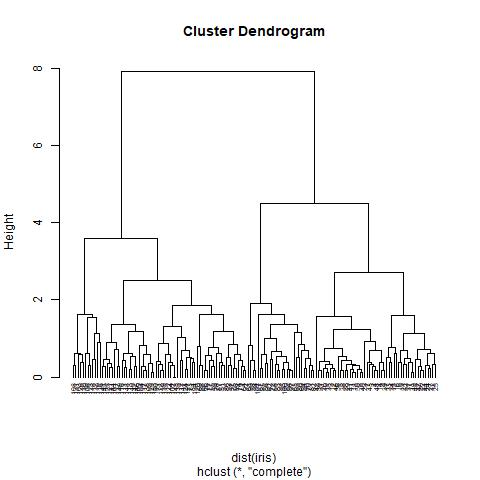

<!-- ## 👋 Welcome to my portfolio

Hello! My name is Matt, and I set up this page to showcase some of the data science projects I've been working on.

At age 18, while working as a cold caller in a telesales team at Ovo Energy, I built my first data product: a recommendation engine which predicted customers' propensity to buy. The tool helped me double my sales rate and, after I'd persuaded senior managers to take it into production, boosted our whole team's sales by 10%. 

The reason I tell this story is because I think it shows what data can and should be: a tool for empowering people and uplifting businesses. 

In the past 8 years, I've studied at two of the world's best universities and worked in a variety of industries, gaining experience in machine learning, strategy, analytics and marketing. My [CV](https://mattschapman.github.io/pdf/Matt_Chapman_CV.pdf) has plenty of information about the professional projects I've worked on, but the purpose of this page is to showcase some of my favourite personal (on-the-side) projects in a more visual way. 

If you have any questions, feel free to drop me an [email](mailto:mattchapmanmsc@gmail.com) or send me a message on [LinkedIn](https://www.linkedin.com/in/matt-chapman-ba8488118/). 

Thanks for reading,

Matt -->

---

## Selected data science projects

----

### 5. Predict Health Outcomes of Horses

This project come from the following Kaggle competition : https://www.kaggle.com/competitions/playground-series-s3e22/overview. The dataset for this competition (both train and test) was generated from a deep learning model trained on a portion of the Horse Survival Dataset. The objective of this project is to train the model to prediction outcome. The metric is micro-averaged F1-score.

 

 [![](https://img.shields.io/badge/pandas-white?logo=data:image/png;base64,iVBORw0KGgoAAAANSUhEUgAAAMIAAAEDCAMAAABQ/CumAAAAeFBMVEX///8TB1QAAEb/ygDnBIgPAFLNzNYTAFnQ0NgMAFcAAETb2eP39/oUBlfV1N7/xwDmAID/9tfLydcjG17/4Yz//vbCwM3ykcL61OfoBIwyKmgAADYAAE0AAErx8PTIxdT/+un/34T85/Lyir/lAHv50eX+9fkpH2Ma8J+4AAACEklEQVR4nO3dzVIaQRSAUYNCEIGoiYmJivnP+79hFrmLVHELZ6pnmG483xqaPruh5lb32ZkkSZIkSZIkvb52z7dZU2+rT4uH2X6rx6m31afF7M1+87dTb6tPCDWEUEMINYRQQ5MS1tu0nqtMSrhKn26e1v1WmZawyn58g4DQL4QIoSyECKEshAihLIQIoSyECKEshAihLIQIoSyECKEshAihLIQIoSyECOFA6cvM5a4nYb29yjoO4WmVvM58WPQkbF8e+RqPcDlPVp4t+xLS/W0QEBCqI8yTLpsizN8n/WmJ0CEEBAQEBAQEBIT2CF+/fci6a4hw8y7rvC3CeRYCAgICAgICAgICAgICwlCEtJYIdzdp/3+kdkKHToFQ+RjJMCEcCKF7CAdC6B7CgRC6Nylh9zGtJUJ6uNCsnsOFhhkvPAHC9x+fsloi/Pp5nXTREuH++iLpMwICAgICAgICAgICAgKC/87R7/u0lggdQkBAQEBAQEB4dYQON67UTqh9KuwkDlRBQED4R8gOF5o3Rdh8yepLGO0ez6MNPO+WQ9w3NilhvBAihLIQIoSyECKEshAihLIQIoSyECKEshAihLIQIoSyECKEshAihLIQIoSyEKJt+lL0SNeADUR4TG9cGWXHew10AkPP4aRBO9ohEuOFUEMINYRQQwg1dAKEDvd41t5t2u7lL0qSJEmSJEnSyfUXeomSFq0EzbkAAAAASUVORK5CYII=)](#)       [![](https://img.shields.io/badge/Xgboost-white?logo=data:image/png;base64,iVBORw0KGgoAAAANSUhEUgAAAAoAAAAKCAMAAAC67D+PAAAAIGNIUk0AAHomAACAhAAA+gAAAIDoAAB1MAAA6mAAADqYAAAXcJy6UTwAAACuUExURQAAAC6o4Cum3yak3zqt4uvx+Wu/6Eex4zWr4Rqf3BCb2zCn3y2m3y2m3iWj3iyl3i+n3y6n3jKo3y+o4C+o4C2n3y2n3yel30ey5Fu75zOq4Sel3yel3yyn3yqm3yak3imm3ymm3yqm3yyn3yqm3yml3yak3yil3yWk3iel3iel3yel3yml3yil3yqm3zGo4C6n3yql3iKi3Sik3Sym3yym3yum3iym3i+n3wAAAEVLK78AAAA5dFJOUwAAAAAAAAAAAAAAAAAAAAAAAAASGSIgIQIBDF6KeYSdaF9jZntmbn6GhYGEgIJhCAcNDAgKCQsKCankUGkAAAABYktHRACIBR1IAAAACXBIWXMAAA7YAAAO2AEHSJGmAAAAB3RJTUUH5wsdFRIsQvdCYgAAAAFvck5UAc+id5oAAABPSURBVAjXY2DAChgZmZiYWVjZ2DkYhEVExcQlOLkkpRikZWTl5BUUlZRVGFTV1DU0tbR1dPUY9A0MjYxNTM3MLRi4eXj5+AUEeAWFsBsLADroBl2z3xGNAAALQGVYSWZJSSoACAAAAAgAAAEEAAEAAADoAwAAAQEEAAEAAAD0AQAAAgEDAAMAAABuAAAAGgEFAAEAAAB0AAAAGwEFAAEAAAB8AAAAKAEDAAEAAAADAAAAMQECAAwAAACEAAAAMgECABQAAACQAAAApAAAAAgACAAIACYAAAABAAAAJgAAAAEAAABHSU1QIDIuMTAuOAAyMDE5OjA0OjIzIDE0OjEwOjI0AAgAAAEEAAEAAAAAAQAAAQEEAAEAAACAAAAAAgEDAAMAAAAKAQAAAwEDAAEAAAAGAAAABgEDAAEAAAAGAAAAFQEDAAEAAAADAAAAAQIEAAEAAAAQAQAAAgIEAAEAAAAvCgAAAAAAAAgACAAIAP/Y/+AAEEpGSUYAAQEAAAEAAQAA/9sAQwAIBgYHBgUIBwcHCQkICgwUDQwLCwwZEhMPFB0aHx4dGhwcICQuJyAiLCMcHCg3KSwwMTQ0NB8nOT04MjwuMzQy/9sAQwEJCQkMCwwYDQ0YMiEcITIyMjIyMjIyMjIyMjIyMjIyMjIyMjIyMjIyMjIyMjIyMjIyMjIyMjIyMjIyMjIyMjIy/8AAEQgAgAEAAwEiAAIRAQMRAf/EAB8AAAEFAQEBAQEBAAAAAAAAAAABAgMEBQYHCAkKC//EALUQAAIBAwMCBAMFBQQEAAABfQECAwAEEQUSITFBBhNRYQcicRQygZGhCCNCscEVUtHwJDNicoIJChYXGBkaJSYnKCkqNDU2Nzg5OkNERUZHSElKU1RVVldYWVpjZGVmZ2hpanN0dXZ3eHl6g4SFhoeIiYqSk5SVlpeYmZqio6Slpqeoqaqys7S1tre4ubrCw8TFxsfIycrS09TV1tfY2drh4uPk5ebn6Onq8fLz9PX29/j5+v/EAB8BAAMBAQEBAQEBAQEAAAAAAAABAgMEBQYHCAkKC//EALURAAIBAgQEAwQHBQQEAAECdwABAgMRBAUhMQYSQVEHYXETIjKBCBRCkaGxwQkjM1LwFWJy0QoWJDThJfEXGBkaJicoKSo1Njc4OTpDREVGR0hJSlNUVVZXWFlaY2RlZmdoaWpzdHV2d3h5eoKDhIWGh4iJipKTlJWWl5iZmqKjpKWmp6ipqrKztLW2t7i5usLDxMXGx8jJytLT1NXW19jZ2uLj5OXm5+jp6vLz9PX29/j5+v/aAAwDAQACEQMRAD8A+f6KKKACiiigAooooAKKKKACiiigAooooAKKKKACiiigAooooAKKKKACiiigAooooAKKKKACiiigAooooAKKKKACiiigAooooAKKKKACiiigAooooAKKKKACiiigAooooAKKKKACiiigAooooAKKKKACiiigAooooAKKKKACiiigAooooAKKKKACiiigAooooAKKKKACiiigAooooAKKKKACiiigAooooAKKKKACiiigAooooAKKKKACiiigAooooAKKKKACiiigAooooAKKKKACiiigAoor15PDWmeKPCGjra20ViZbeBvtK28SvmMiKd3PBcfLM4XcCxC9+K1p0nUuo9FcxrVo0rOWzdjyGivaG0bRrK0svD39lQvdXVurvdCzTfFbBsSzl2RyHkIZEGcKzdVATNXULrwd4Wgs9OvbKCSRY9wSKwhuJlHUNM7leWySBk8dlUrnX6q1dykkl+fYxWMUrKEW29beXfXv0PIaK9W0i10DxLrFzrNhpsMdpYokbpJbpH5s0gYLmIFo9ipEx42tvYE7u2usfh+81HUtKg0e1leyXyryX+yoo4kc/KY1kA3BwdwBAU/IxU8A04YRzWklq7LfUmpjlBtOD0V3tp+P5HiVFdg3gm91bxPq8OnQw2Gm21/NbiW5kby4trNhB953IAUHAYjcu7Gc1n6p4L13SmhMlmbiG4uTa28tqfNEsmflAA+YFuqhgCecDg453TmlzW0OpVYOXLdX7dTn6K7ZvhdrqWfmG5037ZnH2H7T+8zu2/fx5XT5vv8AT34rL0XwVrOtTzKIksooJWgnnvSY1jkAJKFQC5YYAIVTt3LnAOabpVE0uV6iVak02pKy312OdortF+GWt/2lHGxil00TxxT6janekSsMlyjbXwAGHIGSMA5IzpePPC9hBpFvqGh6TFaR27SG98ueRtqExLGT5jnPzMw+X8e1V9Xqcrk1sR9apc0YKSvLY85ooorE6AooooAKKKKACiiigAooooAKKKKACiiigAooooAKKKKACiiigCexs7jUb+2sbVBJc3MqwxIWC7nYgAZOAOSOTxXuWl6V/Y2hWWlCYXDWscjNMpcrIfMXeU3cBFaWMADbndu2gs2PJ/B/iO28MatNe3OnNeiS3aBVSZYmjLFcsGKPj5QynAGQxGcZB0YPH80fjGfWZLRzYzQG1axjuMEQjBVQ7K2DvVXJCjLbuAGIrrwtaFF873/TqcONoVMRF01orfe+i9DubXS2Txz4w1Gad3kE1usAVyUW3uFaaNDkZBVEiUAcDBAyMGrcehLNfeJNT1fS5WnOpLBayX2nIYZrVVZYTCzLzhU+YjII8s5zk15/qXxCMviOLV9L0mG1xY/Y5orlxOZxuLBmZVQ5HyAY5xGoyRkVsN8VNNRWe28N3KzgZjM2pK6Bu25RCpYZ6gEZ9R1rWlWopJSfwt9L3uYVqGIbk4r4klva1jtdJ0pYBJbvZW1sbnUrhnXTrU7hBCRbjKKMswMMz7VzkyHAy2KuaBqOp39zptxq2mX1pcfbTELDUizMU+TDgMq8EswHHVDye3m2m/EjSNP0aw0//hG7thaQLFlNUCqzcl2AMLEbnLNjJxuwOMVneIfiFLqlpJZ6XYnTreZNsrPcedMw53KHCqAhBGRtzwRuwSKuOKpxglfZPS3V+ZnPBVZ1ZNrdrW+yVuh6Bq2l+IrLw9Fo+g2STanbeTpji0iyIhtYSTKcAJl1JMjAYMhbhsEb1/b6fdvqU4dNsF99psoQFw5BdNwUjoglByMbWZDkcZ8s0X4lQ2Ok29nqWjy3k1ughSe3vFt90agBQymNgSAMZGMgDIzknn18aa6urC/+2uQGb/RSzeRtbbuTZn7p2JnvlVOcgGksVSSW7207WG8FWk2tFbmd+rb29LHqls2sy69qBubC9t9Djtlisjc24iEk7GIu6nGZFPlyFWycKw+7uwdZWOpRW9pZ6dfWjzC5tYGeGUpcM3mym4gnK7DvBeVfmyCOAQFJ831f4mrcae0Oj6XcafdNwLmW9ExjXvsAjTa3o2TjnAzgi3D8V7Nogbvw2wnI2stjfC3gCjhVSMxOVAXAxuPTjA4DWJgnbm7vVd+m4ng6rjdwV9FZO1rddu/kdYLO9tLrSTZ61ey6atvd/abS+dWaRl8tQS6KplwbhCokHybGweQK4v4lXviLT7k6RN50OiXMcMsB+zLGLj92jsPNCgyBXbkFiAQvGQMUV+I903iddQntXOlpG8CabFMF2xtg/fKn5yyozPtydoHC4UUfGPjBPFC2MEGntZ21p5jKstx5zsz7Q3zBVG3CLgY9eTkAYVa0JU3GDa1v8jpo0KsasZ1En7tr+d7nLUUUVxnoBRRRQAUUUUAFFFFABRRRQAUUUUAFFFFABRRRQAUUUUAFFFFABRRRQAUUUUAFFFFABRRRQAUUUUAFFFFABRRRQAUUUUAFFFFABRRRQAUUUUAFFFFABRRRQAUUUUAFFFFABRRRQAUUUUAFFFFABRRRQAUUUUAFFFFABRRRQAUUUUAFFFFABRRRQAUUUUAFFFFABRRRQAUUUUAFFFFABRRRQAUUUUAFFFFABRRRQAUUUUAFFFFABRRRQAUUUUAFFFFABRRRQAUUUUAFFFFABRRRQB//2QBGf/JeAAAAJXRFWHRkYXRlOmNyZWF0ZQAyMDIzLTExLTI5VDIxOjE4OjM4KzAwOjAw3eclLQAAACV0RVh0ZGF0ZTptb2RpZnkAMjAyMy0xMS0yOVQyMToxODozOCswMDowMKy6nZEAAAAodEVYdGRhdGU6dGltZXN0YW1wADIwMjMtMTEtMjlUMjE6MTg6NDQrMDA6MDA2yt8jAAAAGnRFWHRleGlmOkJpdHNQZXJTYW1wbGUAOCwgOCwgOBLtPicAAAAhdEVYdGV4aWY6RGF0ZVRpbWUAMjAxOTowNDoyMyAxNDoxMDoyNFDWNLAAAAAUdEVYdGV4aWY6SW1hZ2VMZW5ndGgANTAwepCB2QAAABR0RVh0ZXhpZjpJbWFnZVdpZHRoADEwMDAXFjEKAAAAGXRFWHRleGlmOlNvZnR3YXJlAEdJTVAgMi4xMC44SYxETQAAAABJRU5ErkJggg==)](#)

Skills developed: Supervised learning (LightGBM? CatBoost, Xgboost), Model optimization (optuna), Model tracking (MLFlow)

[View code on Github](https://github.com/petoulemonde/horse_health_prediction_project/blob/master/notebook_horse_health_prediction_project.html)

----

### 4. Naïve Bees: Predict Species from Images

**Short name**: naive_bees

**Language**: Python

**Tags**: Data manipulation, Data visualization, Machine learning

**Principal packages**: pandas, PIL, numpy, matplotlib, scikit-image, scikit-learn

**Description**: The question at hand is: can a machine identify a bee as a honey bee or a bumble bee? These bees have different behaviors and appearances, but given the variety of backgrounds, positions, and image resolutions it can be a challenge for machines to tell them apart.

Being able to identify bee species from images is a task that ultimately would allow researchers to more quickly and effectively collect field data. Pollinating bees have critical roles in both ecology and agriculture, and diseases like colony collapse disorder threaten these species. Identifying different species of bees in the wild means that we can better understand the prevalence and growth of these important insects.

---

### 3. SMS spam detection

**Short name**: sms_spam

**Language**: Python

**Tags**: Data manipulation, Natural language processing, Supervised machine learning, deep learning

**Principal packages**: Pandas, Numpy, Keras

**Description**: Spam is unsolicited and unwanted messages sent electronically and whose content may be malicious. Email spam is sent/received over the Internet while SMS spam is typically transmitted over a mobile network. We’ll refer to user that sent spam as ‘spammers’. SMS messages are usually very cheap (if not free) for the user to send, making it appealing for unrightful exploitation. This is further aggravated by the fact that SMS is usually regarded by the user as a safer, more trustworthy form of communication than other sources, e. g., emails.

The dangers of spam messages for the users are many: undesired advertisement, exposure of private information, becoming a victim of a fraud or financial scheme, being lured into malware and phishing websites, involuntary exposition to inappropriate content, etc. For the network operator, spam messages result in an increased cost in operations.

In the case under study, spam is an annoyance to the user and thus detrimental to the quality of the service that hurts the brand in the process. This can lead to complaints, low ratings and even loss of users, not to mention users getting scammed.

---

### 2. [Iris dataset exploration](https://github.com/petoulemonde/iris_project)

The data set includes 50 samples of each of the three iris species (Iris setosa, Iris virginica and Iris versicolor).  Four characteristics were measured from each sample: length and width of sepals and petals, in centimetres. In this project, I found the best algorithm to predict species.

 

 [![](https://img.shields.io/badge/Skim-white?logo=data:image/png;base64,iVBORw0KGgoAAAANSUhEUgAAABoAAAAeCAYAAAAy2w7YAAAAIGNIUk0AAHomAACAhAAA+gAAAIDoAAB1MAAA6mAAADqYAAAXcJy6UTwAAAAGYktHRAD/AP8A/6C9p5MAAAAJcEhZcwAALiMAAC4jAXilP3YAAAAHdElNRQfnCwUQOwpH2uXvAAAFynpUWHRSYXcgcHJvZmlsZSB0eXBlIHhtcAAAWMOdWUmW6zYM3OMUOQJJcJCO41jSLu9lmeOnCpSsiZLs337dtkUQQ2EgwJb//vlX/sKP+uhE36XTV+nyUFweciox++D4Pb/zWJRrOoSQfY55yiEnfdXnH+ophOBkZYOHf3NL6uKQXHBR81SwMThNYdSIXxeCju4VHF9QIYB51lcKMUrMB/l1kTp0JeLl9AWZU7GfMBYQhdFElDCp156vMIk6DXgQ8HeoTPCupQdbqF26MFAAl1ddjhrFmJMUzYoHvZnWA4URGs4EwCVANpCghgBix2j7Kp2sRgG6DqwaZplO4wo3PgO/PGBl3kPTvIE43ctbxcWqu2qsLopgRY3lJH0mXAEFYjHHMLVZGL5OEUeA0wAf8KD/XjNE3Rvo6QKEHJHgIiyfyVa9wIAenao2dPweEnmSnGnMOaocxIT8XgUJCYk+NiYGPeMHmlSJ/ntTZQZuiMMvbscuvzUwD8LHXwMM/8FXuQboXqh8L7VoigUhAJopgbKoRX0AfYpIkVxxYTZ9GZIl9qwPe61km9m5INzp3DUYZ2c/C5HZeiZs/i3Plj3VePklz6p+bWHyHdDnarTUpCX/BeBlSPTwQZccUrZLgL8EfLfqpONxPbg9BdhV0/S91pVntld6ycKgbmOqoPgTxpouHwaaUErjXuh2j7Q23aMBredPW23FUFgK5tn6wNQ9GN9gk4HRo/yNAX3T6A44w2tXVve/GS0zgzkJrS7Ox1ICC7CNMB2nHCKsOwjd7ZHjpkegbStzMSkqgWfuKyMb5zZTfw9nk/g5spnpfS0mCMW44JGQOEiTwYowi9le2GGXfBs7qW/hCJ+xMXizQj6SPorouE+uZRxJ70XIKuPiVH9Fj/iNpVjV/JvYRBYdNB3oYz5+bh6Qm86HLR8bqgsD145A/kz+kWHs5cIcRBGi5xMMqCEdWJcr8GfT/sSUo2j5VfaVU6QmH080HsjAp0eKxisDrvWX3wy4Firfqn52QGQ3nOx7ylF+N6Jtg/yZ/DPDxf1La4n2F+UV0nNCLUIvyRWWixLudZfPYMIW1N8pfy9M7qTtNKVeOh8F03mHtMH9ST8TIdcyGlp9TNpAP++Ua/h+006eZT1oSWtc6cXOgsIOLFqqPju6rak8ADnLexa3qdk2dbDRYm0caJyO+WOysUffa8dCg1IuMFgHC+I32szmrQNI6LKxcW6cKYoV4EX3B3RAUVXRgGKCHvAd3zDqDHhHP8+JDkw4T3s8K6ze6IqT9njmTbukam3Ns/xnvSV2tUzR3tL/4q8LsNtbmPnr+M7OxJq9tIw3dnNhp7CsE064jZ+DoHXgerEFy17o0lqqEFrvOlPvSVaKOzFyJcdahmxnrmfSRIsmdkNoBZcpaul6jVEX6VwNLk5JQ3/U6o7hI9hNDZEgZIC2hxcGiCq7L2BkIZoSThGP2Hsh9Hr89ZpsucNnV6eUNrMzWvKFV75LEWihaFsCwjzityAdQI1XshRxTCF86pBCxdIGZZXwamJCYT3wIirPKfIo/zm+pGGKZ0u19ImFh2S2ODqK3NHJkyzbvkmYh0ZrJW4l5I7ptlJsEl6uMv5Q3Dg+41RdrmEqcss9Ae90xFoFc+D6GF5gcWNsdQw3CzqrdfQkvNZrZAHErpBrKUx0P7SDWcGczTDoTiY09Wke2QdDpvnU4Jzm87vN6BOS9Bx7SLVqhAwqULko5yG1StzXkLS7t8FuQL0ZkmbzQIX1jMBMNK0/GfKVPheN1ucq55XmSTbV6Cb4rDhMIA47fDcNlJgylbzOrd8ti4tOe93j7N4CESj1tETV25Q3a5AbxAtti73s+B/uQT6FdIQJe+anGxO5Vz365GI/s3R7Zstac15DPC13W5dDc73iONLJmfAu89jobBsxTuIcUFFGFlXXo2WNq+ttx7t2uH973X6+bd/+q2BTakIEOdeqUN6+yfbfGIb+/1lGpWk/z7w8AAAAAW9yTlQBz6J3mgAACFdJREFUSMd9lnmMXVUdxz/nnLu8fZu3zNpZOrRT2sJQKNakhRhrEYgiMeJCDALRAGqjEhMM/us/JojiH5JoUEyMy19GgxhZhFBKtaFlAg62pdPOdDqd7c2bt9333t2Of7zXgoL8/ro5N/f7vfe7nHvgQ+aO+x+CeI6t+27GLAyR2XbNtsTY9icTY9t/mZ7ctUuk84zfeACAT9334IdBoT5o8d6HH6EeKtrtDjXHIZfNZduud08Yhj+KZ3K32rH4tNduH7SiMZVKJucaoXAitk20r8gdn7+bmWNHPpzo6997lDCew/UCFhcvMDY2btVqtduq1c2fKDvyYDJfLKXyRaLJFGY01hf6/qFmvXYglUxWBwaH5i5dWvIt26Zvyzjx/p1sLLx9BVtcvvjEl+7lb795iokbb+Lc8VcYmd63p+k0v4Uy7kxk+xKRZBoNKKVQSqHRhH6AU9ukWSm3tO/9OR6LPb5w8tg/+qam9e7bP8vsi8+y9sZrXaKJA7dQXlokEk+wMn+Oq3bsGKlUKl/1Q31/JJUeTOdLKMsCrQmCACEEhmGglCIIAkKtCX2fenkNp7qxGvr+U1rIJ9v16nyir0C7UacwvAVlZvO4rRambScM0/xCq93+qRlL3FUcGU2m+grYERs0aK0RoiuAZZlIKXBrVVrLF3BWlojmSyRy+XgYBPs7LeegMk3PtKyzvut2hFSo9Jathtdp3eR12o+Zkdi3U6X+oYnJbWwdG2ViZIjltXVMpWh3XLTWXRmkxGs08E69Qbh6Ed2okhrZwt4brsWKJWj7uhj6/m2dVnOvVGolEk9cUNixH0hl/DBdHLi2f3RcJdNpxoeHSCcTpBJxOq5HMZthsJgnm0qSTSXpz/exsbbGl6e3s+fq7Zy5cJFrrr+WPdfv5sTsHBgmdjwphVJbfbfz6U6zUTK01h9PFUq5ZF+BTDpFIhbDCwJsy6LWaDJUKmIoiW2ZBH5A23U5u7CItiOkRye468D1FHbvZte+aWbmLuG0XZSUCMsiXShhWXa6vDh/0EAQCCkBKG9WqTUdtNa8/c4chhKMpGziiRTn1ms0nBau5+EHAVJKfv/vBYxSgdFtV9FouRybOYXreRhKonu+IgUIAgN6C3T1DwIfPwhodVw+OiD5/v4EsnANr664rFcbnF+vML++ieP6RJNpfn3sDLUX3+Qrt36EuYsrSCHQuosDAnq+GgBSSpRUPaKQwA8QgONDyvKJ503mzzZYXVrhMzfsZLCYwdeaowsVfvyXoyQiNpVqnY1qA9CEoUZK2X31XlINNL1FjUAQhgGe56G1ZqGmWa77THVWGSwW+cWfnuPomXkm8hmG+wuIWBrPC5gY72O1XMHzPIQAKRVCCMSVHUFgaDS+7+P3vsL3fYIgAKARmJxvKnZUL7Gz/yp2DJVYKFc4sbjK7IZDWxsEfsjkUJ6Ts6d7Je4+L6VE90oOmise6TAk1BqtNVIKIsk0ZiLNb880SUWavOnO8MldW7GjETAt/vqvec4sl0ln4kRNyUq5ihCiR0BPwrDrv+55dHmuFFJIZDSBaZscWwEvmubuQ1dzbr2BHTUxELT0PEEQsqWQZW2jQsNxUFISBCGiF4gwDAlDjeZ/iKB7U0hJICSeF2JbBm8trHH8zBIvvXmOQirGaCnLdZNDTA32MTVS5NmjJ3pedENwGUf3FOK9REIIlOomTyuDIATP8zENRTYZZbPZ5lK5ysW1TWbeWUQHAamozUgxw9LqRk+RLlkQhF0i3q2NcZnd9/0rRFlL4WuPui+xJEwOFdg5NkDTDSlXG5QrNdYqNQbyWWpOm47nY5oGvh+gNUgpCMOuBUJIBGAIQArZ25m1jhIg5k8L1w2xd+zBw2JyuMjcUpmIodg92o89OUw8YjE2kOO5oyd7EnUrI4QgDDVCXN7xu98kEQJlKJRhoIQIh2OmrqsImXiE65LdFFmmwfpmnY16g1OLK7x+ep4gDPE8n/mLy3ieRxAEaN0tq9ZgGGZPoW6fJFoLr9NBCgFSqbNtLcN8if6BEnOXVumLmYz2Zxjrz5GK2RhSkIjalHIJ0CHr1TqxaIR4NNIFFQIpxZWoEwZotFR2ruS7TnPSdztFZZoIZVDQLgVCZjcdJsdHCIVB1FLs3z3B3qlRJof6SNomsahNJhljetsYGsHiyvq7RfU8GuU1GpX18yB+LsgUyBQHxjy384AyrXuj8XixKMGwY9SsCIfv+xy5bIqXT55huVIDDbap2NqfI2pIZk6fxzQVY4NF2q7H86+9Qa28TqNSrvpu5w9SqSfqZ2ffEjc/9Agzzz/Ddfd8U5z81RP7CMPvItXtkUyfZScSpBIJpqfG2btzK8VMglBrnLZH3DZRQuAF3V/B4mqFF149zusnZvxOs/l3BI8l86UXGuU1P1UoIUYOfIxmuYZl29QrZaamdsQvzM/f2Wq3D1vxxN54Lo8yLYQQRG2TTCJGLGJhKAM/CGi0XNbLG5RXlmnXq7OGUk9I0/qd23Kq0WSKIPCJxdPvHre++I3v8NLLr5BOp5g/fw4rluj33c79UhkPRJKp4UgqgzLMXrJCEAIdBrj1Gq3a5kro+08rw/hZrbx2Pts/iOs4JPJFVk4c+e8D5Fv/fI3G6hJ2YZiNUzNEcsVGfW72FStbeNFzHNtrO5NCSNuwLNDgOg2c8mqr06j/ETh8y+FHn547fmRz+uBt1DfWqZyaoXlp4f0HyPfO8PYdtIw4hm3T3NwgmsqYrc3KIeBhMxo9AEK6LecY6MetWPwZz3Fa0VSGwPcwIklWT7z0PswPJLo8hen9uE4NaRh06nWsWKzgdzpf02hbGdaTXru5ZMVThL5HPJNl+fUj/xfrP2na98EiSovEAAAAJXRFWHRkYXRlOmNyZWF0ZQAyMDIzLTExLTA1VDE2OjU5OjA0KzAwOjAwud8wigAAACV0RVh0ZGF0ZTptb2RpZnkAMjAyMy0xMS0wNVQxNjo1OTowNCswMDowMMiCiDYAAAAodEVYdGRhdGU6dGltZXN0YW1wADIwMjMtMTEtMDVUMTY6NTk6MTArMDA6MDCnco1kAAAAE3RFWHRkYzpGb3JtYXQAaW1hZ2UvcG5n6IZgQwAAAAx0RVh0R0lNUDpBUEkAMi4wJUoNPgAAABR0RVh0R0lNUDpQbGF0Zm9ybQBNYWMgT1MAh5OgAAAAH3RFWHRHSU1QOlRpbWVTdGFtcAAxNTQ3MjU0MTU1MjQ2NjEwJ+BmfQAAABN0RVh0R0lNUDpWZXJzaW9uADIuMTAuNhDgOQ4AAAATdEVYdHhtcDpDb2xvclNwYWNlAHNSR0LuXmVHAAAAGXRFWHR4bXA6Q3JlYXRvclRvb2wAR0lNUCAyLjEw6nU78AAAACB0RVh0eG1wOkV4aWZWZXJzaW9uAEV4aWYgVmVyc2lvbiAyLjFa9hHDAAAAKHRFWHR4bXA6Rmxhc2hQaXhWZXJzaW9uAEZsYXNoUGl4IFZlcnNpb24gMS4wOrGrrwAAABh0RVh0eG1wOk9yaWVudGF0aW9uAFRvcC1sZWZ0uG7l4QAAABd0RVh0eG1wOlBpeGVsWERpbWVuc2lvbgA1NjQKA8ajAAAAF3RFWHR4bXA6UGl4ZWxZRGltZW5zaW9uADgwNieAciwAAAAXdEVYdHhtcDpSZXNvbHV0aW9uVW5pdABJbmNo2TGTXQAAABJ0RVh0eG1wOlhSZXNvbHV0aW9uADcyD6oy0gAAABJ0RVh0eG1wOllSZXNvbHV0aW9uADcykqXTpAAAAEV0RVh0eG1wTU06RG9jdW1lbnRJRABnaW1wOmRvY2lkOmdpbXA6OWI0NDk4MTEtMTM2Mi00Yzk0LWJkMmMtYjUxNzdkYjQwYjU4XV/gXAAAAD10RVh0eG1wTU06SW5zdGFuY2VJRAB4bXAuaWlkOmViMTQzOGEzLWI0M2MtNDdmOC1hYTkxLTdlY2ZlOWExZGM1M4WHUdYAAABFdEVYdHhtcE1NOk9yaWdpbmFsRG9jdW1lbnRJRAB4bXAuZGlkOjJjZTI3OTcwLWNkYzktNDAyOS05OTFjLWU0YzkzZDQ2YTU1Odz2INgAAAAASUVORK5CYII=)](#)  [![](https://img.shields.io/badge/Corrplot-white?logo=data:image/jpeg;base64,/9j/4AAQSkZJRgABAQEAYABgAAD//gA7Q1JFQVRPUjogZ2QtanBlZyB2MS4wICh1c2luZyBJSkcgSlBFRyB2NjIpLCBxdWFsaXR5ID0gOTAK/9sAQwADAgIDAgIDAwMDBAMDBAUIBQUEBAUKBwcGCAwKDAwLCgsLDQ4SEA0OEQ4LCxAWEBETFBUVFQwPFxgWFBgSFBUU/9sAQwEDBAQFBAUJBQUJFA0LDRQUFBQUFBQUFBQUFBQUFBQUFBQUFBQUFBQUFBQUFBQUFBQUFBQUFBQUFBQUFBQUFBQU/8AAEQgAHgAeAwEiAAIRAQMRAf/EABsAAQABBQEAAAAAAAAAAAAAAAgGAQIEBQcJ/8QALhAAAQQBAgQFAwQDAAAAAAAAAQIDBAURBiEABxIxCBQVIkETMmEWIyRxUVKB/8QAFwEAAwEAAAAAAAAAAAAAAAAAAQYHAv/EACYRAAEDAgUEAwEAAAAAAAAAAAECAxEABAUTITFBUWGB8FJxweH/2gAMAwEAAhEDEQA/ANPY2z/K6VbLcuPqacX6kpx5d/ZrfDxs20hICWx/qPjCh1KUerAPoPyK1fB1TQzFRZnmlLtJvQQ9KcBSHk59zyEkfcNuwzt84pq7kVV6pq5cUzLpxT/WCj1V1KSFSkPq36T2UnYfA2/IGV7qHUXhJ1lNkSZrDtQtm0nk2morCUoqesUJR7EoA6sJH95WSrOAWlSm8Tay25kE8+/ylZKXbB3Mc6e+ffvoauctfGGofVbZth1p24SlMextcdCbBlIJw1sd/jsO2x4Zda5GuW/OMuurDZUz7CtKTuCchWMnYb4/r54BHNbwvX1ZCsrSDZ2KoM+LNlhx/V8wD+TYMOIwgM9inBIPc4KsqSOJpyZ1xAp7edXztQFUkzrhQQu9spHtRKYRnKmhnf5O++fk8ILaw0swek8VaL2wbv7VLzE6E8hXftG1Y/OJ3y1PaWv6ifYdaRJZCE6ontt49WaGSEtdxnH+B23A4inhd5rxq/VNlBtrKFawjMvHVifbzp+wmshCehxnBTsCD3P3HpJxw9l1qLuE6zMBZCnen+OvukL6gckdz0jI/wCfngc625PT6Spvp1dOszJPqKkhep5LSf3bNlZ+1nIzjJ/PfPfgOIUwCknXjxW8NurfE28haDuRv8h+RRG1drG85f6pvlLv1ulZuFNsr1VYLSoKsWwn2hsDOASBsFAFSilSUpLs8LvM2n1JT2jvq6JDxt7QgpsJkjb6rJVhTrQOMqGOxwQcZJxbzN8MFfqLTtv9W1vlPPJlJIVfuYw7NZeUOosk4ynOMdwM5O4P9PB1fyq5kSaaokvzY0py6mEz9Uzeoq880gklLQ92wycErJJJBABo6su6ZKUTAqHpUtp3UidK/9k=)](#) [![](https://img.shields.io/badge/FactoMineR-white?logo=data:image/jpeg;base64,/9j/4AAQSkZJRgABAQAAAQABAAD/2wBDAAMCAgICAgMCAgIDAwMDBAYEBAQEBAgGBgUGCQgKCgkICQkKDA8MCgsOCwkJDRENDg8QEBEQCgwSExIQEw8QEBD/2wBDAQMDAwQDBAgEBAgQCwkLEBAQEBAQEBAQEBAQEBAQEBAQEBAQEBAQEBAQEBAQEBAQEBAQEBAQEBAQEBAQEBAQEBD/wAARCAAeAB4DAREAAhEBAxEB/8QAGgAAAgIDAAAAAAAAAAAAAAAABAcFBgIDCP/EACsQAAAFAwMEAQMFAAAAAAAAAAECAwQFAAYRBxIhCDFBYRMUFVEWIjJCkf/EABoBAAIDAQEAAAAAAAAAAAAAAAcIAwQGBQn/xAAuEQABAwMDAwIFBAMAAAAAAAABAgMEBREhAAZBBxIxCBMUIjJRYRUjQoFxkcH/2gAMAwEAAhEDEQA/AEHatpwD6CgoGBtYr6XkCnERMcxU26YGwY5zdgEA5AB71f3FuGmbRpYmSgCpX0p+50Yd8772v0x2uifNbC31D5EZznzq9MunbTNOdLbl2LqTUiogLpIpw2ARIBwPIe6XGr9TNwT2zKj2bavawznSG7o66bu3Ek1SMQyyFdoAsbfYZ1HDoTbq7Z7LaeKndN2Kx0ftK4fGmoqX+Qbx5xXfoXVSZSn24tcbC21gG/IB5sNbTZPqGqu1pbUPdTQeZWASb5APNhpdakwdlvYiKdxUEZufeokugfcUyaheDBgecZzgfNMM65T50VqVDyhXgjOnhlu0TcVJi1SkgKbcvn/n9abnTg8hYKx/1VNTCLY08b5ClcHAuNnHFKv1SmS6xWjFaQVJawAOL687OvtcqG7N1riNoKm2MJAyBcX0frBe9tRrBO6LcnGSkoJfovkTVATFRNyOKz+3aVLfc+ElNkN/VkcjQ/2fRZsh4wJrSg39WR/IeNGWnrBZraIZx0UxdyLk6RVFys0t4mVEP3CPuoKlt2ct5TrqglIOO42xqCq7RqTslx6SsISCQO42xxpJa9TJWVzluMke+ZpSZQKVs6S2bBKHIgHujx0nmqRBXTnVhSW8gpN/Om+9OW4XY1Kdo0p0OIZymxuB3HOmP0+DBuIZOz7lZtVEy5PDkckAxlU+5xLn3WI6s0KXSJaatGKux3yRwRgX0LfUds+ftqsIr0AqSxIF7ji2M6uGoem8JcoNbUh7eaNFFDg4UcgiAFAgcCXjzQ5olbfhd02Q4VAYtfQM2/uGXTiqfIdUoD5QCefvo21rLgXdvqMfshoNZioZr9Q3AElFQJ/fcHge9V59Ufale77nuBQ7rHIF+Laq1Sry2ZodDvvBYCu1WQCeLfjXPGq6bGUligjLqycC3MZJk6XOKhjKhwoXcPfA0y/TaivU+lipS0Btb3AFsDwbafLoDtCRTKCa5UWUoVJ8JtawT4NvzrRAakxz20I9krCqlcsh3N3Ca20xDgOQHIc4z3DzW/koh1WEYc5vvSdHCbIpG69u/o9Vi97Zx5yP8HjUst1ly9kiVrc1uhMuRDhdM4JYD8YxQJrvR6Ml+8F7sQc2IvpLt8+nKJCmd1Nk+20rISQTb+9Yveo+Z1JYG2sDR8GuG10zTUwqoXzhQOS13tr9L6XRVpnVD95SfHA/1zrd9NPT3RKSW6vWVfEWOE+Bf8/fVT1K1LjV4uJYsbfBs3bCcCEA4f6P5H3RbqEppbaG0oskeBpnK/uFh1ppiMz2JRgAeLa//9k=)](#)     [![](https://img.shields.io/badge/FactoMineR-white?logo=data:image/jpeg;base64,/9j/4AAQSkZJRgABAQEAYABgAAD/4REKRXhpZgAATU0AKgAAAAgABAE7AAIAAAAVAAAISodpAAQAAAABAAAIYJydAAEAAAAqAAAQ2OocAAcAAAgMAAAAPgAAAAAc6gAAAAgAAAAAAAAAAAAAAAAAAAAAAAAAAAAAAAAAAAAAAAAAAAAAAAAAAAAAAAAAAAAAAAAAAAAAAAAAAAAAAAAAAAAAAAAAAAAAAAAAAAAAAAAAAAAAAAAAAAAAAAAAAAAAAAAAAAAAAAAAAAAAAAAAAAAAAAAAAAAAAAAAAAAAAAAAAAAAAAAAAAAAAAAAAAAAAAAAAAAAAAAAAAAAAAAAAAAAAAAAAAAAAAAAAAAAAAAAAAAAAAAAAAAAAAAAAAAAAAAAAAAAAAAAAAAAAAAAAAAAAAAAAAAAAAAAAAAAAAAAAAAAAAAAAAAAAAAAAAAAAAAAAAAAAAAAAAAAAAAAAAAAAAAAAAAAAAAAAAAAAAAAAAAAAAAAAAAAAAAAAAAAAAAAAAAAAAAAAAAAAAAAAAAAAAAAAAAAAAAAAAAAAAAAAAAAAAAAAAAAAAAAAAAAAAAAAAAAAAAAAAAAAAAAAAAAAAAAAAAAAAAAAAAAAAAAAAAAAAAAAAAAAAAAAAAAAAAAAAAAAAAAAAAAAAAAAAAAAAAAAAAAAAAAAAAAAAAAAAAAAAAAAAAAAAAAAAAAAAAAAAAAAAAAAAAAAAAAAAAAAAAAAAAAAAAAAAAAAAAAAAAAAAAAAAAAAAAAAAAAAAAAAAAAAAAAAAAAAAAAAAAAAAAAAAAAAAAAAAAAAAAAAAAAAAAAAAAAAAAAAAAAAAAAAAAAAAAAAAAAAAAAAAAAAAAAAAAAAAAAAAAAAAAAAAAAAAAAAAAAAAAAAAAAAAAAAAAAAAAAAAAAAAAAAAAAAAAAAAAAAAAAAAAAAAAAAAAAAAAAAAAAAAAAAAAAAAAAAAAAAAAAAAAAAAAAAAAAAAAAAAAAAAAAAAAAAAAAAAAAAAAAAAAAAAAAAAAAAAAAAAAAAAAAAAAAAAAAAAAAAAAAAAAAAAAAAAAAAAAAAAAAAAAAAAAAAAAAAAAAAAAAAAAAAAAAAAAAAAAAAAAAAAAAAAAAAAAAAAAAAAAAAAAAAAAAAAAAAAAAAAAAAAAAAAAAAAAAAAAAAAAAAAAAAAAAAAAAAAAAAAAAAAAAAAAAAAAAAAAAAAAAAAAAAAAAAAAAAAAAAAAAAAAAAAAAAAAAAAAAAAAAAAAAAAAAAAAAAAAAAAAAAAAAAAAAAAAAAAAAAAAAAAAAAAAAAAAAAAAAAAAAAAAAAAAAAAAAAAAAAAAAAAAAAAAAAAAAAAAAAAAAAAAAAAAAAAAAAAAAAAAAAAAAAAAAAAAAAAAAAAAAAAAAAAAAAAAAAAAAAAAAAAAAAAAAAAAAAAAAAAAAAAAAAAAAAAAAAAAAAAAAAAAAAAAAAAAAAAAAAAAAAAAAAAAAAAAAAAAAAAAAAAAAAAAAAAAAAAAAAAAAAAAAAAAAAAAAAAAAAAAAAAAAAAAAAAAAAAAAAAAAAAAAAAAAAAAAAAAAAAAAAAAAAAAAAAAAAAAAAAAAAAAAAAAAAAAAAAAAAAAAAAAAAAAAAAAAAAAAAAAAAAAAAAAAAAAAAAAAAAAAAAAAAAAAAAAAAAAAAAAAAAAAAAAAAAAAAAAAAAAAAAAAAAAAAAAAAAAAAAAAAAAAAAAAAAAAAAAAAAAAAAAAAAAAAAAAAAAAAAAAAAAAAAAAAAAAAAAAAAAAAAAAAAAAAAAAAAAAAAAAAAAAAAAAAAAAAAAAAAAAAAAAAAAAAAAAAAAAAAAAAAAAAAAAAAAAAAAAAAAAAAAAAAAAAAAAAAAAAAAAAAAAAAAAAAAAAAAAAAAAAAAAAAAAAAAAAAAAAAAAAAAAAAAAAAAAAAAAAAAAAAAAAAAAAAAAAAAAAAAAAAAAAAAAAAAAAAAAAAAAAAAAAAAAAAAAAAAAAAAAAAAAAAAAAAAAAAAAAAAAAAAAAAAAAAAAAAAAAAAAAAAAAAAAAAAAAAAAAAAAAAAAAAAAAAAAAAAAAAAAAAAAAAAAAAAAAAAAAAAAAAAAAAAAAAAAAAAAAAAAAAAAAAAAAAAAAAAAAAAAAAAAAAAAAAAAAAAAAAAAAAAAAAAAAAAAAAAAAAAAAAAAAAAAAAAAAAAAAAAAAAAAAAAAAAAAAAAAAAAAAAAAAAAAAAAAAAAAAAAAAAAAAAAAAAAAAAAAAAAAAAAAAAAAAAAAAAAAAAAAAAAAAAAAAAAAAAAAAAAAAAAAAAAAAAAAAAAAAAAAAAAAAAAAAAAAAAAAAAAAAAAAAAAAAAAAAAAAAAAAAAAAAAAAAAAAAAAAAAAAAAAAAAAAAAAAAAAAAAAAAAAAAAAAAAAAAAAAAAAAAAAAAAAAAAAAAAAAAAAAAAAAAAAAAAAAAAAAAAAAAAAAAAAAAAAAAAAAAAAAAAAAAAAAAAAAAAAAAAAAAAAAAAAAAAAAAAAAAAAAAAAAAAAAAAAAAAAAAAAAAAAAAAAAAAAAAAAAAAAAAAAAAAAAAAAAAAAAAAAAAAAAAAAAAAAAAAAAAAAAAAAAAAAAAAAAAAAAAAAAAAAAAAAAAAAAAAAAAAAAAAAAAAAAAAAAAAAAAAAAAAAAAAAAAAAAAAAAAAAAAAAAAAAAAAAAAAAAAAAAAAAAAAAAAAAAAAAAAAAAAAAAAAAAAAAAAAAAAAAAAAAAAAAAAAAAAAAAAAAAAAAAAAAAAAAAAAAAAAAAAAAAAAAAAAAAAAAAAAAAAAAAAAAAAAAAAAAAAAAAAAAAAAAAAAAAAAAAAAAAAAAAAAAAAAAAAAAAAAAAAAAAAAAAAAAAAAAAAFBpZXJyZS1FdGllbm5lX2xvY2FsAAAABZADAAIAAAAUAAAQrpAEAAIAAAAUAAAQwpKRAAIAAAADNDkAAJKSAAIAAAADNDkAAOocAAcAAAgMAAAIogAAAAAc6gAAAAgAAAAAAAAAAAAAAAAAAAAAAAAAAAAAAAAAAAAAAAAAAAAAAAAAAAAAAAAAAAAAAAAAAAAAAAAAAAAAAAAAAAAAAAAAAAAAAAAAAAAAAAAAAAAAAAAAAAAAAAAAAAAAAAAAAAAAAAAAAAAAAAAAAAAAAAAAAAAAAAAAAAAAAAAAAAAAAAAAAAAAAAAAAAAAAAAAAAAAAAAAAAAAAAAAAAAAAAAAAAAAAAAAAAAAAAAAAAAAAAAAAAAAAAAAAAAAAAAAAAAAAAAAAAAAAAAAAAAAAAAAAAAAAAAAAAAAAAAAAAAAAAAAAAAAAAAAAAAAAAAAAAAAAAAAAAAAAAAAAAAAAAAAAAAAAAAAAAAAAAAAAAAAAAAAAAAAAAAAAAAAAAAAAAAAAAAAAAAAAAAAAAAAAAAAAAAAAAAAAAAAAAAAAAAAAAAAAAAAAAAAAAAAAAAAAAAAAAAAAAAAAAAAAAAAAAAAAAAAAAAAAAAAAAAAAAAAAAAAAAAAAAAAAAAAAAAAAAAAAAAAAAAAAAAAAAAAAAAAAAAAAAAAAAAAAAAAAAAAAAAAAAAAAAAAAAAAAAAAAAAAAAAAAAAAAAAAAAAAAAAAAAAAAAAAAAAAAAAAAAAAAAAAAAAAAAAAAAAAAAAAAAAAAAAAAAAAAAAAAAAAAAAAAAAAAAAAAAAAAAAAAAAAAAAAAAAAAAAAAAAAAAAAAAAAAAAAAAAAAAAAAAAAAAAAAAAAAAAAAAAAAAAAAAAAAAAAAAAAAAAAAAAAAAAAAAAAAAAAAAAAAAAAAAAAAAAAAAAAAAAAAAAAAAAAAAAAAAAAAAAAAAAAAAAAAAAAAAAAAAAAAAAAAAAAAAAAAAAAAAAAAAAAAAAAAAAAAAAAAAAAAAAAAAAAAAAAAAAAAAAAAAAAAAAAAAAAAAAAAAAAAAAAAAAAAAAAAAAAAAAAAAAAAAAAAAAAAAAAAAAAAAAAAAAAAAAAAAAAAAAAAAAAAAAAAAAAAAAAAAAAAAAAAAAAAAAAAAAAAAAAAAAAAAAAAAAAAAAAAAAAAAAAAAAAAAAAAAAAAAAAAAAAAAAAAAAAAAAAAAAAAAAAAAAAAAAAAAAAAAAAAAAAAAAAAAAAAAAAAAAAAAAAAAAAAAAAAAAAAAAAAAAAAAAAAAAAAAAAAAAAAAAAAAAAAAAAAAAAAAAAAAAAAAAAAAAAAAAAAAAAAAAAAAAAAAAAAAAAAAAAAAAAAAAAAAAAAAAAAAAAAAAAAAAAAAAAAAAAAAAAAAAAAAAAAAAAAAAAAAAAAAAAAAAAAAAAAAAAAAAAAAAAAAAAAAAAAAAAAAAAAAAAAAAAAAAAAAAAAAAAAAAAAAAAAAAAAAAAAAAAAAAAAAAAAAAAAAAAAAAAAAAAAAAAAAAAAAAAAAAAAAAAAAAAAAAAAAAAAAAAAAAAAAAAAAAAAAAAAAAAAAAAAAAAAAAAAAAAAAAAAAAAAAAAAAAAAAAAAAAAAAAAAAAAAAAAAAAAAAAAAAAAAAAAAAAAAAAAAAAAAAAAAAAAAAAAAAAAAAAAAAAAAAAAAAAAAAAAAAAAAAAAAAAAAAAAAAAAAAAAAAAAAAAAAAAAAAAAAAAAAAAAAAAAAAAAAAAAAAAAAAAAAAAAAAAAAAAAAAAAAAAAAAAAAAAAAAAAAAAAAAAAAAAAAAAAAAAAAAAAAAAAAAAAAAAAAAAAAAAAAAAAAAAAAAAAAAAAAAAAAAAAAAAAAAAAAAAAAAAAAAAAAAAAAAAAAAAAAAAAAAAAAAAAAAAAAAAAAAAAAAAAAAAAAAAAAAAAAAAAAAAAAAAAAAAAAAAAAAAAAAAAAAAAAAAAAAAAAAAAAAAAAAAAAAAAAAAAAAAAAAAAAAAAAAAAAAAAAAAAAAAAAAAAAAAAAAAAAAAAAAAAAAAAAAAAAAAAAAAAAAAAAAAAAAAAAAAAAAAAAAAAAAAAAAAAAAAAAAAAAAAAAAAAAAAAAAAAAAAAAAAAAAAAAAAAAAAAAAAAAAAAAAAAAAAAAAAAAAAAAAAAAAAAAAAAAAAAAAAAAAAAAAAAAAAAAAAAAAAAAAAAAAAAAAAAAAAAAAAAAAAAAAAAAAAAAAAAAAAAAAAAAAAAAAAAAAAAAAAAAAAAAAAAAAAAAAAAAAAAAAAAAAAAAAAAAAAAAAAAAAAAAAAAAAAAAAAAAAAAAAAAAAAAAAAAAAAAAAAAAAAAAAAAAAAAAAAAAAAAAAAAAAAAAAAAAAAAAAAAAAAAAAAAAAAAAAAAAAAAAAAAAAAAAAAAAAAAAAAAAAAAAAAAAAAAAAAAAAAAAAAAAAAAAAAAAAAAAAAAAAAAAAAAAAAAAAAAAAAAAAAAAAAAAAAAAAAAAAAAAAAAAAAAAAAAAAAAAAAAAAAAAAAAAAAAAAAAAAAAAAAAAAAAAAAAAAAAAAAAAAAAAAAAAAAAAAAAAAAAAAAAAAAAAAAAAAAAAAAAAAAAAAAAAAAAAAAAAAAAAAAAAAAAAAAAAAAAAAAAAAAAAAAAAAAAAAAAAAAAAAAAAAAAAAAAAAAAAAAAAAAAAAAAAAAAAAAAAAAAAAAAAAAAAAAAAAAAAAAAAAAAAAAAAAAAAAAAAAAAAAAAAAAAAAAAAAAAAAAAAAAAAAAAAAAAAAAAAAAAAAAAAAAAAAAAAAAAAAAAAAAAAAAAAAAAAAAAAAAAAAAAAAAAAAAAAAAAAAAAAAAAAAAAAAAAAAAAAAAAAAAAAAAAAAAAAAAAADIwMjM6MTE6MDUgMjI6Mzg6MzQAMjAyMzoxMTowNSAyMjozODozNAAAAFAAaQBlAHIAcgBlAC0ARQB0AGkAZQBuAG4AZQBfAGwAbwBjAGEAbAAAAP/hCydodHRwOi8vbnMuYWRvYmUuY29tL3hhcC8xLjAvADw/eHBhY2tldCBiZWdpbj0n77u/JyBpZD0nVzVNME1wQ2VoaUh6cmVTek5UY3prYzlkJz8+DQo8eDp4bXBtZXRhIHhtbG5zOng9ImFkb2JlOm5zOm1ldGEvIj48cmRmOlJERiB4bWxuczpyZGY9Imh0dHA6Ly93d3cudzMub3JnLzE5OTkvMDIvMjItcmRmLXN5bnRheC1ucyMiPjxyZGY6RGVzY3JpcHRpb24gcmRmOmFib3V0PSJ1dWlkOmZhZjViZGQ1LWJhM2QtMTFkYS1hZDMxLWQzM2Q3NTE4MmYxYiIgeG1sbnM6ZGM9Imh0dHA6Ly9wdXJsLm9yZy9kYy9lbGVtZW50cy8xLjEvIi8+PHJkZjpEZXNjcmlwdGlvbiByZGY6YWJvdXQ9InV1aWQ6ZmFmNWJkZDUtYmEzZC0xMWRhLWFkMzEtZDMzZDc1MTgyZjFiIiB4bWxuczp4bXA9Imh0dHA6Ly9ucy5hZG9iZS5jb20veGFwLzEuMC8iPjx4bXA6Q3JlYXRlRGF0ZT4yMDIzLTExLTA1VDIyOjM4OjM0LjQ4NzwveG1wOkNyZWF0ZURhdGU+PC9yZGY6RGVzY3JpcHRpb24+PHJkZjpEZXNjcmlwdGlvbiByZGY6YWJvdXQ9InV1aWQ6ZmFmNWJkZDUtYmEzZC0xMWRhLWFkMzEtZDMzZDc1MTgyZjFiIiB4bWxuczpkYz0iaHR0cDovL3B1cmwub3JnL2RjL2VsZW1lbnRzLzEuMS8iPjxkYzpjcmVhdG9yPjxyZGY6U2VxIHhtbG5zOnJkZj0iaHR0cDovL3d3dy53My5vcmcvMTk5OS8wMi8yMi1yZGYtc3ludGF4LW5zIyI+PHJkZjpsaT5QaWVycmUtRXRpZW5uZV9sb2NhbDwvcmRmOmxpPjwvcmRmOlNlcT4NCgkJCTwvZGM6Y3JlYXRvcj48L3JkZjpEZXNjcmlwdGlvbj48L3JkZjpSREY+PC94OnhtcG1ldGE+DQogICAgICAgICAgICAgICAgICAgICAgICAgICAgICAgICAgICAgICAgICAgICAgICAgICAgICAgICAgICAgICAgICAgICAgICAgICAgICAgICAgICAgICAgICAgICAgICAgICAgCiAgICAgICAgICAgICAgICAgICAgICAgICAgICAgICAgICAgICAgICAgICAgICAgICAgICAgICAgICAgICAgICAgICAgICAgICAgICAgICAgICAgICAgICAgICAgICAgICAgICAKICAgICAgICAgICAgICAgICAgICAgICAgICAgICAgICAgICAgICAgICAgICAgICAgICAgICAgICAgICAgICAgICAgICAgICAgICAgICAgICAgICAgICAgICAgICAgICAgICAgIAogICAgICAgICAgICAgICAgICAgICAgICAgICAgICAgICAgICAgICAgICAgICAgICAgICAgICAgICAgICAgICAgICAgICAgICAgICAgICAgICAgICAgICAgICAgICAgICAgICAgCiAgICAgICAgICAgICAgICAgICAgICAgICAgICAgICAgICAgICAgICAgICAgICAgICAgICAgICAgICAgICAgICAgICAgICAgICAgICAgICAgICAgICAgICAgICAgICAgICAgICAKICAgICAgICAgICAgICAgICAgICAgICAgICAgICAgICAgICAgICAgICAgICAgICAgICAgICAgICAgICAgICAgICAgICAgICAgICAgICAgICAgICAgICAgICAgICAgICAgICAgIAogICAgICAgICAgICAgICAgICAgICAgICAgICAgICAgICAgICAgICAgICAgICAgICAgICAgICAgICAgICAgICAgICAgICAgICAgICAgICAgICAgICAgICAgICAgICAgICAgICAgCiAgICAgICAgICAgICAgICAgICAgICAgICAgICAgICAgICAgICAgICAgICAgICAgICAgICAgICAgICAgICAgICAgICAgICAgICAgICAgICAgICAgICAgICAgICAgICAgICAgICAKICAgICAgICAgICAgICAgICAgICAgICAgICAgICAgICAgICAgICAgICAgICAgICAgICAgICAgICAgICAgICAgICAgICAgICAgICAgICAgICAgICAgICAgICAgICAgICAgICAgIAogICAgICAgICAgICAgICAgICAgICAgICAgICAgICAgICAgICAgICAgICAgICAgICAgICAgICAgICAgICAgICAgICAgICAgICAgICAgICAgICAgICAgICAgICAgICAgICAgICAgCiAgICAgICAgICAgICAgICAgICAgICAgICAgICAgICAgICAgICAgICAgICAgICAgICAgICAgICAgICAgICAgICAgICAgICAgICAgICAgICAgICAgICAgICAgICAgICAgICAgICAKICAgICAgICAgICAgICAgICAgICAgICAgICAgICAgICAgICAgICAgICAgICAgICAgICAgICAgICAgICAgICAgICAgICAgICAgICAgICAgICAgICAgICAgICAgICAgICAgICAgIAogICAgICAgICAgICAgICAgICAgICAgICAgICAgICAgICAgICAgICAgICAgICAgICAgICAgICAgICAgICAgICAgICAgICAgICAgICAgICAgICAgICAgICAgICAgICAgICAgICAgCiAgICAgICAgICAgICAgICAgICAgICAgICAgICAgICAgICAgICAgICAgICAgICAgICAgICAgICAgICAgICAgICAgICAgICAgICAgICAgICAgICAgICAgICAgICAgICAgICAgICAKICAgICAgICAgICAgICAgICAgICAgICAgICAgICAgICAgICAgICAgICAgICAgICAgICAgICAgICAgICAgICAgICAgICAgICAgICAgICAgICAgICAgICAgICAgICAgICAgICAgIAogICAgICAgICAgICAgICAgICAgICAgICAgICAgICAgICAgICAgICAgICAgICAgICAgICAgICAgICAgICAgICAgICAgICAgICAgICAgICAgICAgICAgICAgICAgICAgICAgICAgCiAgICAgICAgICAgICAgICAgICAgICAgICAgICAgICAgICAgICAgICAgICAgICAgICAgICAgICAgICAgICAgICAgICAgICAgICAgICAgICAgICAgICAgICAgICAgICAgICAgICAKICAgICAgICAgICAgICAgICAgICAgICAgICAgICAgICAgICAgICAgICAgICAgICAgICAgICAgICAgICAgICAgICAgICAgICAgICAgICAgICAgICAgICAgICAgICAgICAgICAgIAogICAgICAgICAgICAgICAgICAgICAgICAgICAgICAgICAgICAgICAgICAgICAgICAgICAgICAgICAgICAgICAgICAgICAgICAgICAgICAgICAgICAgICAgICAgICAgICAgICAgCiAgICAgICAgICAgICAgICAgICAgICAgICAgICAgICAgICAgICAgICAgICAgICAgICAgICAgICAgICAgICAgICAgICAgICAgICAgICAgICAgICAgICAgICAgICAgICAgICAgICAKICAgICAgICAgICAgICAgICAgICAgICAgICAgIDw/eHBhY2tldCBlbmQ9J3cnPz7/2wBDAAcFBQYFBAcGBQYIBwcIChELCgkJChUPEAwRGBUaGRgVGBcbHichGx0lHRcYIi4iJSgpKywrGiAvMy8qMicqKyr/2wBDAQcICAoJChQLCxQqHBgcKioqKioqKioqKioqKioqKioqKioqKioqKioqKioqKioqKioqKioqKioqKioqKioqKir/wAARCAAeAB4DASIAAhEBAxEB/8QAGQAAAgMBAAAAAAAAAAAAAAAABAUCAwcG/8QAMBAAAQMCBAMGBQUAAAAAAAAAAQIDBAURAAYSIQcTMRQWIkFRkVNhk7LSIzIzVIH/xAAYAQACAwAAAAAAAAAAAAAAAAABAgAEBf/EABwRAQACAgMBAAAAAAAAAAAAAAEAEQIhEiJRgf/aAAwDAQACEQMRAD8ATVKdW6vmmchmXNkSHJLtkIeVewUegvYAAYBDtYMF2YJEzs7Kw245z1WSo+XXFi1R0ZqlKmyH47IkvanI/wC8eJVrYZRMvMSOGdTr3apAdjT22EMgjlqSdO6h6+Lr8sathXyUuytQBLGYVTUxAqeJC2ualsvKBKLXv1w/4c1+qxa/IDVQkaVxVFSVuFYJCk2Njffc++KsoUGn5pziiA3UZ4ZEFa1PXCXAtKQNIO/h39tvngTIQtmF4ekVf3owuSIkOHLSxjkPkjjJH7Ry9Ha5H8lrXsu3Xzvg116OOEma22nGheu+BCVDdOpNrD0sD7YAzDw9qcbMc9sSIi0l9S0qK1AkKOoXGnrvhb3EqnxYf1FfhiUKN+RrrU06O9Ca40Q1MuR0N93xcoUkJva/2gf5jNMh75ieI/rL+9GIdxKn8WH9RX4Y7Dhzw9nrq8qRJlxm222NH6epZJUoHzA28JwtGGLuHaz/2Q==)](#) [![](https://img.shields.io/badge/GtSummary-white?logo=data:image/jpeg;base64,/9j/4AAQSkZJRgABAQEAYABgAAD/4REKRXhpZgAATU0AKgAAAAgABAE7AAIAAAAVAAAISodpAAQAAAABAAAIYJydAAEAAAAqAAAQ2OocAAcAAAgMAAAAPgAAAAAc6gAAAAgAAAAAAAAAAAAAAAAAAAAAAAAAAAAAAAAAAAAAAAAAAAAAAAAAAAAAAAAAAAAAAAAAAAAAAAAAAAAAAAAAAAAAAAAAAAAAAAAAAAAAAAAAAAAAAAAAAAAAAAAAAAAAAAAAAAAAAAAAAAAAAAAAAAAAAAAAAAAAAAAAAAAAAAAAAAAAAAAAAAAAAAAAAAAAAAAAAAAAAAAAAAAAAAAAAAAAAAAAAAAAAAAAAAAAAAAAAAAAAAAAAAAAAAAAAAAAAAAAAAAAAAAAAAAAAAAAAAAAAAAAAAAAAAAAAAAAAAAAAAAAAAAAAAAAAAAAAAAAAAAAAAAAAAAAAAAAAAAAAAAAAAAAAAAAAAAAAAAAAAAAAAAAAAAAAAAAAAAAAAAAAAAAAAAAAAAAAAAAAAAAAAAAAAAAAAAAAAAAAAAAAAAAAAAAAAAAAAAAAAAAAAAAAAAAAAAAAAAAAAAAAAAAAAAAAAAAAAAAAAAAAAAAAAAAAAAAAAAAAAAAAAAAAAAAAAAAAAAAAAAAAAAAAAAAAAAAAAAAAAAAAAAAAAAAAAAAAAAAAAAAAAAAAAAAAAAAAAAAAAAAAAAAAAAAAAAAAAAAAAAAAAAAAAAAAAAAAAAAAAAAAAAAAAAAAAAAAAAAAAAAAAAAAAAAAAAAAAAAAAAAAAAAAAAAAAAAAAAAAAAAAAAAAAAAAAAAAAAAAAAAAAAAAAAAAAAAAAAAAAAAAAAAAAAAAAAAAAAAAAAAAAAAAAAAAAAAAAAAAAAAAAAAAAAAAAAAAAAAAAAAAAAAAAAAAAAAAAAAAAAAAAAAAAAAAAAAAAAAAAAAAAAAAAAAAAAAAAAAAAAAAAAAAAAAAAAAAAAAAAAAAAAAAAAAAAAAAAAAAAAAAAAAAAAAAAAAAAAAAAAAAAAAAAAAAAAAAAAAAAAAAAAAAAAAAAAAAAAAAAAAAAAAAAAAAAAAAAAAAAAAAAAAAAAAAAAAAAAAAAAAAAAAAAAAAAAAAAAAAAAAAAAAAAAAAAAAAAAAAAAAAAAAAAAAAAAAAAAAAAAAAAAAAAAAAAAAAAAAAAAAAAAAAAAAAAAAAAAAAAAAAAAAAAAAAAAAAAAAAAAAAAAAAAAAAAAAAAAAAAAAAAAAAAAAAAAAAAAAAAAAAAAAAAAAAAAAAAAAAAAAAAAAAAAAAAAAAAAAAAAAAAAAAAAAAAAAAAAAAAAAAAAAAAAAAAAAAAAAAAAAAAAAAAAAAAAAAAAAAAAAAAAAAAAAAAAAAAAAAAAAAAAAAAAAAAAAAAAAAAAAAAAAAAAAAAAAAAAAAAAAAAAAAAAAAAAAAAAAAAAAAAAAAAAAAAAAAAAAAAAAAAAAAAAAAAAAAAAAAAAAAAAAAAAAAAAAAAAAAAAAAAAAAAAAAAAAAAAAAAAAAAAAAAAAAAAAAAAAAAAAAAAAAAAAAAAAAAAAAAAAAAAAAAAAAAAAAAAAAAAAAAAAAAAAAAAAAAAAAAAAAAAAAAAAAAAAAAAAAAAAAAAAAAAAAAAAAAAAAAAAAAAAAAAAAAAAAAAAAAAAAAAAAAAAAAAAAAAAAAAAAAAAAAAAAAAAAAAAAAAAAAAAAAAAAAAAAAAAAAAAAAAAAAAAAAAAAAAAAAAAAAAAAAAAAAAAAAAAAAAAAAAAAAAAAAAAAAAAAAAAAAAAAAAAAAAAAAAAAAAAAAAAAAAAAAAAAAAAAAAAAAAAAAAAAAAAAAAAAAAAAAAAAAAAAAAAAAAAAAAAAAAAAAAAAAAAAAAAAAAAAAAAAAAAAAAAAAAAAAAAAAAAAAAAAAAAAAAAAAAAAAAAAAAAAAAAAAAAAAAAAAAAAAAAAAAAAAAAAAAAAAAAAAAAAAAAAAAAAAAAAAAAAAAAAAAAAAAAAAAAAAAAAAAAAAAAAAAAAAAAAAAAAAAAAAAAAAAAAAAAAAAAAAAAAAAAAAAAAAAAAAAAAAAAAAAAAAAAAAAAAAAAAAAAAAAAAAAAAAAAAAAAAAAAAAAAAAAAAAAAAAAAAAAAAAAAAAAAAAAAAAAAAAAAAAAAAAAAAAAAAAAAAAAAAAAAAAAAAAAAAAAAAAAAAAAAAAAAAAAAAAAAAAAAAAAAAAAAAAAAAAAAAAAAAAAAAAAAAAAAAAAAAAAAAAAAAAAAAAAAAAAAAAAAAAAAAAAAAAAAAAAAAAAAAAAAAAAAAAAAAAAAAAAAAAAAAAAAAAAAAAAAAAAAAAAAAAAAAAAAAAAAAAAAAAAAAAAAAAAAAAAAAAAAAAAAAAAAAAAAAAAAAAAAAAAAAAAAAAAAAAAAAAAAAAAAAAAAAAAAAAAAAAAAAAAAAAAAAAAAAAAAAAAAAAAAAAAAAAAAAAAAAAAAAAAAAAAAAAAAAAAAAAAAAAAAAAAAAAAAAAAAAAAAAAAAAAAAAAAAAAAAAAAAAAAAAAAAAAAAAAAAAAAAAAAAAAAAAAAAAAAAAAAAAAAAAAAAAAAAAAAAAAAAAAAAAAAAAAAAAAAAAAAAAAAAAAAAAAAAAAAAAAAAAAAAAAAAAAAAAAAAAAAAAAAAAAAAAAAAAAAAAAAAAAAAAAAAAAAAAAAAAAAAAAAAAAAAAAAAAAAAAAAAAAAAAAAAAAAAAAAAAAAAAAAAAAAAAAAAAAAAAAAAAAAAAAAAAAAAAAAAAAAAAAAAAAAAAAAAAAAAAAAAAAAAAAAAAAAAAAAAAAAAAAAAAAAAAAAAAAAAAAAAAAAAAAAAAAAAAAAAAAAAAAAAAAAAAFBpZXJyZS1FdGllbm5lX2xvY2FsAAAABZADAAIAAAAUAAAQrpAEAAIAAAAUAAAQwpKRAAIAAAADNjkAAJKSAAIAAAADNjkAAOocAAcAAAgMAAAIogAAAAAc6gAAAAgAAAAAAAAAAAAAAAAAAAAAAAAAAAAAAAAAAAAAAAAAAAAAAAAAAAAAAAAAAAAAAAAAAAAAAAAAAAAAAAAAAAAAAAAAAAAAAAAAAAAAAAAAAAAAAAAAAAAAAAAAAAAAAAAAAAAAAAAAAAAAAAAAAAAAAAAAAAAAAAAAAAAAAAAAAAAAAAAAAAAAAAAAAAAAAAAAAAAAAAAAAAAAAAAAAAAAAAAAAAAAAAAAAAAAAAAAAAAAAAAAAAAAAAAAAAAAAAAAAAAAAAAAAAAAAAAAAAAAAAAAAAAAAAAAAAAAAAAAAAAAAAAAAAAAAAAAAAAAAAAAAAAAAAAAAAAAAAAAAAAAAAAAAAAAAAAAAAAAAAAAAAAAAAAAAAAAAAAAAAAAAAAAAAAAAAAAAAAAAAAAAAAAAAAAAAAAAAAAAAAAAAAAAAAAAAAAAAAAAAAAAAAAAAAAAAAAAAAAAAAAAAAAAAAAAAAAAAAAAAAAAAAAAAAAAAAAAAAAAAAAAAAAAAAAAAAAAAAAAAAAAAAAAAAAAAAAAAAAAAAAAAAAAAAAAAAAAAAAAAAAAAAAAAAAAAAAAAAAAAAAAAAAAAAAAAAAAAAAAAAAAAAAAAAAAAAAAAAAAAAAAAAAAAAAAAAAAAAAAAAAAAAAAAAAAAAAAAAAAAAAAAAAAAAAAAAAAAAAAAAAAAAAAAAAAAAAAAAAAAAAAAAAAAAAAAAAAAAAAAAAAAAAAAAAAAAAAAAAAAAAAAAAAAAAAAAAAAAAAAAAAAAAAAAAAAAAAAAAAAAAAAAAAAAAAAAAAAAAAAAAAAAAAAAAAAAAAAAAAAAAAAAAAAAAAAAAAAAAAAAAAAAAAAAAAAAAAAAAAAAAAAAAAAAAAAAAAAAAAAAAAAAAAAAAAAAAAAAAAAAAAAAAAAAAAAAAAAAAAAAAAAAAAAAAAAAAAAAAAAAAAAAAAAAAAAAAAAAAAAAAAAAAAAAAAAAAAAAAAAAAAAAAAAAAAAAAAAAAAAAAAAAAAAAAAAAAAAAAAAAAAAAAAAAAAAAAAAAAAAAAAAAAAAAAAAAAAAAAAAAAAAAAAAAAAAAAAAAAAAAAAAAAAAAAAAAAAAAAAAAAAAAAAAAAAAAAAAAAAAAAAAAAAAAAAAAAAAAAAAAAAAAAAAAAAAAAAAAAAAAAAAAAAAAAAAAAAAAAAAAAAAAAAAAAAAAAAAAAAAAAAAAAAAAAAAAAAAAAAAAAAAAAAAAAAAAAAAAAAAAAAAAAAAAAAAAAAAAAAAAAAAAAAAAAAAAAAAAAAAAAAAAAAAAAAAAAAAAAAAAAAAAAAAAAAAAAAAAAAAAAAAAAAAAAAAAAAAAAAAAAAAAAAAAAAAAAAAAAAAAAAAAAAAAAAAAAAAAAAAAAAAAAAAAAAAAAAAAAAAAAAAAAAAAAAAAAAAAAAAAAAAAAAAAAAAAAAAAAAAAAAAAAAAAAAAAAAAAAAAAAAAAAAAAAAAAAAAAAAAAAAAAAAAAAAAAAAAAAAAAAAAAAAAAAAAAAAAAAAAAAAAAAAAAAAAAAAAAAAAAAAAAAAAAAAAAAAAAAAAAAAAAAAAAAAAAAAAAAAAAAAAAAAAAAAAAAAAAAAAAAAAAAAAAAAAAAAAAAAAAAAAAAAAAAAAAAAAAAAAAAAAAAAAAAAAAAAAAAAAAAAAAAAAAAAAAAAAAAAAAAAAAAAAAAAAAAAAAAAAAAAAAAAAAAAAAAAAAAAAAAAAAAAAAAAAAAAAAAAAAAAAAAAAAAAAAAAAAAAAAAAAAAAAAAAAAAAAAAAAAAAAAAAAAAAAAAAAAAAAAAAAAAAAAAAAAAAAAAAAAAAAAAAAAAAAAAAAAAAAAAAAAAAAAAAAAAAAAAAAAAAAAAAAAAAAAAAAAAAAAAAAAAAAAAAAAAAAAAAAAAAAAAAAAAAAAAAAAAAAAAAAAAAAAAAAAAAAAAAAAAAAAAAAAAAAAAAAAAAAAAAAAAAAAAAAAAAAAAAAAAAAAAAAAAAAAAAAAAAAAAAAAAAAAAAAAAAAAAAAAAAAAAAAAAAAAAAAAAAAAAAAAAAAAAAAAAAAAAAAAAAAAAAAAAAAAAAAAAAAAAAAAAAAAAAAAAAAAAAAAAAAAAAAAAAAAAAAAAAAAAAAAAAAAAAAAAAAAAAAAAAAAAAAAAAAAAAAAAAAAAAAAAAAAAAAAAAAAAAAAAAAAAAAAAAAAAAAAAAAAAAAAAAAAAAAAAAAAAAAAAAAAAAAAAAAAAAAAAAAAAAAAAAAAAAAAAAAAAAAAAAAAAAAAAAAAAAAAAAAAAAAAAAAAAAAAAAAAAAAAAAAAAAAAAAAAAAAAAAAAAAAAAAAAAAAAAAAAAAAAAAAAAAAAAAAAAAAAAAAAAAAAAAAAAAAAAAAAAAAAAAAAAAAAAAAAAAAAAAAAAAAAAAAAAAAAAAAAAAAAAAAAAAAAAAAAAAAAAAAAAAAAAAAAAAAAAAAAAAAAAAAAAAAAAAAAAAAAAAAAAAAAAAAAAAAAAAAAAAAAAAAAAAAAAAAAAAAAAAAAAAAAAAAAAAAAAAAAAAAAAAAAAAAAAAAAAAAAAAAAAAAAAAAAAAAAAAAAAAAAAAAAAAAAAAAAAAAAAAAAAAAAAAAAAAAAAAAAAAAAAAAAAAAAAAAAAAAAAAAAAAAAAAAAAAAAAAAAAAAAAAAAAAAAAAAAAAAAAAAAAAAAAAAAAAAAAAAAAAAAAAAAAAAAAAAAAAAAAAAAAAAAAAAAAAAAAAAAAADIwMjM6MTE6MDUgMjI6NDA6MTgAMjAyMzoxMTowNSAyMjo0MDoxOAAAAFAAaQBlAHIAcgBlAC0ARQB0AGkAZQBuAG4AZQBfAGwAbwBjAGEAbAAAAP/hCydodHRwOi8vbnMuYWRvYmUuY29tL3hhcC8xLjAvADw/eHBhY2tldCBiZWdpbj0n77u/JyBpZD0nVzVNME1wQ2VoaUh6cmVTek5UY3prYzlkJz8+DQo8eDp4bXBtZXRhIHhtbG5zOng9ImFkb2JlOm5zOm1ldGEvIj48cmRmOlJERiB4bWxuczpyZGY9Imh0dHA6Ly93d3cudzMub3JnLzE5OTkvMDIvMjItcmRmLXN5bnRheC1ucyMiPjxyZGY6RGVzY3JpcHRpb24gcmRmOmFib3V0PSJ1dWlkOmZhZjViZGQ1LWJhM2QtMTFkYS1hZDMxLWQzM2Q3NTE4MmYxYiIgeG1sbnM6ZGM9Imh0dHA6Ly9wdXJsLm9yZy9kYy9lbGVtZW50cy8xLjEvIi8+PHJkZjpEZXNjcmlwdGlvbiByZGY6YWJvdXQ9InV1aWQ6ZmFmNWJkZDUtYmEzZC0xMWRhLWFkMzEtZDMzZDc1MTgyZjFiIiB4bWxuczp4bXA9Imh0dHA6Ly9ucy5hZG9iZS5jb20veGFwLzEuMC8iPjx4bXA6Q3JlYXRlRGF0ZT4yMDIzLTExLTA1VDIyOjQwOjE4LjY4NjwveG1wOkNyZWF0ZURhdGU+PC9yZGY6RGVzY3JpcHRpb24+PHJkZjpEZXNjcmlwdGlvbiByZGY6YWJvdXQ9InV1aWQ6ZmFmNWJkZDUtYmEzZC0xMWRhLWFkMzEtZDMzZDc1MTgyZjFiIiB4bWxuczpkYz0iaHR0cDovL3B1cmwub3JnL2RjL2VsZW1lbnRzLzEuMS8iPjxkYzpjcmVhdG9yPjxyZGY6U2VxIHhtbG5zOnJkZj0iaHR0cDovL3d3dy53My5vcmcvMTk5OS8wMi8yMi1yZGYtc3ludGF4LW5zIyI+PHJkZjpsaT5QaWVycmUtRXRpZW5uZV9sb2NhbDwvcmRmOmxpPjwvcmRmOlNlcT4NCgkJCTwvZGM6Y3JlYXRvcj48L3JkZjpEZXNjcmlwdGlvbj48L3JkZjpSREY+PC94OnhtcG1ldGE+DQogICAgICAgICAgICAgICAgICAgICAgICAgICAgICAgICAgICAgICAgICAgICAgICAgICAgICAgICAgICAgICAgICAgICAgICAgICAgICAgICAgICAgICAgICAgICAgICAgICAgCiAgICAgICAgICAgICAgICAgICAgICAgICAgICAgICAgICAgICAgICAgICAgICAgICAgICAgICAgICAgICAgICAgICAgICAgICAgICAgICAgICAgICAgICAgICAgICAgICAgICAKICAgICAgICAgICAgICAgICAgICAgICAgICAgICAgICAgICAgICAgICAgICAgICAgICAgICAgICAgICAgICAgICAgICAgICAgICAgICAgICAgICAgICAgICAgICAgICAgICAgIAogICAgICAgICAgICAgICAgICAgICAgICAgICAgICAgICAgICAgICAgICAgICAgICAgICAgICAgICAgICAgICAgICAgICAgICAgICAgICAgICAgICAgICAgICAgICAgICAgICAgCiAgICAgICAgICAgICAgICAgICAgICAgICAgICAgICAgICAgICAgICAgICAgICAgICAgICAgICAgICAgICAgICAgICAgICAgICAgICAgICAgICAgICAgICAgICAgICAgICAgICAKICAgICAgICAgICAgICAgICAgICAgICAgICAgICAgICAgICAgICAgICAgICAgICAgICAgICAgICAgICAgICAgICAgICAgICAgICAgICAgICAgICAgICAgICAgICAgICAgICAgIAogICAgICAgICAgICAgICAgICAgICAgICAgICAgICAgICAgICAgICAgICAgICAgICAgICAgICAgICAgICAgICAgICAgICAgICAgICAgICAgICAgICAgICAgICAgICAgICAgICAgCiAgICAgICAgICAgICAgICAgICAgICAgICAgICAgICAgICAgICAgICAgICAgICAgICAgICAgICAgICAgICAgICAgICAgICAgICAgICAgICAgICAgICAgICAgICAgICAgICAgICAKICAgICAgICAgICAgICAgICAgICAgICAgICAgICAgICAgICAgICAgICAgICAgICAgICAgICAgICAgICAgICAgICAgICAgICAgICAgICAgICAgICAgICAgICAgICAgICAgICAgIAogICAgICAgICAgICAgICAgICAgICAgICAgICAgICAgICAgICAgICAgICAgICAgICAgICAgICAgICAgICAgICAgICAgICAgICAgICAgICAgICAgICAgICAgICAgICAgICAgICAgCiAgICAgICAgICAgICAgICAgICAgICAgICAgICAgICAgICAgICAgICAgICAgICAgICAgICAgICAgICAgICAgICAgICAgICAgICAgICAgICAgICAgICAgICAgICAgICAgICAgICAKICAgICAgICAgICAgICAgICAgICAgICAgICAgICAgICAgICAgICAgICAgICAgICAgICAgICAgICAgICAgICAgICAgICAgICAgICAgICAgICAgICAgICAgICAgICAgICAgICAgIAogICAgICAgICAgICAgICAgICAgICAgICAgICAgICAgICAgICAgICAgICAgICAgICAgICAgICAgICAgICAgICAgICAgICAgICAgICAgICAgICAgICAgICAgICAgICAgICAgICAgCiAgICAgICAgICAgICAgICAgICAgICAgICAgICAgICAgICAgICAgICAgICAgICAgICAgICAgICAgICAgICAgICAgICAgICAgICAgICAgICAgICAgICAgICAgICAgICAgICAgICAKICAgICAgICAgICAgICAgICAgICAgICAgICAgICAgICAgICAgICAgICAgICAgICAgICAgICAgICAgICAgICAgICAgICAgICAgICAgICAgICAgICAgICAgICAgICAgICAgICAgIAogICAgICAgICAgICAgICAgICAgICAgICAgICAgICAgICAgICAgICAgICAgICAgICAgICAgICAgICAgICAgICAgICAgICAgICAgICAgICAgICAgICAgICAgICAgICAgICAgICAgCiAgICAgICAgICAgICAgICAgICAgICAgICAgICAgICAgICAgICAgICAgICAgICAgICAgICAgICAgICAgICAgICAgICAgICAgICAgICAgICAgICAgICAgICAgICAgICAgICAgICAKICAgICAgICAgICAgICAgICAgICAgICAgICAgICAgICAgICAgICAgICAgICAgICAgICAgICAgICAgICAgICAgICAgICAgICAgICAgICAgICAgICAgICAgICAgICAgICAgICAgIAogICAgICAgICAgICAgICAgICAgICAgICAgICAgICAgICAgICAgICAgICAgICAgICAgICAgICAgICAgICAgICAgICAgICAgICAgICAgICAgICAgICAgICAgICAgICAgICAgICAgCiAgICAgICAgICAgICAgICAgICAgICAgICAgICAgICAgICAgICAgICAgICAgICAgICAgICAgICAgICAgICAgICAgICAgICAgICAgICAgICAgICAgICAgICAgICAgICAgICAgICAKICAgICAgICAgICAgICAgICAgICAgICAgICAgIDw/eHBhY2tldCBlbmQ9J3cnPz7/2wBDAAcFBQYFBAcGBQYIBwcIChELCgkJChUPEAwRGBUaGRgVGBcbHichGx0lHRcYIi4iJSgpKywrGiAvMy8qMicqKyr/2wBDAQcICAoJChQLCxQqHBgcKioqKioqKioqKioqKioqKioqKioqKioqKioqKioqKioqKioqKioqKioqKioqKioqKir/wAARCAAeABsDASIAAhEBAxEB/8QAGAAAAwEBAAAAAAAAAAAAAAAABAUGAwf/xAAqEAABAwIGAQQBBQAAAAAAAAABAgMEBREABhITITFBIlFhYhQWIzJxcv/EABYBAQEBAAAAAAAAAAAAAAAAAAADAv/EABoRAAIDAQEAAAAAAAAAAAAAAAACAREiAzH/2gAMAwEAAhEDEQA/AO9VPMcaBK/BjNO1CpFOpMKKAVgHpSyfS2n7KI+L9YUzItSdSmXX66qlqJuzGpzgSlk+6lKSS8fggI+vnBVHWEZhzFpBKzPQSE2Fx+MyOb4nswVGp1LMEmBTz+O4xFJbcRGS4t5zSVabE/xHjoE8XuQMZa6z6BvCzW9BQRXNuTFR3U4aDpSPd5rlTf8AoakfKesVLL7UlhD0dxDrTiQpDjatSVA9EEdjEpT2H49Tpz7jWy69fWANIUkpJJt4PuLm3H94PyKAMlU8JAACV2AH3VifJ2ddRUwBFWI6WK7UG6nPmUZmbMQ8xOaIS06NhDe2pznQdSSbKteybE9YKcyY+22N/NdcLZWFuKS+AkEDjjTwk+R0eL4sHWm32ltPIS42tJSpCxcKB7BB7GJ/9LyYB28uVd2mRF8KjKaD6Gh7shR/bPx6kfXFgJkRmcvy4j83MFWlr3StmCVFx2Z6VcJbTb03UCTa3AuQL3pMpwpNOytBizmtmQhBK29QVoJUTYkcE8+MbUmgwaPuLjNqckvW35T6i488fss8n4HQ8AYZYA//2Q==)](#)

Skills developed: Visualization, Supervised machine learning, Unsupervised machine learning

[View code on Github](https://github.com/petoulemonde/iris_project/blob/master/notebook_Iris-dataset-exploration.html)

---

### 1. [Dr. Semmelweis and the Discovery of Handwashing](https://github.com/petoulemonde/Semmelweiss_project)

In 1847, Dr. Semmelweis instated a policy where doctors had to use a chlorine solution to wash their hands between performing autopsies and seeing patients. The maternal mortality rate drastically decreased as seen in the plot below. In this project, I used the Semmelweiss data to prove that handwashing is a medical necessity.

 

   

Skills developed: Manipulation, Visualization, Probability & statistics

[View code on Github](https://github.com/petoulemonde/Semmelweiss_project/blob/master/notebook_Dr.-Semmelweis-and-the-Discovery-of-Handwashing.html)

----

## Skill-based projects

----

### 7. Predict US stocks closing movements

This dataset is extracted from the following Kaggle competition : https://www.kaggle.com/competitions/optiver-trading-at-the-close/overview. Kaggle competition brief : This dataset contains historic data for the daily ten minute closing auction on the NASDAQ stock exchange. Your challenge is to predict the future price movements of stocks relative to the price future price movement of a synthetic index composed of NASDAQ-listed stocks.
The objective of this project is to create a proof of concept of the use of mlflow without autlog with optuna, and best model extraction from mlflow.

    

Skills developed: Model optimization 

[View code on Github](https://github.com/petoulemonde/US_stocks_prediction_project/blob/master/notebook_US_stocks_prediction_project.html)

----

### 6. Bad Passwords and the NIST Guidelines

**Short name**: bad_passwords

**Language**: Python

**Tags**: Data manipulation, Importing & cleaning, Case studies

**Principal packages**: pandas, regex

**Description**: Almost every web service you join will require you to come up with a password. But what makes a good password? In June 2017 the National Institute of Standards and Technology (NIST) published publication 800-63B titled Digital Identity Guidelines: Authentication and Lifecycle Management. This publication doesn't tell you what is a good password, but it does have specific rules for what is a bad password.

In this project, you will take a list of user passwords and, using publication 800-63B, you will write code that automatically detects and flags the bad passwords.

---

### 5. Name Game Gender Prediction using Sound

**short name**: gender_prediction

**Language**: Python

**Tags**: Case studies

**Principal packages**: pandas, fuzzy

**Description**: Grey and Gray. Colour and Color. Words like these have been the cause of many heated arguments between Brits and Americans. Accents (and jokes) aside, there are many words that are pronounced the same way but have different spellings. While it is easy for us to realize their equivalence, basic programming commands will fail to equate such two strings.

More extreme than word spellings are names because people have more flexibility in choosing to spell a name in a certain way. To some extent, tradition sometimes governs the way a name is spelled, which limits the number of variations of any given English name. But if we consider global names and their associated English spellings, you can only imagine how many ways they can be spelled out.

One way to tackle this challenge is to write a program that checks if two strings sound the same, instead of checking for equivalence in spellings. We'll do that here using fuzzy name matching.

----

### 4. Analyzing Students' Mental Health

**Short name**: student_mental_health

**Language**: PostgreSQL

**Tags**: Data manipulation, Case studies

**Description**: Does going to university in a different country affect your mental health? A Japanese international university surveyed its students in 2018 and published a study the following year that was approved by several ethical and regulatory boards.

The study found that international students have a higher risk of mental health difficulties than the general population. Explore the `students` data using PostgreSQL to find out if this is true and see if the length of stay is a contributing factor.

---

### 3. Analyze International Debt Statistics

**Short name**: international_debt_statistics

**Language**: SQL

**Tags**: Data manipulation, Importing & cleaning

**Description**: It's not that we humans only take debts to manage our necessities. A country may also take debt to manage its economy. For example, infrastructure spending is one costly ingredient required for a country's citizens to lead comfortable lives. [The World Bank](https://www.worldbank.org) is the organization that provides debt to countries.

In this notebook, we are going to analyze international debt data collected by The World Bank. The dataset contains information about the amount of debt (in USD) owed by developing countries across several categories. We are going to find the answers to questions like: 
- What is the total amount of debt that is owed by the countries listed in the dataset?
- Which country owns the maximum amount of debt and what does that amount look like?
- What is the average amount of debt owed by countries across different debt indicators?

---

### 2. Visualizing Inequalities in Life Expectancy

**Short name**: life_expectancy_inequalities

**Language**: R

**Tags**: Data manipulation, Data visualization, Importing & cleaning data 

**Principal packages**: dplyr, tidyr, ggplot2

**Description**: Life expectancy at birth is a measure of the average a living being is expected to live. It takes into account several demographic factors like gender, country, or year of birth.
Life expectancy at birth can vary along time or between countries because of many causes: the evolution of medicine, the degree of development of countries, or the effect of armed conflicts. Life expectancy varies between gender, as well. The data shows that women live longer that men. Why? Several potential factors, including biological reasons and the theory that women tend to be more health conscious.
Let's create some plots to explore the inequalities about life expectancy at birth around the world. We will use a dataset from the United Nations Statistics Division.

----

### 1. Rise and Fall of programming languages

**Short name**: programming_languages

**Language**: R

**Tags**: Data manipulation, Data visualization, Importing & cleaning data

**Principal packages:**: tidyverse, skimr.

**Description**: It's important to stay informed about trends in programming languages and technologies. Knowing what languages are growing or shrinking can help you decide where to invest. An excellent source to gain a better understanding of popular technologies is [Stack Overflow](https://stackoverflow.com/). Stack overflow is an online question-and-answer site for coding topics. By looking at the number of questions about each technology, you can get an idea of how many people are using it.

----

Page template enspired by <a href="https://github.com/evanca/quick-portfolio">evanca</a> and <a href="https://medium.com/@evanca/set-up-your-portfolio-website-in-less-than-10-minutes-with-github-pages-d0efa8ff56fd">Medium article from evanca</a>

